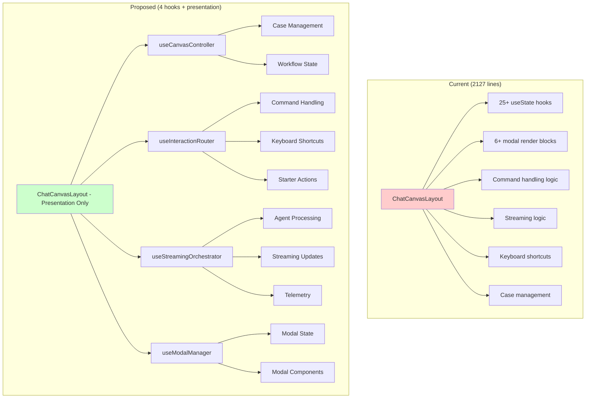

# ChatCanvasLayout Decomposition Analysis

## Executive Summary

**Current State**: 2127-line monolithic component with severe role conflation
**Target State**: 4 headless hooks + pure presentation component
**Risk Level**: HIGH (core UI component)
**Timeline**: Sprint 1 (analysis) → Sprint 3 (implementation)

---

## Current Architecture Anti-Pattern

### Component Role Conflation Diagnosis

`ChatCanvasLayout.tsx` is acting as:

```
├── UI Orchestrator (layout, sidebar, command bar)
├── State Aggregator (SDUI, Canvas, Workflow, Streaming)
├── Interaction Router (drag/drop, commands, modals)
├── Async Control Plane (streaming, retries, loading)
└── Workflow Mediator (case stages, progress, transitions)
```

### Critical Issues Identified

1. **State Explosion**: 25+ useState hooks (lines 514-579)
2. **Mixed Concerns**: UI rendering + business logic + async handling
3. **Tight Coupling**: Direct service calls in component body
4. **Modal Sprawl**: 6+ modal states managed inline
5. **Event Handling Complexity**: Keyboard shortcuts, drag/drop, commands

---

## Extraction Boundaries

### Boundary 1: Headless Canvas Controller
**Hook**: `useCanvasController()`
**Extract**: Lines 514-600, 896-1159
**Responsibilities**:
- Case management (selectedCaseId, cases array)
- Workflow state coordination
- Session management
- Derived state calculations

**Current Code Pattern**:
```typescript
// Lines 514-600: State explosion
const [cases, setCases] = useState<ValueCase[]>(FALLBACK_CASES);
const [selectedCaseId, setSelectedCaseId] = useState<string | null>(null);
const [workflowState, setWorkflowState] = useState<WorkflowState | null>(null);
const [currentSessionId, setCurrentSessionId] = useState<string | null>(null);

// Lines 587-598: Derived state
const selectedCase = React.useMemo(() => cases.find((c) => c.id === selectedCaseId), [cases, selectedCaseId]);
const inProgressCases = React.useMemo(() => cases.filter((c) => c.status === "in-progress"), [cases]);
```

**Target Hook Interface**:
```typescript
interface CanvasControllerReturn {
  // Case management
  cases: ValueCase[];
  selectedCase: ValueCase | null;
  selectedCaseId: string | null;
  inProgressCases: ValueCase[];
  completedCases: ValueCase[];

  // Actions
  selectCase: (id: string) => void;
  createCase: (company: string, website?: string) => void;
  updateCase: (id: string, updates: Partial<ValueCase>) => void;

  // Workflow state
  workflowState: WorkflowState | null;
  currentSessionId: string | null;
  setWorkflowState: (state: WorkflowState) => void;
}
```

### Boundary 2: Interaction Router
**Hook**: `useInteractionRouter()`
**Extract**: Lines 1235-1616
**Responsibilities**:
- Command handling (⌘K, keyboard shortcuts)
- Starter actions (upload, analyze, import)
- Drag/drop interactions
- Modal triggers

**Current Code Pattern**:
```typescript
// Lines 1235-1256: Starter action routing
const handleStarterAction = useCallback((action: string, data?: { files?: File[] }) => {
  switch (action) {
    case "upload_notes": setPendingUploadFile(data?.files?.[0] ?? null); setIsUploadNotesModalOpen(true); break;
    case "analyze_email": setIsEmailAnalysisModalOpen(true); break;
    case "import_crm": setIsCRMImportModalOpen(true); break;
    // ... more cases
  }
}, []);

// Lines 900-924: Keyboard shortcuts
useEffect(() => {
  const handleKeyDown = (e: KeyboardEvent) => {
    if ((e.metaKey || e.ctrlKey) && e.key === "k") {
      e.preventDefault(); setIsCommandBarOpen(true);
    }
    // ... more shortcuts
  };
}, []);
```

**Target Hook Interface**:
```typescript
interface InteractionRouterReturn {
  // Command handling
  isCommandBarOpen: boolean;
  openCommandBar: () => void;
  closeCommandBar: () => void;
  handleCommand: (query: string) => Promise<void>;

  // Keyboard shortcuts
  keyboardBindings: KeyboardShortcutMap;

  // Starter actions
  handleStarterAction: (action: string, data?: any) => void;

  // Modal triggers
  modalTriggers: {
    newCase: () => void;
    uploadNotes: (file?: File) => void;
    analyzeEmail: () => void;
    importCRM: () => void;
    uploadCall: () => void;
  };
}
```

### Boundary 3: Streaming Orchestrator
**Hook**: `useStreamingOrchestrator()`
**Extract**: Lines 927-1159
**Responsibilities**:
- Agent chat processing
- Streaming updates
- Loading states
- Telemetry tracking
- Error handling

**Current Code Pattern**:
```typescript
// Lines 927-998: Command processing with streaming
const handleCommand = useEvent(async (query: string) => {
  setIsLoading(true);
  setStreamingUpdate({ stage: "analyzing", message: "Understanding your request..." });

  // Telemetry tracking
  const chatSpanId = `chat-${Date.now()}`;
  sduiTelemetry.startSpan(chatSpanId, TelemetryEventType.CHAT_REQUEST_START, {...});

  // Agent processing
  const result = await agentChatService.chat({...});

  // Telemetry completion
  sduiTelemetry.endSpan(chatSpanId, TelemetryEventType.CHAT_REQUEST_COMPLETE, {...});
});
```

**Target Hook Interface**:
```typescript
interface StreamingOrchestratorReturn {
  // Processing state
  isLoading: boolean;
  streamingUpdate: StreamingUpdate | null;
  renderedPage: RenderPageResult | null;

  // Actions
  processCommand: (query: string, context: CommandContext) => Promise<void>;
  cancelProcessing: () => void;
  retryProcessing: () => Promise<void>;

  // Telemetry
  telemetry: {
    startSpan: (id: string, type: TelemetryEventType, data: any) => void;
    endSpan: (id: string, type: TelemetryEventType, data: any) => void;
  };

  // Error handling
  error: Error | null;
  clearError: () => void;
}
```

### Boundary 4: Modal Manager
**Hook**: `useModalManager()`
**Extract**: Lines 532-579, 1974-2122
**Responsibilities**:
- Modal state coordination
- Modal lifecycle management
- Modal data handling
- Modal orchestration

**Current Code Pattern**:
```typescript
// Lines 532-579: Modal state explosion
const [isNewCaseModalOpen, setIsNewCaseModalOpen] = useState(false);
const [newCaseCompany, setNewCaseCompany] = useState("");
const [newCaseWebsite, setNewCaseWebsite] = useState("");
const [isUploadNotesModalOpen, setIsUploadNotesModalOpen] = useState(false);
const [pendingUploadFile, setPendingUploadFile] = useState<File | null>(null);
// ... 6+ more modal states

// Lines 1974-2122: Inline modal rendering
{isNewCaseModalOpen && (
  <div className="fixed inset-0 bg-black/50 flex items-center justify-center z-50">
    {/* 50+ lines of modal JSX */}
  </div>
)}
```

**Target Hook Interface**:
```typescript
interface ModalManagerReturn {
  // Modal state
  modals: {
    newCase: { isOpen: boolean; data: NewCaseData };
    uploadNotes: { isOpen: boolean; data: UploadNotesData };
    emailAnalysis: { isOpen: boolean; data: EmailAnalysisData };
    crmImport: { isOpen: boolean; data: CRMImportData };
    salesCall: { isOpen: boolean; data: SalesCallData };
    betaHub: { isOpen: boolean; data: BetaHubData };
    sync: { isOpen: boolean; data: SyncData };
    export: { isOpen: boolean; data: ExportData };
  };

  // Actions
  openModal: <K extends keyof ModalManagerReturn['modals']>(modal: K, data?: ModalManagerReturn['modals'][K]['data']) => void;
  closeModal: <K extends keyof ModalManagerReturn['modals']>(modal: K) => void;
  updateModalData: <K extends keyof ModalManagerReturn['modals']>(modal: K, data: Partial<ModalManagerReturn['modals'][K]['data']>) => void;

  // Modal components (render props)
  ModalComponents: React.ComponentType<any>[];
}
```

---

## Proposed Architecture

### Mermaid Decomposition Diagram



### Component Size Comparison

| Aspect | Current | Proposed | Reduction |
|--------|---------|----------|-----------|
| **Lines of Code** | 2127 | ~200 (presentation) | 91% |
| **useState Hooks** | 25+ | 0 (moved to hooks) | 100% |
| **useCallback Hooks** | 15+ | 0 (moved to hooks) | 100% |
| **Modal JSX** | 150+ lines | 0 (moved to hook) | 100% |
| **Business Logic** | 800+ lines | 0 (moved to hooks) | 100% |

---

## Implementation Strategy

### Phase 1: Hook Creation (Sprint 3, Day 13)
1. **Create hook interfaces** with TypeScript definitions
2. **Extract logic incrementally** starting with least risky (ModalManager)
3. **Maintain backward compatibility** during transition
4. **Add comprehensive tests** for each hook

### Phase 2: Component Refactoring (Sprint 3, Day 13)
1. **Replace state with hook calls**
2. **Remove inline business logic**
3. **Simplify JSX structure**
4. **Add prop validation**

### Phase 3: Testing & Validation (Sprint 3, Day 14)
1. **Integration testing** with all hooks
2. **Performance benchmarking**
3. **Accessibility validation**
4. **Cross-browser testing**

### Risk Mitigation

| Risk | Mitigation | Owner |
|------|------------|-------|
| **Breaking Changes** | Incremental extraction with feature flags | Frontend Architect |
| **Performance Regression** | Benchmark before/after each hook extraction | SRE |
| **Lost Functionality** | Comprehensive test coverage for each hook | QA Lead |
| **State Synchronization** | Clear data flow diagrams between hooks | Control Plane Lead |

---

## Success Criteria

### Functional Requirements
- [ ] All existing functionality preserved
- [ ] No breaking changes to public API
- [ ] Modal behavior identical
- [ ] Command processing unchanged
- [ ] Keyboard shortcuts working

### Quality Requirements
- [ ] Each hook < 200 lines
- [ ] 100% test coverage for hooks
- [ ] TypeScript strict mode compliance
- [ ] ESLint/Prettier compliance
- [ ] Accessibility WCAG 2.1 AA compliance

### Performance Requirements
- [ ] Render time ≤ current baseline
- [ ] Memory usage ≤ current baseline
- [ ] Bundle size unchanged or reduced
- [ ] No additional re-renders

---

## Next Steps

1. **Sprint 1**: Complete this analysis document ✅
2. **Sprint 2**: Create hook interfaces and test infrastructure
3. **Sprint 3**: Implement hooks and refactor component
4. **Post-Sprint**: Performance validation and documentation

**Dependencies**: State invariants documentation (Sprint 1, Day 2) must be completed before hook implementation to ensure proper data flow boundaries.

---

*Document Status*: ✅ **Ready for Implementation**
*Next Review*: Sprint 2, Day 1 (Hook Interface Design)
*Approval Required*: Frontend Architect, Control Plane Lead
