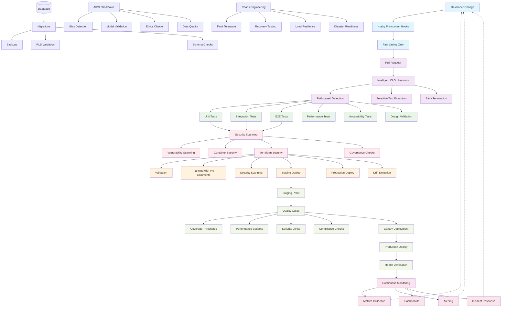

# ValueOS CI/CD Architecture



## Design Principles

**ValueOS CI/CD is a governed delivery system, not a pipeline:**

- **Change-aware**: Only run what matters
- **Environment-safe**: No promotion without proof
- **Security-first**: Security is enforced, not inspected later
- **Autonomous but constrained**: Automation everywhere, guardrails always
- **Observable**: Every deployment produces evidence

## Change Lifecycle Flow

```text
Developer → Local Guardrails → PR Validation → Test & Security Fabric →
Staging Proof → Production Deploy → Continuous Monitoring
```

## Layer 1: Developer Entry & Fast Feedback

- **Husky pre-commit hooks** for immediate feedback
- **Fast-only checks** (lint-staged) - no blocking heavy tests
- **Dev Containers/Codespaces** with CI parity

## Layer 2: Intelligent PR Validation

- **Intelligent CI Orchestrator** - the system brain
- **Path-based change detection** - only test what changes
- **Dependency-aware test selection**
- **Early termination** on critical failures

## Layer 3: Integrated Test & Quality Fabric

| Dimension     | Enforcement                     |
| ------------- | ------------------------------- |
| Functional    | Unit, Integration, E2E          |
| Performance   | k6 load & budget checks         |
| Accessibility | a11y validation                 |
| Design        | Design lint & token consistency |
| Observability | Instrumentation verification    |

## Layer 4: Security & Compliance as Continuous Enforcement

- **Dependency vulnerability scanning**
- **Container image scanning**
- **Terraform security analysis**
- **Secrets validation**
- **Architectural rule enforcement**
- **AI bias probes**

## Layer 5: Infrastructure as Controlled System

| Stage            | Control             |
| ---------------- | ------------------- |
| Validate         | Syntax + formatting |
| Plan             | PR-commented diffs  |
| Scan             | tfsec / Checkov     |
| Deploy (Staging) | Automatic           |
| Deploy (Prod)    | Approval-gated      |
| Drift Detection  | Continuous          |

## Layer 6: Environment Promotion Model

- **Dev**: Fast, permissive
- **Staging**: Proof environment
- **Production**: Locked, auditable
- **Canary deployments** for production safety

## Layer 7: Database as First-Class Citizen

- **Migration automation**
- **Backup scheduling**
- **RLS & security validation**
- **Schema compatibility checks**

## Layer 8: Observability & Feedback Loops

- **Health checks** and **performance regressions**
- **Error rates** and **resource utilization**
- **Slack/email alerting** with **dashboard trends**
- **Automated incident workflows**

## Quality Gates (Non-Negotiable Contracts)

- Coverage thresholds
- Performance budgets
- Security severity limits
- Compliance checks
- Architecture invariants

## Specialized Subsystems

### AI/ML Governance

- Bias detection
- Model validation
- Training data quality
- Ethics enforcement

### Chaos & Resilience Engineering

- Fault tolerance testing
- Recovery procedures
- Load resilience
- Disaster readiness

## System Intelligence

The CI/CD system observes itself:

- Build success rate
- Test reliability
- Deployment frequency
- Security posture trends
- Mean time to recovery

---

**Mental Model:** "ValueOS CI/CD is a change-governance system. Every commit is evaluated for risk, validated proportionally, secured continuously, promoted safely, and observed after release — with no silent failure modes."
