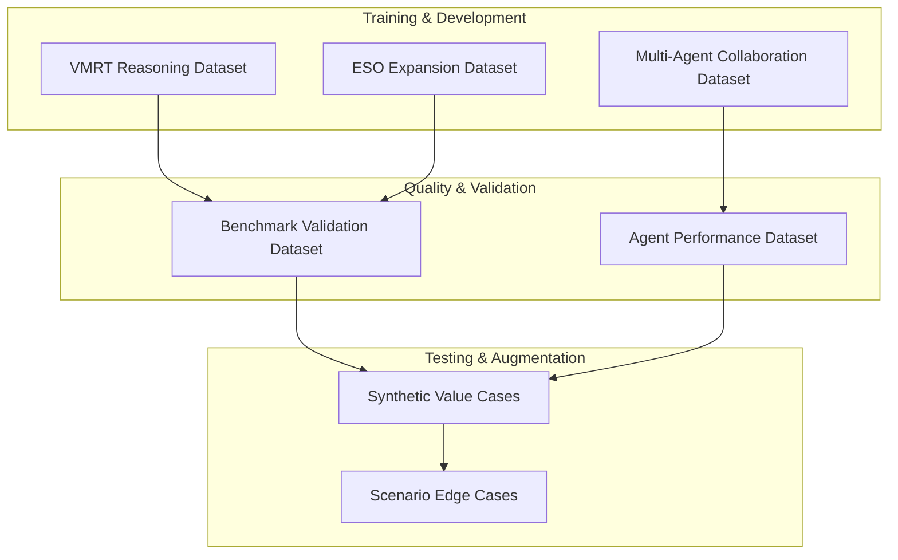

# ValueOS Technical Dataset Design Plan

## Overview
This document outlines 7 technical datasets to build for the ValueOS platform to support training, validation, and operational excellence of the multi-agent economic reasoning system.

## Dataset Architecture



## 1. VMRT (Value Modeling Reasoning Trace) Dataset

### Purpose
Train and validate the reasoning engine's ability to construct valid financial impact chains with proper causal logic.

### Schema
```typescript
interface VMRTDatasetEntry {
  // Input context
  context: {
    organization: {
      industry: string;
      size: "smb" | "mid_market" | "enterprise";
      region?: string;
    };
    constraints: {
      budgetUsd?: number;
      timelineMonths?: number;
      minRoi?: number;
      riskTolerance?: "low" | "medium" | "high";
    };
    persona: string;
  };
  
  // Expected reasoning chain
  expectedReasoningSteps: VMRTReasoningStep[];
  
  // Financial outcomes
  expectedFinancialImpact: VMRTFinancialImpact;
  
  // Quality metrics
  qualityMetrics: {
    logicalClosure: boolean;
    benchmarkAligned: boolean;
    unitIntegrity: boolean;
    fccPassed: boolean;
  };
  
  // Metadata
  source: "synthetic" | "real" | "expert";
  difficulty: "easy" | "medium" | "hard";
  industryDomain: string;
}
```

### Data Generation Strategy
- **Synthetic Generation**: 60% - Use parameterized templates across industries
- **Expert Validation**: 25% - Finance professionals create real scenarios
- **Real Production**: 15% - Anonymized customer data with consent

### Key Metrics to Track
- Reasoning step accuracy (target: 95%)
- Financial calculation precision (target: 98%)
- Benchmark alignment rate (target: 90%)
- FCC pass rate (target: 85%)

## 2. ESO (Economic Structure Ontology) Expansion Dataset

### Purpose
Expand the 500+ KPI ontology with new industry metrics, formulas, and causal relationships.

### Schema
```typescript
interface ESOKPIExpansion {
  // KPI Definition
  kpi: {
    id: string;
    name: string;
    domain: ESOIndustry;
    category: string;
    unit: string;
    description: string;
    formulaString?: string;
    dependencies: string[];
    improvementDirection: ImprovementDirection;
  };
  
  // Benchmark Data
  benchmarks: {
    p25: number;
    p50: number;
    p75: number;
    worldClass?: number;
    source: string;
    vintage: string;
  };
  
  // Relationships
  relationships: {
    targetKpiId: string;
    type: ESORelationType;
    strength: number;
    logic?: string;
    description?: string;
  }[];
  
  // Persona Mapping
  personaRelevance: {
    persona: ESOPersona;
    primaryPain: string;
    financialDriver: FinancialDriver;
    typicalGoals: string[];
  }[];
  
  // Validation
  validation: {
    sourceCredibility: "high" | "medium" | "low";
    industryConsensus: boolean;
    formulaTested: boolean;
  };
}
```

### Data Sources
- **Industry Reports**: Gartner, Forrester, APQC benchmarks
- **Academic Research**: Operations management journals
- **Expert Interviews**: CFOs, COOs, industry specialists
- **Public Datasets**: Census data, Bureau of Labor Statistics

### Expansion Targets
- **Healthcare**: 50 new KPIs (patient outcomes, operational efficiency)
- **Manufacturing**: 75 new KPIs (supply chain, quality metrics)
- **Professional Services**: 40 new KPIs (utilization, project profitability)
- **Retail**: 35 new KPIs (inventory turnover, customer lifetime value)

## 3. Multi-Agent Collaboration Dataset

### Purpose
Train and optimize the 7-agent system's coordination patterns and communication flows.

### Schema
```typescript
interface AgentInteractionTrace {
  // Session Context
  sessionId: string;
  timestamp: string;
  userIntent: string;
  valueCaseId: string;
  
  // Agent Choreography
  agentFlow: {
    coordinator: {
      initialDecomposition: string[];
      dagPlan: string[];
      timestamp: number;
    };
    opportunityAgent: {
      identifiedLeveragePoints: string[];
      causalMap: Record<string, string[]>;
      confidence: number;
    };
    targetAgent: {
      roiModels: ROIModel[];
      interventionPlans: string[];
    };
    integrityAgent: {
      validationResults: {
        stepId: string;
        passed: boolean;
        issues: string[];
      }[];
    };
    communicator: {
      narratives: {
        persona: StakeholderPersona;
        narrative: ExecutiveNarrative;
      }[];
    };
  };
  
  // Collaboration Metrics
  metrics: {
    totalSteps: number;
    coordinationFailures: number;
    integrityRejections: number;
    narrativeQuality: number;
    executionTime: number;
  };
  
  // Success Criteria
  outcome: {
    valueCaseCreated: boolean;
    userSatisfaction: number;
    roiAchieved: boolean;
  };
}
```

### Training Patterns
- **Optimal Flows**: 1000+ examples of perfect agent coordination
- **Recovery Scenarios**: 500+ examples of integrity failures and corrections
- **Edge Cases**: 200+ examples of ambiguous user intent
- **Performance Bottlenecks**: 300+ examples of timeout/circuit breaker scenarios

## 4. Benchmark & Validation Dataset

### Purpose
Continuous quality assurance and regression testing for the entire system.

### Schema
```typescript
interface BenchmarkEntry {
  // Test Scenario
  scenarioId: string;
  description: string;
  category: "financial_calculation" | "agent_coordination" | "narrative_quality" | "ontology_integrity";
  
  // Input
  input: {
    vmrt?: VMRT;
    kpi?: ESOKPINode;
    agentFlow?: AgentInteractionTrace;
  };
  
  // Expected Output
  expected: {
    financialImpact?: VMRTFinancialImpact;
    kpiRelationships?: ESOEdge[];
    narrativeMetrics?: {
      confidence: number;
      personaAlignment: number;
    };
    qualityScore?: number;
  };
  
  // Tolerance
  tolerance: {
    financial: number; // percentage variance allowed
    logical: boolean;  // strict boolean match
    quality: number;   // minimum score
  };
  
  // Metadata
  priority: "critical" | "high" | "medium";
  lastUpdated: string;
  regressionTest: boolean;
}
```

### Validation Categories
- **Financial Accuracy**: 200+ test cases
- **Ontology Consistency**: 150+ test cases
- **Agent Performance**: 100+ test cases
- **Narrative Quality**: 75+ test cases
- **Integration Flows**: 50+ test cases

## 5. Agent Performance Dataset

### Purpose
Measure and optimize individual agent performance and system-wide efficiency.

### Schema
```typescript
interface AgentPerformanceMetrics {
  // Agent Identity
  agentType: string;
  agentVersion: string;
  sessionId: string;
  timestamp: string;
  
  // Execution Metrics
  execution: {
    inputSize: number;
    outputSize: number;
    processingTime: number;
    tokenCount: number;
    cost: number;
  };
  
  // Quality Metrics
  quality: {
    accuracy: number;
    completeness: number;
    consistency: number;
    safetyScore: number;
  };
  
  // Reliability Metrics
  reliability: {
    successRate: number;
    retryCount: number;
    circuitBreakerTrips: number;
    timeoutCount: number;
  };
  
  // Collaboration Metrics
  collaboration: {
    messagesSent: number;
    messagesReceived: number;
    dependenciesResolved: number;
    coordinationScore: number;
  };
  
  // Business Impact
  impact: {
    valueCaseCreated: boolean;
    userSatisfaction?: number;
    roiAchieved?: number;
  };
}
```

### Analysis Dimensions
- **Agent-Specific**: Performance by agent type and version
- **Temporal**: Performance trends over time
- **Contextual**: Performance by industry, persona, complexity
- **Comparative**: Performance relative to other agents

## 6. Synthetic Value Case Generation Dataset

### Purpose
Generate realistic but synthetic value cases for testing, training augmentation, and demo scenarios.

### Schema
```typescript
interface SyntheticValueCase {
  // Organization Profile
  organization: {
    name: string;
    industry: string;
    size: string;
    annualRevenue: number;
    employeeCount: number;
    techMaturity: "low" | "medium" | "high";
  };
  
  // Business Challenge
  challenge: {
    painPoint: string;
    affectedKPIs: string[];
    currentPerformance: number;
    targetPerformance: number;
    urgency: "low" | "medium" | "high";
  };
  
  // Proposed Solution
  solution: {
    capabilities: string[];
    implementationTimeline: number;
    investmentRequired: number;
    expectedBenefits: string[];
  };
  
  // Financial Model
  financialModel: {
    costSavings: {
      annual: number;
      timeframe: number;
      confidence: number;
    };
    revenueUplift: {
      annual: number;
      timeframe: number;
      confidence: number;
    };
    totalROI: number;
    paybackMonths: number;
  };
  
  // Risk Factors
  risks: {
    description: string;
    probability: number;
    impact: number;
    mitigation: string;
  }[];
  
  // Validation
  validation: {
    realisticScore: number;
    complexity: "simple" | "moderate" | "complex";
    industryFit: number;
  };
}
```

### Generation Strategy
- **Industry Templates**: 50 base templates per major industry
- **Parameter Variation**: 10x variations per template
- **Complexity Scaling**: 3 levels per scenario
- **Risk Injection**: 20% include significant risk factors

## 7. Scenario Edge Cases & Failure Modes Dataset

### Purpose
Test system resilience and error handling for rare but critical scenarios.

### Schema
```typescript
interface EdgeCaseScenario {
  // Scenario Definition
  scenarioId: string;
  category: "data_quality" | "calculation_edge" | "agent_conflict" | "system_limit";
  severity: "critical" | "high" | "medium";
  
  // Trigger Conditions
  trigger: {
    description: string;
    probability: number;
    detectability: "easy" | "medium" | "hard";
  };
  
  // Input State
  input: {
    vmrt?: Partial<VMRT>;
    kpi?: Partial<ESOKPINode>;
    agentState?: Record<string, unknown>;
  };
  
  // Expected System Behavior
  expectedBehavior: {
    errorHandling: "graceful" | "strict" | "recoverable";
    fallbackStrategy: string;
    userNotification: string;
    auditLog: boolean;
  };
  
  // Recovery Path
  recovery: {
    steps: string[];
    manualIntervention: boolean;
    dataCorrection: boolean;
    learningOpportunity: boolean;
  };
  
  // Test Validation
  validation: {
    testSteps: string[];
    successCriteria: string[];
    regressionRisk: "high" | "medium" | "low";
  };
}
```

### Edge Case Categories
- **Financial Extremes**: Negative values, zero, very large numbers
- **Missing Data**: Incomplete KPIs, missing benchmarks
- **Circular Dependencies**: KPI loops, reasoning cycles
- **Agent Conflicts**: Competing recommendations, integrity failures
- **Scale Issues**: Enterprise vs SMB data volumes
- **Temporal Anomalies**: Vintage mismatches, forecast errors

## Implementation Roadmap

### Phase 1: Foundation (Weeks 1-4)
- [ ] Set up dataset infrastructure and storage
- [ ] Create VMRT dataset with 500+ synthetic entries
- [ ] Build ESO expansion framework for 100 new KPIs
- [ ] Establish data validation pipelines

### Phase 2: Expansion (Weeks 5-8)
- [ ] Generate multi-agent collaboration traces (1000+ sessions)
- [ ] Create benchmark validation suite (200+ test cases)
- [ ] Build agent performance tracking system
- [ ] Develop synthetic value case generator

### Phase 3: Refinement (Weeks 9-12)
- [ ] Add edge case scenarios (100+ critical cases)
- [ ] Implement continuous data quality monitoring
- [ ] Create automated dataset update pipelines
- [ ] Document generation methodologies

### Phase 4: Production (Weeks 13-16)
- [ ] Deploy datasets to production environments
- [ ] Set up A/B testing framework
- [ ] Create dataset versioning system
- [ ] Establish feedback loops for continuous improvement

## Success Metrics

### Dataset Quality
- **Completeness**: 100% coverage of core scenarios
- **Accuracy**: >95% validation pass rate
- **Diversity**: 10+ industries, 8+ personas, 3+ complexity levels
- **Timeliness**: Monthly updates with new patterns

### System Impact
- **Training Performance**: 20% improvement in agent accuracy
- **Validation Speed**: 50% reduction in manual review time
- **Edge Case Coverage**: 90% of known failure modes tested
- **User Satisfaction**: 15% improvement in case acceptance rates

## Next Steps

1. **Immediate**: Review this plan and confirm priorities
2. **Short-term**: Begin Phase 1 implementation
3. **Ongoing**: Establish data governance and quality standards

This dataset architecture will provide the foundation for training, validation, and continuous improvement of the ValueOS platform's economic reasoning capabilities.