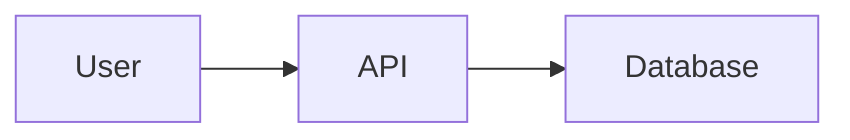

# Documentation Style Guide

Guidelines for writing and maintaining ValueOS documentation.

## 🎯 Core Principles

### 1. Clarity Over Cleverness
Write to be understood, not to impress. Use simple, direct language.

❌ **Bad**: "Leverage our sophisticated authentication paradigm to facilitate seamless user ingress."  
✅ **Good**: "Use SSO to let users log in with their company credentials."

### 2. Show, Don't Just Tell
Include code examples, screenshots, and step-by-step instructions.

### 3. Respect the Reader's Time
Get to the point quickly. Use scannable formatting.

### 4. Maintain Consistency
Follow established patterns for structure, formatting, and terminology.

---

## ✍️ Writing Style

### Tone
- **Professional** but not stuffy
- **Helpful** but not condescending
- **Direct** but not abrupt
- **Technical** but not jargon-heavy

### Voice
- Use **active voice**: "Click the button" not "The button should be clicked"
- Use **second person**: "You can configure..." not "Users can configure..."
- Use **present tense**: "The API returns..." not "The API will return..."

### Avoid Marketing Language
❌ Avoid: comprehensive, powerful, robust, cutting-edge, revolutionary, game-changing  
✅ Use: complete, effective, reliable, modern, new, improved

---

## 📝 Content Structure

### Page Structure

Every documentation page should follow this structure:

```markdown
# Page Title

Brief introduction (1-2 sentences explaining what this page covers).

## 🎯 Overview (optional)

High-level summary of the topic.

## Main Content Sections

### Subsection 1
Content...

### Subsection 2
Content...

## 💡 Best Practices (optional)

Tips and recommendations.

## 🔗 Related Documentation (optional)

Links to related pages.

---

> **Note**: Additional context or clarifications.

> **Tip**: Helpful suggestions.

> ⚠️ **Warning**: Important cautions.
```

### Section Headings

- **H1 (#)**: Page title only (one per page)
- **H2 (##)**: Major sections
- **H3 (###)**: Subsections
- **H4 (####)**: Rarely needed, use sparingly

---

## 🎨 Formatting

### Emphasis

- **Bold** for UI elements: "Click the **Settings** button"
- *Italic* for emphasis: "This is *important* to understand"
- `Code` for technical terms: "Set the `apiKey` parameter"

### Lists

**Unordered lists** for items without sequence:
```markdown
- First item
- Second item
- Third item
```

**Ordered lists** for sequential steps:
```markdown
1. First step
2. Second step
3. Third step
```

### Code Blocks

Always specify the language:

````markdown
```typescript
const client = new ValueOS({
  apiKey: process.env.VALUEOS_API_KEY
});
```
````

### Tables

Use tables for structured comparisons:

```markdown
| Feature | Starter | Professional | Enterprise |
|---------|---------|--------------|------------|
| Users | 5 | 50 | Unlimited |
| SSO | ❌ | ✅ | ✅ |
```

### Callouts

Use blockquotes for callouts:

```markdown
> **Note**: Additional information that's helpful but not critical.

> **Tip**: Suggestions to improve the user experience.

> ⚠️ **Warning**: Important cautions about potential issues.
```

---

## 💻 Code Examples

### General Guidelines

1. **Complete and runnable**: Examples should work as-is
2. **Realistic**: Use realistic variable names and values
3. **Commented**: Explain non-obvious code
4. **Consistent**: Follow project coding standards

### TypeScript Examples

```typescript
import { ValueOS } from '@valueos/sdk';

// Initialize client with API key
const client = new ValueOS({
  apiKey: process.env.VALUEOS_API_KEY!,
  environment: 'production'
});

// Create a metric
const metric = await client.metrics.create({
  name: 'Feature Revenue Impact',
  type: 'revenue',
  unit: 'USD',
  value: 50000
});

console.log(`Created metric: ${metric.id}`);
```

### Command Line Examples

```bash
# Install dependencies
npm install @valueos/sdk

# Run the application
npm start
```

### Configuration Examples

```json
{
  "api": {
    "key": "vos_your_api_key_here",
    "environment": "production"
  }
}
```

---

## 📚 Content Types

### Tutorials

**Purpose**: Teach a specific task step-by-step

**Structure**:
1. What you'll build
2. Prerequisites
3. Step-by-step instructions
4. Verification
5. Next steps

**Example**: "Build Your First Integration"

### How-To Guides

**Purpose**: Solve a specific problem

**Structure**:
1. Problem statement
2. Solution overview
3. Detailed steps
4. Troubleshooting

**Example**: "How to Configure SSO with Okta"

### Reference Documentation

**Purpose**: Provide complete technical details

**Structure**:
1. Overview
2. Parameters/Options
3. Return values
4. Examples
5. Related items

**Example**: "API Reference"

### Conceptual Documentation

**Purpose**: Explain concepts and architecture

**Structure**:
1. Introduction
2. Key concepts
3. How it works
4. Use cases
5. Best practices

**Example**: "Understanding Value Metrics"

---

## 🔗 Links and References

### Internal Links

Use relative paths:
```markdown
See [User Management](./user-management.md) for details.
```

### External Links

Use full URLs with descriptive text:
```markdown
Learn more about [OAuth 2.0](https://oauth.net/2/).
```

### Link Text

❌ **Bad**: "Click [here](./guide.md) for more information"  
✅ **Good**: "See the [installation guide](./guide.md) for setup instructions"

---

## 📊 Visual Elements

### Screenshots

- Use high-resolution images
- Annotate important areas
- Keep file sizes reasonable (<500KB)
- Use descriptive alt text

```markdown

```

### Diagrams

- Use Mermaid for diagrams when possible
- Keep diagrams simple and focused
- Include text descriptions

```markdown

```

### Icons

Use Lucide icons metaphorically in text:
- 🎯 Goals/Objectives
- 📊 Data/Analytics
- 🔒 Security
- ⚡ Performance
- 🚀 Getting Started
- 💡 Tips/Ideas
- ⚠️ Warnings
- ✅ Success/Completion
- ❌ Errors/Failures

---

## 🏷️ Terminology

### Consistent Terms

Use these terms consistently:

| Use This | Not This |
|----------|----------|
| API key | API token, access key |
| Dashboard | Portal, console |
| Metric | Measure, KPI |
| Organization | Company, account |
| User | Member, person |
| Workspace | Project, space |

### Technical Terms

- Define technical terms on first use
- Link to glossary for complex terms
- Use industry-standard terminology

---

## ✅ Quality Checklist

Before publishing documentation:

- [ ] Spelling and grammar checked
- [ ] Code examples tested and working
- [ ] Links verified (no broken links)
- [ ] Screenshots up-to-date
- [ ] Follows style guide
- [ ] Reviewed by another person
- [ ] Metadata updated (date, version)
- [ ] Related docs updated

---

## 🔄 Maintenance

### Regular Reviews

- Review quarterly for accuracy
- Update for new features
- Remove deprecated content
- Check for broken links

### Version Control

- Track changes in git
- Use meaningful commit messages
- Tag releases
- Maintain changelog

### Deprecation

When deprecating content:

1. Add deprecation notice at top
2. Provide migration path
3. Set removal date
4. Archive after removal

```markdown
> ⚠️ **Deprecated**: This feature is deprecated as of v2.0.0 and will be removed in v3.0.0. 
> Use [new feature](./new-feature.md) instead.
```

---

## 📖 Examples

### Good Example

```markdown
# Setting Up SSO

Configure Single Sign-On to let users log in with their company credentials.

## Prerequisites

- Admin access to ValueOS
- Admin access to your identity provider
- Professional or Enterprise plan

## Step 1: Create Application in Okta

1. Log in to Okta Admin Console
2. Navigate to **Applications** → **Applications**
3. Click **Create App Integration**
4. Select **SAML 2.0**
5. Click **Next**

**Single sign-on URL:**
```
https://app.valueos.com/auth/saml/callback
```

## Troubleshooting

### SSO Login Fails

**Symptom**: Error message when trying to log in via SSO

**Solution**:
1. Verify metadata URL is correct
2. Check certificate hasn't expired
3. Ensure user is assigned to app in Okta
```

### Bad Example

```markdown
# SSO

SSO is a powerful feature that enables seamless authentication.

To set it up, you need to configure your identity provider. This is a 
comprehensive process that requires careful attention to detail.

First, you'll want to navigate to the settings. Then, you should click 
on the authentication tab. After that, you can configure SSO.

For more information, click here.
```

---

## 🤝 Contributing

See [Contributing Guide](../../CONTRIBUTING.md) for how to contribute to documentation.

---

## 📚 Resources

- [Markdown Guide](https://www.markdownguide.org/)
- [Google Developer Documentation Style Guide](https://developers.google.com/style)
- [Microsoft Writing Style Guide](https://docs.microsoft.com/en-us/style-guide/)
- [Write the Docs](https://www.writethedocs.org/)

---

> **Note**: This style guide is a living document. Suggest improvements via pull request.
