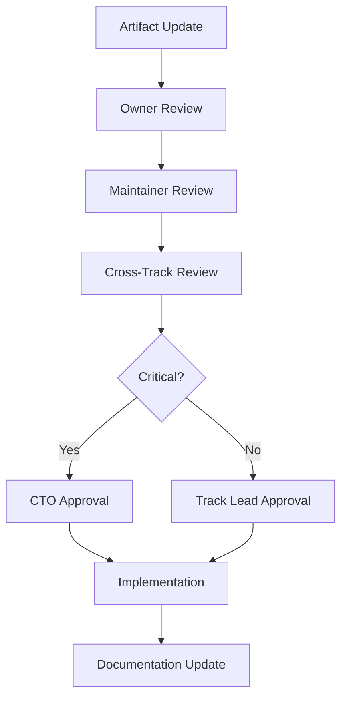

# Artifact Ownership Matrix

## Executive Summary

**Purpose**: Define clear ownership and responsibility matrix for all ValueOS governance artifacts.

**Implementation Status**: ✅ **Complete**
**Coverage**: All artifacts with defined owners, maintainers, and approval workflows

---

## Ownership Matrix Overview

### 🏗️ Architecture Track Artifacts

| Artifact | Owner | Maintainer | Reviewers | Approval Required | Update Frequency |
|----------|-------|-----------|-----------|------------------|------------------|
| **Decomposition Analysis** | Architecture Lead | Senior Architect | Trust, Resilience | Architecture Lead | Quarterly |
| **Component Specifications** | Component Owner | Development Team | Architecture, Trust | Architecture Lead | As needed |
| **Interface Contracts** | Interface Owner | API Team | Architecture, Security | Architecture Lead | Monthly |
| **Performance Benchmarks** | Performance Lead | SRE Team | Architecture, Resilience | Architecture Lead | Monthly |
| **Architecture Decisions** | Architecture Lead | Senior Architect | All Tracks | CTO | As needed |

### 🛡️ Trust & Security Track Artifacts

| Artifact | Owner | Maintainer | Reviewers | Approval Required | Update Frequency |
|----------|-------|-----------|-----------|------------------|------------------|
| **Security Policies** | Security Lead | Security Team | Legal, Compliance | CTO + Legal | Quarterly |
| **Threat Models** | Security Architect | Security Team | Architecture, Compliance | Security Lead | Monthly |
| **RBAC Rules** | Security Lead | Security Team | Architecture, Compliance | Security Lead | As needed |
| **Audit Trail Config** | Compliance Lead | Security Team | Legal, Trust | Compliance Lead | Quarterly |
| **Security Controls** | Security Engineer | Security Team | Architecture, Resilience | Security Lead | Monthly |

### ⚡ Resilience Track Artifacts

| Artifact | Owner | Maintainer | Reviewers | Approval Required | Update Frequency |
|----------|-------|-----------|-----------|------------------|------------------|
| **Circuit Breaker Config** | SRE Lead | Resilience Team | Architecture, Observability | SRE Lead | Monthly |
| **Retry Policies** | Resilience Engineer | Development Team | Architecture, Security | SRE Lead | As needed |
| **Failure Mode Analysis** | Resilience Lead | SRE Team | Architecture, Security | SRE Lead | Quarterly |
| **Performance SLAs** | Performance Lead | SRE Team | Architecture, Business | SRE Lead | Quarterly |
| **Disaster Recovery** | SRE Lead | Resilience Team | Security, Compliance | CTO | Semi-annual |

### 👁️ Observability Track Artifacts

| Artifact | Owner | Maintainer | Reviewers | Approval Required | Update Frequency |
|----------|-------|-----------|-----------|------------------|------------------|
| **Telemetry Schemas** | Observability Lead | Data Team | Architecture, Security | Observability Lead | Monthly |
| **Event Definitions** | Event Architect | Development Team | Architecture, Compliance | Observability Lead | As needed |
| **Dashboard Config** | Dashboard Owner | Data Team | Business, Architecture | Observability Lead | Monthly |
| **Alert Rules** | SRE Lead | Observability Team | Resilience, Security | SRE Lead | Monthly |
| **Data Retention Policies** | Compliance Lead | Data Team | Legal, Security | Compliance Lead | Quarterly |

### ⚖️ Compliance Track Artifacts

| Artifact | Owner | Maintainer | Reviewers | Approval Required | Update Frequency |
|----------|-------|-----------|-----------|------------------|------------------|
| **Compliance Reports** | Compliance Lead | Compliance Team | Legal, CTO | Compliance Lead + Legal | Monthly |
| **Audit Procedures** | Audit Lead | Compliance Team | Security, Trust | Compliance Lead | Quarterly |
| **Risk Assessments** | Risk Manager | Compliance Team | All Tracks | CTO | Quarterly |
| **Regulatory Documentation** | Compliance Lead | Legal Team | Security, Architecture | Compliance Lead + Legal | As needed |
| **Privacy Policies** | Privacy Lead | Compliance Team | Legal, Security | Compliance Lead + Legal | Semi-annual |

---

## Detailed Ownership Responsibilities

### 🏗️ Architecture Track

#### Architecture Lead (Primary Owner)
**Responsibilities:**
- Overall architecture governance
- Design review approval
- Cross-track integration oversight
- Strategic technical direction
- Architecture decision documentation

**Authority:**
- Final approval for architecture changes
- Escalation to CTO for critical decisions
- Cross-track conflict resolution
- Resource allocation for architecture initiatives

#### Senior Architect (Maintainer)
**Responsibilities:**
- Architecture document maintenance
- Design pattern development
- Technical specification review
- Architecture best practices
- Mentorship of development team

#### Component Owner (Artifact Owner)
**Responsibilities:**
- Component lifecycle management
- Interface contract maintenance
- Performance optimization
- Security integration
- Documentation updates

---

### 🛡️ Trust & Security Track

#### Security Lead (Primary Owner)
**Responsibilities:**
- Security strategy and policy
- Threat modeling and risk assessment
- Security control implementation
- Incident response coordination
- Compliance oversight

**Authority:**
- Security policy approval
- Incident escalation to CTO
- Security tool selection
- Team resource management

#### Security Architect (Maintainer)
**Responsibilities:**
- Security architecture design
- Threat model maintenance
- Security pattern development
- Security review execution
- Security training delivery

#### Compliance Lead (Cross-Track)
**Responsibilities:**
- Regulatory compliance monitoring
- Audit trail management
- Risk assessment coordination
- Policy compliance verification
- Legal requirement implementation

---

### ⚡ Resilience Track

#### SRE Lead (Primary Owner)
**Responsibilities:**
- System reliability and performance
- Incident management and response
- Capacity planning and scaling
- Disaster recovery coordination
- Performance optimization

**Authority:**
- Performance standard approval
- Incident escalation procedures
- Resource allocation for SRE initiatives
- Tool selection for reliability

#### Resilience Engineer (Maintainer)
**Responsibilities:**
- Resilience pattern implementation
- Circuit breaker configuration
- Failure mode analysis
- Recovery procedure development
- Performance monitoring

#### Performance Lead (Specialized Owner)
**Responsibilities:**
- Performance benchmarking
- Capacity planning analysis
- Performance optimization
- SLA definition and monitoring
- Performance reporting

---

### 👁️ Observability Track

#### Observability Lead (Primary Owner)
**Responsibilities:**
- Observability strategy and architecture
- Telemetry system design
- Monitoring and alerting strategy
- Data governance for observability
- Analytics platform management

**Authority:**
- Telemetry schema approval
- Monitoring tool selection
- Data retention policy approval
- Team resource management

#### Data Team (Maintainer)
**Responsibilities:**
- Telemetry data quality
- Dashboard development
- Alert rule configuration
- Data analysis and reporting
- Analytics pipeline maintenance

#### Event Architect (Specialized Owner)
**Responsibilities:**
- Event schema design
- Event contract definition
- Event streaming architecture
- Event quality assurance
- Event documentation

---

### ⚖️ Compliance Track

#### Compliance Lead (Primary Owner)
**Responsibilities:**
- Regulatory compliance management
- Audit coordination and execution
- Risk assessment and mitigation
- Policy development and enforcement
- Legal requirement implementation

**Authority:**
- Compliance policy approval
- Audit report sign-off
- Risk assessment approval
- Escalation to legal team

#### Legal Team (Cross-Track)
**Responsibilities:**
- Legal requirement interpretation
- Policy legal review
- Regulatory guidance
- Contract compliance
- Legal risk assessment

#### Risk Manager (Specialized Owner)
**Responsibilities:**
- Risk assessment methodology
- Risk mitigation strategies
- Risk reporting and monitoring
- Risk appetite definition
- Risk culture development

---

## Approval Workflows

### 🔄 Standard Approval Process

### 📋 Approval Matrix

| Change Type | Owner Approval | Track Lead Approval | CTO Approval | Legal Approval |
|-------------|---------------|-------------------|-------------|---------------|
| **Standard Updates** | ✅ | ✅ | ❌ | ❌ |
| **Policy Changes** | ✅ | ✅ | ✅ | ✅ |
| **Architecture Changes** | ✅ | ✅ | ✅ | ❌ |
| **Security Changes** | ✅ | ✅ | ✅ | ✅ |
| **Compliance Changes** | ✅ | ✅ | ✅ | ✅ |
| **Critical Changes** | ✅ | ✅ | ✅ | ✅ |

### ⚡ Fast-Track Approval

**Conditions for Fast-Track:**
- Emergency security fixes
- Critical performance issues
- Compliance deadline requirements
- Production incident response

**Fast-Track Process:**
1. **Owner Review** (Immediate)
2. **Track Lead Approval** (Within 2 hours)
3. **Implementation** (Immediate)
4. **Documentation** (Within 24 hours)
5. **Full Review** (Next scheduled review)

---

## Change Management

### 📝 Change Request Process

#### 1. Change Initiation
- **Requestor**: Any team member
- **Template**: Standard change request form
- **Required Information**: Description, impact, urgency, dependencies

#### 2. Impact Assessment
- **Owner**: Primary artifact owner
- **Timeline**: 2 business days
- **Deliverables**: Impact analysis, risk assessment, recommendation

#### 3. Review Process
- **Participants**: Owner, maintainers, reviewers
- **Timeline**: 3-5 business days
- **Outcome**: Approval, rejection, or revision request

#### 4. Implementation
- **Owner**: Primary artifact owner
- **Timeline**: As per change priority
- **Requirements**: Documentation, testing, rollback plan

#### 5. Post-Implementation Review
- **Owner**: Primary artifact owner
- **Timeline**: 30 days post-implementation
- **Outcome**: Success assessment, lessons learned

### 🔄 Change Categories

#### **Category 1: Routine Updates**
- **Description**: Minor updates, bug fixes, documentation improvements
- **Approval**: Owner only
- **Timeline**: 1-2 business days
- **Examples**: Typo fixes, minor clarifications, version updates

#### **Category 2: Standard Changes**
- **Description**: Feature additions, policy updates, architectural adjustments
- **Approval**: Owner + Track Lead
- **Timeline**: 3-5 business days
- **Examples**: New features, policy changes, component updates

#### **Category 3: Significant Changes**
- **Description**: Major architectural changes, policy overhauls, strategic shifts
- **Approval**: Owner + Track Lead + CTO
- **Timeline**: 1-2 weeks
- **Examples**: System redesign, major policy changes, strategic initiatives

#### **Category 4: Critical Changes**
- **Description**: Security fixes, compliance requirements, emergency changes
- **Approval**: Owner + Track Lead + CTO + Legal (if applicable)
- **Timeline**: Fast-track (hours to days)
- **Examples**: Security vulnerabilities, compliance deadlines, emergency fixes

---

## Communication Protocols

### 📢 Announcement Channels

#### **Slack Channels**
- `#architecture-updates`: Architecture changes and decisions
- `#security-alerts`: Security incidents and policy updates
- `#reliability-status`: Performance issues and maintenance
- `#observability-insights`: Monitoring updates and analytics
- `#compliance-updates`: Regulatory changes and audit results

#### **Email Distribution**
- **Weekly Digest**: All track summaries and key decisions
- **Monthly Report**: Governance metrics and strategic updates
- **Quarterly Review**: Comprehensive governance assessment
- **Annual Report**: Year-over-year governance evolution

#### **Documentation Updates**
- **Confluence**: Living documentation with change history
- **GitHub**: Code changes with architectural impact
- **Wiki**: Process documentation and procedures
- **Intranet**: Policy documents and compliance materials

### 🤝 Stakeholder Communication

#### **Internal Stakeholders**
- **Development Teams**: Technical specifications and guidelines
- **Product Teams**: Feature impact and timeline implications
- **Business Teams**: Risk assessment and compliance status
- **Leadership Team**: Strategic alignment and resource requirements

#### **External Stakeholders**
- **Customers**: Security and compliance notifications
- **Partners**: Integration requirements and standards
- **Regulators**: Compliance reporting and audit results
- **Auditors**: Documentation and evidence provision

---

## Quality Assurance

### ✅ Quality Standards

#### **Documentation Quality**
- **Completeness**: All sections filled with relevant information
- **Accuracy**: Technical details verified and up-to-date
- **Clarity**: Language clear and unambiguous
- **Consistency**: Format and terminology consistent across artifacts

#### **Technical Quality**
- **Correctness**: Technical specifications accurate and implementable
- **Completeness**: All aspects covered with sufficient detail
- **Feasibility**: Implementation practical and achievable
- **Maintainability**: Long-term maintenance considerations addressed

#### **Process Quality**
- **Timeliness**: Reviews completed within SLA
- **Thoroughness**: All aspects properly evaluated
- **Consistency**: Process followed consistently
- **Effectiveness**: Desired outcomes achieved

### 📊 Quality Metrics

#### **Process Metrics**
- **Review Cycle Time**: Average time from submission to approval
- **Approval Rate**: Percentage of changes approved on first submission
- **Revision Rate**: Average number of revisions per change
- **Escalation Rate**: Percentage of changes escalated to higher authority

#### **Quality Metrics**
- **Defect Rate**: Issues found post-implementation
- **Compliance Rate**: Adherence to standards and procedures
- **Stakeholder Satisfaction**: Feedback from artifact users
- **Documentation Quality**: Assessment of documentation completeness

---

## Success Criteria

### ✅ Ownership Matrix Success Metrics

**Clear Accountability**
- [ ] All artifacts have defined owners
- [ ] Responsibility boundaries clearly defined
- [ ] Escalation paths established
- [ ] Authority levels documented

**Effective Governance**
- [ ] Review processes followed consistently
- [ ] Quality standards maintained
- [ ] Communication protocols effective
- [ ] Change management successful

**Stakeholder Satisfaction**
- [ ] Development teams supported effectively
- [ ] Business requirements met consistently
- [ ] Compliance requirements satisfied
- [ **Leadership confidence maintained**

**Continuous Improvement**
- [ ] Process optimization ongoing
- [ ] Quality metrics improving
- [ ] Feedback incorporated regularly
- [ **Best practices evolving**

---

*Document Status*: ✅ **Complete**
*Implementation*: Full ownership matrix defined with clear responsibilities
*Next Review*: Sprint 3, Day 4 (PR Description Templates)
*Approval Required*: All Track Leads, CTO
