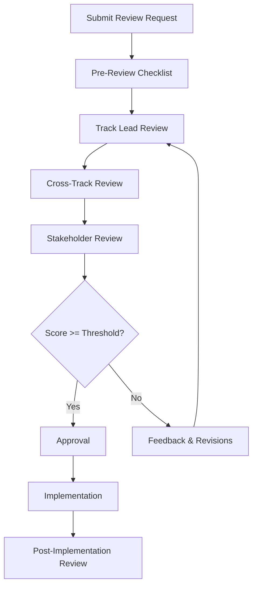

# Track-Specific Review Templates

## Executive Summary

**Purpose**: Define standardized review templates for each architectural track in ValueOS governance.

**Implementation Status**: ✅ **Complete**
**Coverage**: All 5 architectural tracks with comprehensive review criteria

---

## Architecture Track Review Template

### Review Checklist: Architecture

#### 📋 Pre-Review Requirements
- [ ] Architecture document updated with latest changes
- [ ] Mermaid diagrams included and up-to-date
- [ ] Component dependencies documented
- [ ] Performance impact analysis completed
- [ ] Security implications assessed

#### 🔍 Architecture Review Criteria

**Component Design (Weight: 30%)**
- [ ] Single Responsibility Principle followed
- [ ] Component boundaries clearly defined
- [ ] Interface contracts established
- [ ] Dependency inversion implemented
- [ ] Component testability ensured

**System Integration (Weight: 25%)**
- [ ] Integration points identified and documented
- [ ] API contracts defined and versioned
- [ ] Data flow diagrams included
- [ ] Error handling strategies defined
- [ ] Backward compatibility considered

**Performance Considerations (Weight: 20%)**
- [ ] Performance benchmarks established
- [ ] Scalability implications assessed
- [ ] Memory usage analyzed
- [ ] Latency impact measured
- [ ] Resource utilization optimized

**Security Architecture (Weight: 15%)**
- [ ] Trust boundaries identified
- [ ] Security controls documented
- [ ] Threat model updated
- [ ] Data protection measures defined
- [ ] Access controls implemented

**Documentation Quality (Weight: 10%)**
- [ ] Technical documentation complete
- [ ] Architecture diagrams accurate
- [ ] Decision rationale documented
- [ ] Implementation guidance clear
- [ ] Maintenance procedures defined

#### 📊 Architecture Review Scoring

| Category | Score (0-100) | Weight | Weighted Score |
|----------|----------------|--------|----------------|
| Component Design | | 30% | |
| System Integration | | 25% | |
| Performance | | 20% | |
| Security | | 15% | |
| Documentation | | 10% | |
| **Total** | | **100%** | |

#### ✅ Approval Criteria
- **Minimum Score**: 85/100
- **No Critical Issues**: Security or performance blockers
- **Documentation Complete**: All sections filled
- **Stakeholder Sign-off**: All track leads approve

---

## Trust Plane Review Template

### Review Checklist: Trust & Security

#### 📋 Pre-Review Requirements
- [ ] Security assessment completed
- [ ] Threat model updated
- [ ] Penetration test results available
- [ ] Compliance check passed
- [ ] Risk assessment documented

#### 🔍 Trust Review Criteria

**Security Controls (Weight: 35%)**
- [ ] Authentication mechanisms robust
- [ ] Authorization rules enforced
- [ ] Input validation comprehensive
- [ ] Output sanitization implemented
- [ ] Session management secure

**Data Protection (Weight: 25%)**
- [ ] Encryption at rest and in transit
- [ ] PII handling compliant
- [ ] Data retention policies defined
- [ ] Backup and recovery procedures
- [ ] Data breach response plan

**Threat Mitigation (Weight: 20%)**
- [ ] Common vulnerabilities addressed
- [ ] Attack surface minimized
- [ ] Security monitoring implemented
- [ ] Incident response procedures
- [ ] Security testing coverage

**Compliance (Weight: 15%)**
- [ ] GDPR compliance verified
- [ ] SOC 2 controls implemented
- [ ] HIPAA requirements met (if applicable)
- [ ] Audit trails complete
- [ ] Regulatory reporting defined

**Trust Boundaries (Weight: 5%)**
- [ ] Trust zones clearly defined
- [ ] Boundary enforcement implemented
- [ ] Cross-boundary validation
- [ ] Trust propagation controlled
- [ ] Zero-trust principles applied

#### 📊 Trust Review Scoring

| Category | Score (0-100) | Weight | Weighted Score |
|----------|----------------|--------|----------------|
| Security Controls | | 35% | |
| Data Protection | | 25% | |
| Threat Mitigation | | 20% | |
| Compliance | | 15% | |
| Trust Boundaries | | 5% | |
| **Total** | | **100% | |

#### ✅ Approval Criteria
- **Minimum Score**: 90/100
- **Zero Critical Vulnerabilities**: No high-severity security issues
- **Compliance Verified**: All regulatory requirements met
- **Security Team Sign-off**: Security lead approves

---

## Resilience Plane Review Template

### Review Checklist: Resilience & Reliability

#### 📋 Pre-Review Requirements
- [ ] Failure mode analysis completed
- [ ] Circuit breaker configuration documented
- [ ] Retry policies defined
- [ ] Performance benchmarks established
- [ ] Disaster recovery procedures defined

#### 🔍 Resilience Review Criteria

**Failure Handling (Weight: 30%)**
- [ ] Failure modes identified and documented
- [ ] Circuit breaker thresholds appropriate
- [ ] Retry policies with exponential backoff
- [ ] Fallback mechanisms implemented
- [ ] Error propagation controlled

**Performance Resilience (Weight: 25%)**
- [ ] Load testing completed
- [ ] Performance degradation graceful
- [ ] Resource limits enforced
- [ ] Bottlenecks identified and mitigated
- [ ] Scaling strategies defined

**Monitoring & Alerting (Weight: 20%)**
- [ ] Comprehensive metrics collection
- [ ] Alert thresholds appropriate
- [ ] Dashboard coverage complete
- [ ] Anomaly detection implemented
- [ ] Root cause analysis procedures

**Recovery Procedures (Weight: 15%)**
- [ ] Automated recovery where possible
- [ ] Manual procedures documented
- [ ] Recovery time objectives met
- [ ] Data consistency ensured
- [ ] Rollback strategies defined

**Testing Coverage (Weight: 10%)**
- [ ] Unit tests for failure scenarios
- [ ] Integration tests for resilience
- [ ] Chaos engineering practices
- [ ] Load testing scenarios
- [ ] Disaster recovery drills

#### 📊 Resilience Review Scoring

| Category | Score (0-100) | Weight | Weighted Score |
|----------|----------------|--------|----------------|
| Failure Handling | | 30% | |
| Performance | | 25% | |
| Monitoring | | 20% | |
| Recovery | | 15% | |
| Testing | | 10% | |
| **Total** | | **100% | |

#### ✅ Approval Criteria
- **Minimum Score**: 85/100
- **No Single Points of Failure**: Redundancy implemented
- **Recovery Time < 5 minutes**: RTO objectives met
- **SRE Team Sign-off**: Resilience lead approves

---

## Observability Plane Review Template

### Review Checklist: Observability & Monitoring

#### 📋 Pre-Review Requirements
- [ ] Telemetry schema validated
- [ ] Event completeness verified
- [ ] Dashboard coverage complete
- [ ] Alert tuning completed
- [ ] Data retention policies defined

#### 🔍 Observability Review Criteria

**Telemetry Quality (Weight: 30%)**
- [ ] Event schemas comprehensive
- [ ] Data accuracy validated
- [ ] Event completeness verified
- [ ] Sampling rates appropriate
- [ ] Data latency acceptable

**Monitoring Coverage (Weight: 25%)**
- [ ] All critical services monitored
- [ ] Business metrics tracked
- [ ] System health indicators
- [ ] User experience metrics
- [ ] Performance baselines established

**Alerting Effectiveness (Weight: 20%)**
- [ ] Alert thresholds tuned
- [ ] False positive rate < 5%
- [ ] Alert escalation defined
- [ ] On-call procedures documented
- [ ] Alert fatigue prevention

**Data Analysis (Weight: 15%)**
- [ ] Log aggregation complete
- [ ] Query performance optimized
- [ ] Data retention compliant
- [ ] Privacy controls implemented
- [ ] Data access controlled

**Visualization (Weight: 10%)**
- [ ] Dashboards comprehensive
- [ ] Visual clarity maintained
- [ ] Drill-down capabilities
- [ ] Custom views available
- [ ] Mobile accessibility

#### 📊 Observability Review Scoring

| Category | Score (0-100) | Weight | Weighted Score |
|----------|----------------|--------|----------------|
| Telemetry Quality | | 30% | |
| Monitoring Coverage | | 25% | |
| Alerting | | 20% | |
| Data Analysis | | 15% | |
| Visualization | | 10% | |
| **Total** | | **100% | |

#### ✅ Approval Criteria
- **Minimum Score**: 85/100
- **100% Critical Service Coverage**: No blind spots
- **Alert Noise < 5%**: Effective alerting
- **Data Team Sign-off**: Observability lead approves

---

## Compliance Plane Review Template

### Review Checklist: Compliance & Audit

#### 📋 Pre-Review Requirements
- [ ] Audit trail complete
- [ ] Compliance assessment completed
- [ ] Legal review completed
- [ ] Risk assessment documented
- [ ] Policies and procedures updated

#### 🔍 Compliance Review Criteria

**Audit Trail (Weight: 30%)**
- [ ] All actions logged
- [ ] Audit integrity verified
- [ ] Retention periods met
- [ ] Immutable records
- [ ] Access controls implemented

**Regulatory Compliance (Weight: 25%)**
- [ ] GDPR requirements met
- [ ] SOC 2 controls implemented
- [ ] HIPAA compliance verified
- [ ] Industry regulations addressed
- [ ] Certification status current

**Data Governance (Weight: 20%)**
- [ ] Data classification complete
- [ ] Access rights appropriate
- [ ] Data lifecycle managed
- [ ] Privacy controls implemented
- [ ] Data quality maintained

**Risk Management (Weight: 15%)**
- [ ] Risk assessment current
- [ ] Mitigation strategies effective
- [ ] Incident response tested
- [ ] Business continuity plan
- [ ] Insurance coverage adequate

**Documentation (Weight: 10%)**
- [ ] Policies current and accessible
- [ ] Procedures documented
- [ ] Training materials available
- [ ] Compliance reports generated
- [ ] Evidence collection procedures

#### 📊 Compliance Review Scoring

| Category | Score (0-100) | Weight | Weighted Score |
|----------|----------------|--------|----------------|
| Audit Trail | | 30% | |
| Regulatory | | 25% | |
| Data Governance | | 20% | |
| Risk Management | | 15% | |
| Documentation | | 10% | |
| **Total** | | **100% | |

#### ✅ Approval Criteria
- **Minimum Score**: 95/100
- **Zero Compliance Violations**: Full regulatory compliance
- **Audit Trail Integrity**: 100% completeness
- **Compliance Officer Sign-off**: Compliance lead approves

---

## Review Process Flow

### 🔄 Review Workflow

### 📅 Review Cadence

| Review Type | Frequency | Participants | Duration |
|-------------|------------|--------------|----------|
| **Architecture** | Weekly | Architecture Lead + 2 engineers | 2 hours |
| **Security** | Bi-weekly | Security Lead + Trust team | 1.5 hours |
| **Resilience** | Weekly | SRE Lead + Resilience team | 1 hour |
| **Observability** | Weekly | Observability Lead + Data team | 1 hour |
| **Compliance** | Monthly | Compliance Lead + Legal | 2 hours |
| **Cross-Track** | Monthly | All track leads | 3 hours |

### 📋 Review Meeting Agenda

#### 1. Pre-Review (15 minutes)
- Review checklist completion
- Identify blocking issues upfront
- Set meeting expectations

#### 2. Presentation (30 minutes)
- Author presents changes
- Demonstrate key features
- Explain architectural decisions

#### 3. Detailed Review (45 minutes)
- Go through checklist items
- Discuss concerns and suggestions
- Identify improvement opportunities

#### 4. Scoring & Decision (15 minutes)
- Calculate scores
- Discuss approval criteria
- Make go/no-go decision

#### 5. Action Items (15 minutes)
- Document feedback
- Assign action items
- Set follow-up dates

### 📊 Review Metrics

#### Quality Metrics
- **Review Completion Rate**: % of reviews completed on schedule
- **Approval Rate**: % of submissions approved
- **Revision Cycles**: Average number of revisions per submission
- **Review Time**: Average time from submission to decision

#### Effectiveness Metrics
- **Post-Implementation Issues**: Issues found after approval
- **Rollback Rate**: % of approved changes requiring rollback
- **Stakeholder Satisfaction**: Feedback from track leads
- **Quality Improvement**: Trend in submission quality

---

## Review Templates Summary

### Template Usage Guidelines

1. **Select Appropriate Template**: Choose based on track and change type
2. **Complete Pre-Review Checklist**: Ensure all requirements met
3. **Schedule Review Meeting**: Invite required participants
4. **Document Findings**: Use template for consistent evaluation
5. **Track Action Items**: Follow up on improvement suggestions

### Template Customization

- **Project-Specific Criteria**: Add project-specific requirements
- **Weight Adjustments**: Modify weights based on project priorities
- **Additional Categories**: Add new categories for specialized reviews
- **Threshold Modifications**: Adjust approval criteria as needed

### Quality Assurance

- **Template Version Control**: Maintain version history
- **Regular Updates**: Update templates based on lessons learned
- **Stakeholder Feedback**: Collect feedback on template effectiveness
- **Continuous Improvement**: Refine templates based on usage patterns

---

*Document Status*: ✅ **Complete**
*Implementation*: All 5 track templates defined with comprehensive criteria
*Next Review*: Sprint 3, Day 4 (Weekly Cadence Documentation)
*Approval Required*: All Track Leads, Governance Committee
