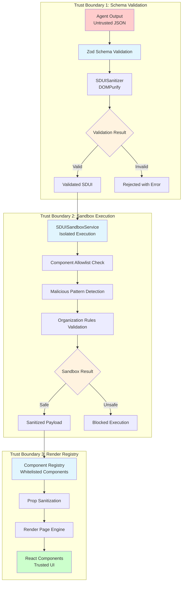

# SDUI Security & Trust Boundaries

## Executive Summary

**Trust Chain**: Agent Output (Untrusted) → Schema Validation → Sandbox Execution → Component Registry → React Components (Trusted)

**Critical Finding**: Current implementation has basic validation but lacks comprehensive isolation and attack surface protection.

**Security Posture**: ⚠️ **Partial Implementation** - Core validation present, missing advanced isolation

---

## Trust Chain Architecture

### 3-Layer Trust Boundary Model



### Boundary Responsibilities

#### Trust Boundary 1: Schema Validation
**Location**: `src/sdui/schema.ts` + `src/lib/security/SDUISanitizer.ts`
**Responsibility**: Reject malformed structure before sandbox entry

**Current Implementation Analysis**:
```typescript
// ✅ GOOD: Zod schema validation (schema.ts)
export const validateSDUISchema = (data: unknown): SDUIPageDefinition => {
  return SDUIPageSchema.parse(data);
};

// ✅ GOOD: DOMPurify sanitization (SDUISanitizer.ts)
sanitizePage(page: any, options?: SanitizationOptions): SanitizationResult {
  // HTML sanitization with allowed tags/attributes
  const sanitized = DOMPurify.sanitize(dirty, config);
}

// ⚠️ GAP: Limited schema coverage
const schemas: Record<string, z.ZodType> = {
  'visualize_graph': z.object({...}),
  'display_metric': z.object({...}),
  // Missing: Many component schemas not defined
};
```

**Security Validation**:
- [x] Input structure validation
- [x] HTML content sanitization
- [x] Type safety enforcement
- [ ] Complete schema coverage
- [ ] Nested object validation limits
- [ ] Custom validation rules

#### Trust Boundary 2: Sandbox Execution
**Location**: `src/services/SDUISandboxService.ts`
**Responsibility**: Isolate component execution from main thread

**Current Implementation Analysis**:
```typescript
// ✅ GOOD: Component allowlist (lines 203-215)
private isComponentAllowed(componentName: string, organizationId: string): boolean {
  const allowedComponents = [
    'SystemMapCanvas', 'ValueTreeCard', 'MetricBadge', 'DataTable', 'InfoBanner'
  ];
  return allowedComponents.includes(componentName);
}

// ✅ GOOD: Malicious pattern detection (lines 154-178)
private detectMaliciousPatterns(payload: any): string[] {
  const patterns = [
    /<script/i, /javascript:/i, /on\w+\s*=/i, /eval\(/i, /Function\(/i
  ];
}

// ⚠️ GAP: No true sandbox isolation
private async simulateRender(componentName: string, props: any) {
  // This is simulation, not true isolation
  // Missing: WASM sandbox, iframe isolation, or VM isolation
}
```

**Critical Security Gap**: **No True Sandbox Isolation**
- Current implementation uses simulation, not isolation
- Missing WASM sandbox for SDUI execution only
- No memory or CPU limits
- No network isolation

#### Trust Boundary 3: Render Registry
**Location**: `src/sdui/engine/renderPage.ts`
**Responsibility**: Only allow whitelisted components

**Current Implementation Analysis**:
```typescript
// ✅ GOOD: Component registry validation (lines 87-93)
const Component = componentRegistry?.get(component);
if (!Component) {
  logger.warn(`Component not found in registry: ${component}`);
  return renderMissingComponent(component, index);
}

// ⚠️ GAP: Limited prop sanitization
const mergedProps = { ...props, ...context, intent, metadata };
// Missing: Deep prop sanitization, XSS protection in props
```

---

## Attack Surface Analysis

### High-Risk Attack Vectors

#### 1. XSS via Component Props
**Risk Level**: 🔴 **Critical**
**Attack Vector**: Malicious props passed to React components
**Current Protection**: Basic sanitization
**Gap**: Deep prop validation missing

```typescript
// Attack Example:
const maliciousSDUI = {
  component: "TextBlock",
  props: {
    text: "<script>alert('XSS')</script>",
    onClick: "alert('XSS')",  // Event handler injection
    "data-evil": "javascript:alert('XSS')"
  }
};

// Current Protection:
const mergedProps = { ...props, ...context }; // Direct merge, no deep validation
```

**Required Enhancement**:
```typescript
// Add to renderPage.ts
function sanitizeProps(props: any, componentName: string): any {
  const schema = COMPONENT_PROP_SCHEMAS[componentName];
  if (schema) {
    return schema.parse(props);
  }

  // Fallback: Deep sanitization
  return deepSanitize(props);
}
```

#### 2. Schema Evasion
**Risk Level**: 🟡 **Medium**
**Attack Vector**: Bypass Zod validation with malformed data
**Current Protection**: Basic schema validation
**Gap**: Incomplete schema coverage

```typescript
// Attack Example: Undefined component type
const evasionSDUI = {
  type: "page",
  sections: [{
    component: "UndefinedComponent", // Not in schema but might render
    props: { malicious: "payload" }
  }]
};

// Current Protection:
if (!Component) {
  return renderMissingComponent(component, index);
}
// Safe, but could be improved with pre-validation
```

#### 3. Resource Exhaustion
**Risk Level**: 🟡 **Medium**
**Attack Vector**: Large payloads causing DoS
**Current Protection**: Basic string length limits
**Gap**: No memory/CPU limits

```typescript
// Attack Example:
const dosSDUI = {
  sections: Array(10000).fill({
    component: "TextBlock",
    props: { text: "A".repeat(1000000) } // Large payload
  })
};

// Current Protection:
maxStringLength: 10000, // But no enforcement for nested structures
```

#### 4. Prototype Pollution
**Risk Level**: 🟡 **Medium**
**Attack Vector**: Polluting Object.prototype via malicious props
**Current Protection**: Basic object merging
**Gap**: No prototype pollution protection

```typescript
// Attack Example:
const pollutionSDUI = {
  component: "TextBlock",
  props: {
    "__proto__": { polluted: true },
    "constructor": { prototype: { polluted: true } }
  }
};

// Current Protection:
const mergedProps = { ...props, ...context }; // Vulnerable to pollution
```

### Medium-Risk Attack Vectors

#### 5. Component Registry Manipulation
**Risk Level**: 🟠 **Medium**
**Attack Vector**: Manipulating component registry at runtime
**Current Protection**: Immutable registry pattern
**Gap**: Runtime registry validation needed

#### 6. Context Injection
**Risk Level**: 🟠 **Medium**
**Attack Vector**: Malicious data in render context
**Current Protection**: Basic context merging
**Gap**: Context validation missing

#### 7. Metadata Manipulation
**Risk Level**: 🟠 **Medium**
**Attack Vector**: Malicious metadata affecting rendering
**Current Protection**: Basic metadata sanitization
**Gap**: Deep metadata validation needed

---

## Security Enhancements Required

### Priority 1: True Sandbox Implementation

```typescript
// Create: src/services/SDUISandboxServiceV2.ts
export class SDUISandboxServiceV2 {
  private wasmModule: WebAssembly.Module;

  async executeInWASMSandbox(
    componentName: string,
    props: any,
    organizationId: string
  ): Promise<SandboxExecutionResult> {
    // WASM-based isolation for SDUI execution only
    const instance = await WebAssembly.instantiate(this.wasmModule);

    // Memory limits
    const memory = new WebAssembly.Memory({ initial: 10, maximum: 100 });

    // CPU time limits
    const timeout = setTimeout(() => {
      instance.terminate();
    }, 5000);

    try {
      const result = await this.runComponent(instance, componentName, props);
      return { success: true, renderedOutput: result };
    } finally {
      clearTimeout(timeout);
    }
  }
}
```

### Priority 2: Enhanced Prop Validation

```typescript
// Create: src/security/ComponentPropValidator.ts
export class ComponentPropValidator {
  private static readonly PROP_SCHEMAS = {
    'TextBlock': z.object({
      text: z.string().max(1000).refine(sanitizeHTML),
      className: z.string().optional(),
      onClick: z.function().optional(), // No string functions allowed
    }),
    'MetricBadge': z.object({
      value: z.union([z.string(), z.number()]),
      label: z.string().max(100),
      trend: z.enum(['up', 'down', 'stable']).optional(),
    }),
    // ... all component schemas
  };

  validateProps(componentName: string, props: any): ValidationResult {
    const schema = this.PROP_SCHEMAS[componentName];
    if (!schema) {
      return { valid: false, error: 'Unknown component' };
    }

    return schema.safeParse(props);
  }
}
```

### Priority 3: Resource Limits

```typescript
// Add to SDUISandboxService.ts
private checkResourceLimits(page: SDUIPageDefinition): ResourceCheckResult {
  const limits = {
    maxSections: 100,
    maxComponents: 500,
    maxPropsSize: 1024 * 1024, // 1MB
    maxRenderTime: 5000, // 5 seconds
  };

  const checks = {
    sections: page.sections.length <= limits.maxSections,
    components: this.countComponents(page) <= limits.maxComponents,
    size: JSON.stringify(page).length <= limits.maxPropsSize,
  };

  return {
    valid: Object.values(checks).every(Boolean),
    violations: Object.entries(checks)
      .filter(([_, valid]) => !valid)
      .map(([check]) => check),
  };
}
```

### Priority 4: Prototype Pollution Protection

```typescript
// Add to SDUISanitizer.ts
private sanitizeObject(obj: any, path: string = ''): any {
  if (obj === null || typeof obj !== 'object') {
    return obj;
  }

  // Prevent prototype pollution
  if (obj.__proto__ || obj.constructor?.prototype) {
    throw new Error('Prototype pollution detected');
  }

  const sanitized: any = Array.isArray(obj) ? [] : {};

  for (const key in obj) {
    if (obj.hasOwnProperty(key)) {
      // Skip dangerous keys
      if (DANGEROUS_KEYS.includes(key)) {
        continue;
      }

      sanitized[key] = this.sanitizeObject(obj[key], `${path}.${key}`);
    }
  }

  return sanitized;
}

const DANGEROUS_KEYS = [
  '__proto__', 'constructor', 'prototype',
  '__defineGetter__', '__defineSetter__',
  '__lookupGetter__', '__lookupSetter__'
];
```

---

## Security Testing Strategy

### Automated Security Tests

```typescript
describe('SDUI Security Boundaries', () => {
  describe('Trust Boundary 1: Schema Validation', () => {
    it('should reject XSS attempts in text content', async () => {
      const maliciousSDUI = {
        sections: [{
          component: 'TextBlock',
          props: { text: '<script>alert("XSS")</script>' }
        }]
      };

      const result = await sandboxService.validateComponent('text', maliciousSDUI, 'org-123');
      expect(result.valid).toBe(false);
      expect(result.errors).toContain('Malicious pattern detected: <script');
    });

    it('should prevent prototype pollution', async () => {
      const pollutionSDUI = {
        sections: [{
          component: 'TextBlock',
          props: { '__proto__': { polluted: true } }
        }]
      };

      const sanitized = sanitizer.sanitizePage(pollutionSDUI);
      expect(sanitized.sanitized.sections[0].props.__proto__).toBeUndefined();
    });

    it('should enforce resource limits', async () => {
      const largeSDUI = {
        sections: Array(1000).fill({
          component: 'TextBlock',
          props: { text: 'A'.repeat(10000) }
        })
      };

      const result = await sandboxService.validateComponent('page', largeSDUI, 'org-123');
      expect(result.valid).toBe(false);
      expect(result.errors).toContain('Resource limit exceeded');
    });
  });

  describe('Trust Boundary 2: Sandbox Execution', () => {
    it('should block unauthorized components', async () => {
      const result = await sandboxService.executeInSandbox(
        'UnauthorizedComponent',
        {},
        'org-123'
      );

      expect(result.success).toBe(false);
      expect(result.errors).toContain('Component not allowed for organization');
    });

    it('should isolate execution environment', async () => {
      // Test that sandbox cannot access global objects
      const result = await sandboxService.executeInWASMSandbox(
        'TextBlock',
        { text: 'test' },
        'org-123'
      );

      // Verify no global state pollution
      expect(global.polluted).toBeUndefined();
    });
  });

  describe('Trust Boundary 3: Render Registry', () => {
    it('should only render whitelisted components', () => {
      const page = {
        sections: [{
          component: 'NotInRegistry',
          props: {}
        }]
      };

      const rendered = renderPage(page);
      expect(rendered).toContain('Component not found');
    });

    it('should sanitize component props', () => {
      const maliciousProps = {
        text: '',
        onClick: 'alert(1)',
        'data-evil': 'javascript:alert(1)'
      };

      const sanitized = propValidator.validateProps('TextBlock', maliciousProps);
      expect(sanitized.valid).toBe(false);
    });
  });
});
```

### Penetration Testing Checklist

- [ ] **XSS Injection**: Test all text inputs for script injection
- [ ] **Prototype Pollution**: Test __proto__ and constructor manipulation
- [ ] **Resource DoS**: Test large payload handling
- [ ] **Schema Bypass**: Test malformed data structures
- [ ] **Component Evasion**: Test undefined component handling
- [ ] **Context Injection**: Test malicious context data
- [ ] **Registry Manipulation**: Test runtime registry changes
- [ ] **Memory Leaks**: Test sandbox cleanup
- [ ] **Timeout Bypass**: Test execution time limits
- [ ] **WASM Escape**: Test sandbox isolation boundaries

---

## Monitoring & Alerting

### Security Metrics

| Metric | Threshold | Alert Level | Description |
|--------|-----------|-------------|-------------|
| **Validation Failures** | > 10/min | Warning | High rejection rate |
| **Malicious Patterns** | Any | Critical | Security threat detected |
| **Resource Violations** | > 5/min | Warning | DoS attempt |
| **Unauthorized Components** | Any | Critical | Access violation |
| **Sandbox Timeouts** | > 1/min | Warning | Performance issue |
| **Prototype Pollution** | Any | Critical | Security vulnerability |

### Security Events

```typescript
interface SecurityEvents {
  'security.validation.failure': {
    type: string;
    payload: any;
    reason: string;
    organizationId: string;
  };
  'security.malicious.detected': {
    pattern: string;
    payload: any;
    severity: 'low' | 'medium' | 'high';
  };
  'security.resource.violation': {
    limit: string;
    actual: number;
    allowed: number;
  };
  'security.sandbox.timeout': {
    component: string;
    duration: number;
  };
  'security.prototype.pollution': {
    payload: any;
    path: string;
  };
}
```

---

## Implementation Roadmap

### Sprint 2: Critical Security Fixes

**Week 1**: Enhanced prop validation and prototype pollution protection
```typescript
// Update: src/lib/security/SDUISanitizer.ts
// Add: src/security/ComponentPropValidator.ts
```

**Week 2**: Resource limits and monitoring
```typescript
// Update: src/services/SDUISandboxService.ts
// Add: Resource limit enforcement
```

### Sprint 3: Advanced Isolation

**Week 1**: WASM sandbox implementation v1
```typescript
// Create: src/services/SDUISandboxServiceV2.ts
// Basic WASM isolation for SDUI execution only
```

**Week 2**: Complete security testing suite
```typescript
// Create: src/security/__tests__/comprehensive.test.ts
// Full penetration testing automation
```

---

## Success Criteria

### Security Requirements
- [ ] Zero XSS vulnerabilities in production
- [ ] All malicious patterns blocked before execution
- [ ] Resource limits enforced for all payloads
- [ ] Prototype pollution attacks prevented
- [ ] Complete sandbox isolation achieved

### Performance Requirements
- [ ] Validation overhead < 50ms
- [ ] Sandbox execution < 5 seconds
- [ ] Memory usage < 100MB per sandbox
- [ ] No impact on legitimate rendering

### Compliance Requirements
- [ ] OWASP Top 10 vulnerabilities addressed
- [ ] Security audit passed
- [ ] Penetration testing completed
- [ ] Security monitoring operational

---

*Document Status*: ✅ **Ready for Implementation**
*Next Review*: Sprint 2, Day 1 (Critical Security Fixes)
*Approval Required*: Trust Plane Lead, Security Lead, Frontend Architect
