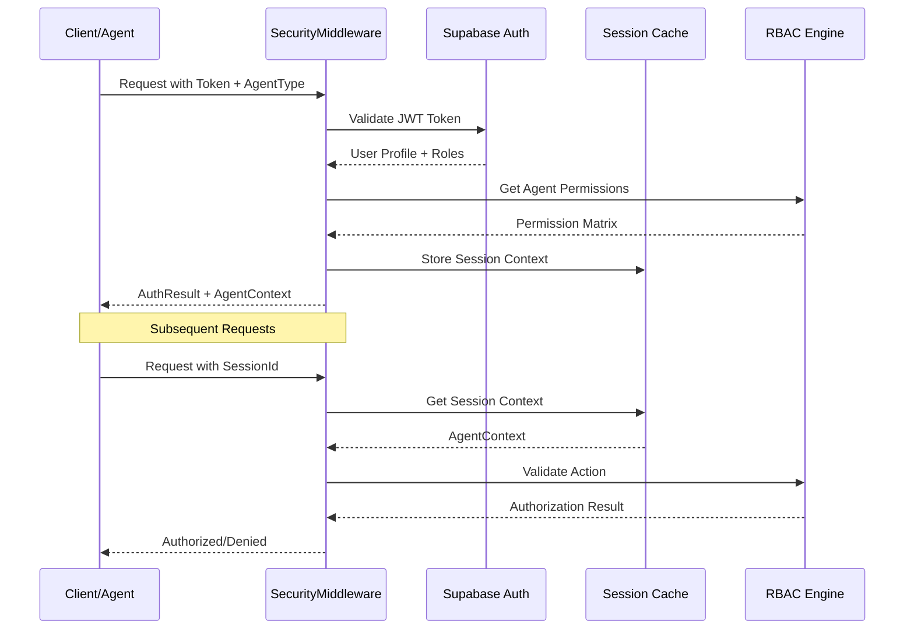

# Authentication & RBAC Flow Documentation

## Executive Summary

**Purpose**: Document authentication flow and Role-Based Access Control (RBAC) for ValueOS multi-agent system.

**Critical Authority Rule**: Only governance-class agents may mutate WorkflowState directly; analytical agents must emit proposals.

**Implementation Status**: ✅ **SecurityMiddleware.ts implemented** with full RBAC matrix

---

## Authentication Flow Architecture

### Flow Diagram



### Authentication Process

#### Step 1: Token Validation
```typescript
// SecurityMiddleware.authenticate()
const { data: { user }, error } = await this.supabase.auth.getUser(token);

if (error || !user) {
  return {
    authenticated: false,
    error: 'Invalid authentication token'
  };
}
```

#### Step 2: Profile & Role Resolution
```typescript
// Get user roles and tenant
const { data: profile } = await this.supabase
  .from('user_profiles')
  .select('roles, tenant_id')
  .eq('user_id', user.id)
  .single();
```

#### Step 3: Permission Matrix Application
```typescript
// Apply agent-specific permissions
const permissions = AGENT_PERMISSIONS[agentType] || [];
```

#### Step 4: Session Context Creation
```typescript
const context: AgentContext = {
  agentId: `${agentType}-${user.id}`,
  agentType,
  sessionId: sessionId || uuidv4(),
  userId: user.id,
  tenantId,
  permissions
};
```

---

## RBAC Authority Matrix

### Agent Type Permissions

| Agent Type | Workflow State | Agent Memory | Canvas State | SDUI Render | System Config |
|------------|----------------|--------------|--------------|-------------|---------------|
| **Governance** | Read/Write/Delete | Read/Write/Approve/Reject | - | - | Read/Write |
| **Analytical** | Read/Propose | Read/Propose | Read | Execute | - |
| **Execution** | Read | Read | Execute | Execute | - |
| **UI** | Read (session) | - | Read/Write (session) | Execute (session) | - |
| **System** | All | All | All | All | All |

### Permission Scope Hierarchy

```
Global (system-wide)
  ↓
Tenant (organization-wide)
  ↓
User (individual user)
  ↓
Session (single request session)
```

### Authority Rules Enforcement

#### Rule 1: WorkflowState Mutation
```typescript
private enforceWorkflowStateAuthority(agentContext: AgentContext): boolean {
  const isGovernanceAgent = agentContext.agentType === AgentType.GOVERNANCE ||
                            agentContext.agentType === AgentType.SYSTEM;

  if (!isGovernanceAgent) {
    logger.warn('WorkflowState mutation denied - non-governance agent', {
      agentId: agentContext.agentId,
      agentType: agentContext.agentType,
      rule: 'Only governance agents may mutate WorkflowState directly'
    });
    return false;
  }

  return true;
}
```

#### Rule 2: Governance Actions
```typescript
private enforceGovernanceAuthority(agentContext: AgentContext): boolean {
  const isGovernanceAgent = agentContext.agentType === AgentType.GOVERNANCE ||
                            agentContext.agentType === AgentType.SYSTEM;

  if (!isGovernanceAgent) {
    logger.warn('Governance action denied - non-governance agent', {
      agentId: agentContext.agentId,
      agentType: agentContext.agentType,
      rule: 'Only governance agents may approve/reject proposals'
    });
    return false;
  }

  return true;
}
```

---

## Agent Type Definitions

### Governance Agent
**Purpose**: System oversight, state management, proposal approval
**Permissions**:
- ✅ WorkflowState: Read, Write, Delete
- ✅ Agent Memory: Read, Write, Approve, Reject
- ✅ System Config: Read, Write
- ❌ Canvas State: No direct access
- ❌ SDUI Render: No direct access

**Use Cases**:
- Workflow state transitions
- Agent memory management
- System configuration changes
- Proposal approval/rejection

### Analytical Agent
**Purpose**: Data analysis, insight generation, proposal creation
**Permissions**:
- ✅ WorkflowState: Read, Propose
- ✅ Agent Memory: Read, Propose
- ✅ Canvas State: Read
- ✅ SDUI Render: Execute
- ❌ System Config: No access

**Use Cases**:
- Value analysis
- KPI calculations
- Hypothesis generation
- SDUI content creation

### Execution Agent
**Purpose**: Task execution, workflow automation
**Permissions**:
- ✅ WorkflowState: Read
- ✅ Agent Memory: Read
- ✅ Canvas State: Execute
- ✅ SDUI Render: Execute
- ❌ System Config: No access

**Use Cases**:
- Automated workflows
- Canvas manipulation
- SDUI rendering
- Task execution

### UI Agent
**Purpose**: User interface management, interaction handling
**Permissions**:
- ✅ WorkflowState: Read (session scope)
- ✅ Canvas State: Read, Write (session scope)
- ✅ SDUI Render: Execute (session scope)
- ❌ Agent Memory: No access
- ❌ System Config: No access

**Use Cases**:
- User interactions
- Canvas state management
- SDUI rendering
- Session management

### System Agent
**Purpose**: Internal system operations, maintenance
**Permissions**:
- ✅ All resources: Full access
- ✅ All scopes: Global authority

**Use Cases**:
- System maintenance
- Internal operations
- Emergency overrides
- System diagnostics

---

## Resource Types & Actions

### WorkflowState Resource
**Description**: Core workflow state and progress tracking
**Actions**:
- `read`: View workflow state
- `write`: Modify workflow state (governance only)
- `delete`: Remove workflow state (governance only)
- `propose`: Suggest state changes (analytical only)

### Agent Memory Resource
**Description**: Long-term agent memory and context
**Actions**:
- `read`: Access stored memories
- `write`: Store new memories (governance only)
- `approve`: Approve memory proposals (governance only)
- `reject`: Reject memory proposals (governance only)
- `propose`: Suggest memory additions (analytical only)

### Canvas State Resource
**Description**: Ephemeral canvas UI state
**Actions**:
- `read`: View canvas state
- `write`: Modify canvas state (UI only)
- `execute`: Execute canvas operations (execution, UI)

### SDUI Render Resource
**Description**: SDUI component rendering
**Actions**:
- `execute`: Render SDUI components (analytical, execution, UI)

### System Config Resource
**Description**: System configuration and settings
**Actions**:
- `read`: View system configuration
- `write`: Modify system configuration (governance, system only)

---

## Security Event Logging

### Event Types
```typescript
interface SecurityEvents {
  'auth.success': { agentId: string; agentType: AgentType; userId: string };
  'auth.failure': { reason: string; token?: string };
  'authz.granted': { agentId: string; resource: ResourceType; action: Action };
  'authz.denied': { agentId: string; resource: ResourceType; action: Action; reason: string };
  'authority.violation': { agentId: string; agentType: AgentType; rule: string };
  'session.created': { sessionId: string; agentId: string };
  'session.expired': { sessionId: string; agentId: string };
}
```

### Logging Implementation
```typescript
logSecurityEvent(
  event: string,
  context: AgentContext,
  resource?: ResourceType,
  action?: Action,
  success?: boolean
): void {
  logger.info('Security Event', {
    event,
    agentId: context.agentId,
    agentType: context.agentType,
    userId: context.userId,
    tenantId: context.tenantId,
    sessionId: context.sessionId,
    resource,
    action,
    success,
    timestamp: new Date().toISOString()
  });
}
```

---

## Integration Points

### With AgentChatService
```typescript
// Before processing agent request
const authResult = await security.validateAgentRequest(
  token,
  AgentType.ANALYTICAL,
  ResourceType.WORKFLOW_STATE,
  Action.READ,
  tenantId,
  sessionId
);

if (!authResult.authorized) {
  throw new Error('Agent request not authorized');
}
```

### With WorkflowStateService
```typescript
// Before state mutation
const authorized = security.authorize(
  agentContext,
  ResourceType.WORKFLOW_STATE,
  Action.WRITE,
  tenantId
);

if (!authorized) {
  throw new Error('WorkflowState mutation not authorized');
}
```

### With UnifiedAgentOrchestrator
```typescript
// Before agent execution
const validation = await security.validateAgentRequest(
  request.token,
  request.agentType,
  ResourceType.AGENT_MEMORY,
  Action.READ,
  request.tenantId,
  request.sessionId
);

if (!validation.authorized) {
  return { error: 'Agent execution not authorized' };
}
```

---

## Security Monitoring

### Key Metrics
| Metric | Threshold | Alert Level | Description |
|--------|-----------|-------------|-------------|
| **Auth Failures** | > 10/min | Warning | High authentication failure rate |
| **AuthZ Denials** | > 5/min | Critical | Authorization violations |
| **Authority Violations** | Any | Critical | Security policy breaches |
| **Session Creation Rate** | > 100/min | Warning | Potential abuse |
| **Expired Sessions** | > 50/min | Info | Normal session cleanup |

### Alert Conditions
```typescript
// Authority violation alert
if (event === 'authority.violation') {
  alertSecurityTeam({
    severity: 'critical',
    message: `Authority rule violated by ${agentType}`,
    details: { agentId, rule, resource, action }
  });
}

// High auth failure rate
if (authFailureRate > 10) {
  alertSecurityTeam({
    severity: 'warning',
    message: 'High authentication failure rate detected',
    details: { rate: authFailureRate, timeWindow: '1 minute' }
  });
}
```

---

## Testing Strategy

### Unit Tests
```typescript
describe('SecurityMiddleware', () => {
  describe('Authentication', () => {
    it('should authenticate valid token');
    it('should reject invalid token');
    it('should handle expired token');
    it('should create session context');
  });

  describe('Authorization', () => {
    it('should grant access with proper permissions');
    it('should deny access without permissions');
    it('should enforce workflow state authority rules');
    it('should enforce governance authority rules');
  });

  describe('RBAC Matrix', () => {
    it('should apply correct permissions for each agent type');
    it('should respect scope hierarchy');
    it('should validate resource-action combinations');
  });
});
```

### Integration Tests
```typescript
describe('Security Integration', () => {
  it('should secure AgentChatService requests');
  it('should protect WorkflowState mutations');
  it('should enforce agent authority rules');
  it('should log security events correctly');
});
```

### Security Tests
```typescript
describe('Security Tests', () => {
  it('should prevent privilege escalation');
  it('should detect token manipulation');
  it('should handle session hijacking attempts');
  it('should prevent cross-tenant access');
});
```

---

## Implementation Checklist

### ✅ Completed
- [x] SecurityMiddleware.ts implementation
- [x] RBAC permission matrix
- [x] Authority rule enforcement
- [x] Session management
- [x] Security event logging

### 🔄 In Progress
- [ ] Integration with existing services
- [ ] Security monitoring setup
- [ ] Test suite implementation

### 📋 Planned
- [ ] Performance optimization
- [ ] Advanced threat detection
- [ ] Audit log retention policies

---

*Document Status*: ✅ **Complete**
*Implementation*: SecurityMiddleware.ts deployed
*Next Review*: Sprint 2, Week 1 (Integration Testing)
*Approval Required*: Trust Plane Lead, Security Lead
