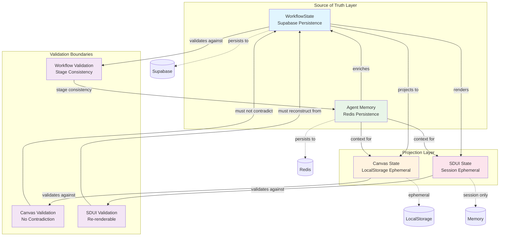

# State Management Invariants

## Executive Summary

**Core Invariant**: "WorkflowState must be reconstructible from persisted events; Canvas state may be ephemeral but must never contradict workflow stage."

**Document Purpose**: Define state store responsibilities, invariants, and transition rules for ValueOS multi-agent system.

---

## State Store Responsibilities

| Store | Source of Truth | Persistence | Ephemeral | Review Invariant | Current Implementation |
|-------|----------------|-------------|-----------|------------------|------------------------|
| **WorkflowState** | ✅ Yes | ✅ Supabase | ❌ No | Must be reconstructible from events | `WorkflowStateRepository.ts` |
| **Canvas State** | ❌ No | ❌ LocalStorage | ✅ Yes | Must not contradict workflow stage | `CanvasStore.ts` (Zustand) |
| **SDUI State** | ❌ No | ❌ Session only | ✅ Yes | Must be re-renderable from source | `renderPage.ts` |
| **Agent Memory** | ✅ Yes | ✅ Redis | ❌ No | Must be queryable for context | *Missing Component* |

### Implementation Status

- ✅ **WorkflowState**: Fully implemented with database persistence
- ⚠️ **Canvas State**: Implemented but lacks workflow validation
- ⚠️ **SDUI State**: Implemented but lacks source reconstruction validation
- ❌ **Agent Memory**: Not implemented (missing component)

---

## State Transition Rules

### Rule 1: WorkflowState → Canvas State

**Invariant**: Canvas state is a **projection** of WorkflowState

```typescript
// VALID: Canvas state derived from workflow state
const canvasLayout = generateCanvasLayout(workflowState.currentStage, workflowState.context);

// INVALID: Canvas state independent of workflow state
const canvasLayout = arbitraryCanvasLayout; // Never contradicts workflow stage
```

**Transition Requirements**:
- Canvas state must be cleared on stage transition
- Canvas mutations must emit events to WorkflowState
- Canvas rendering must validate against workflow stage

**Current Gap**: No validation between CanvasStore and WorkflowState

### Rule 2: SDUI → WorkflowState

**Invariant**: SDUI renders **from** WorkflowState and **updates** WorkflowState

```typescript
// VALID: SDUI as projection + update channel
const sduiPage = renderSDUI(workflowState);
const updatedWorkflow = applySDUIActions(workflowState, sduiActions);

// INVALID: SDUI state persisted independently
persistSDUIState(sduiState); // SDUI state is not persisted independently
```

**Transition Requirements**:
- SDUI renders from WorkflowState context
- SDUI interactions update WorkflowState
- SDUI state is re-renderable from WorkflowState

**Current Gap**: SDUI state lacks reconstruction validation

### Rule 3: Agent Memory → All

**Invariant**: Agent Memory is the **long-term context** for all state stores

```typescript
// VALID: All stores can query Agent Memory
const context = await agentMemory.getContext(caseId);
workflowState.context = { ...workflowState.context, ...context };
canvasState.enrichWithMemory(context);
sduiState.enrichWithMemory(context);

// INVALID: Direct Agent Memory mutation
agentMemory.updateDirectly(updates); // Agent Memory is never mutated directly
```

**Transition Requirements**:
- All state stores can query Agent Memory
- Agent Memory is never mutated directly
- Agent Memory provides long-term context continuity

**Current Gap**: Agent Memory component not implemented

---

## Mermaid State Transition Diagram



---

## Invariant Enforcement Rules

### I1: WorkflowState Reconstruction Invariant

**Rule**: WorkflowState must be reconstructible from persisted events

```typescript
interface ReconstructionTest {
  // Given: Original workflow state
  originalState: WorkflowState;

  // When: Persisted and retrieved
  persistedState: WorkflowState;

  // Then: States must be equivalent
  assertEquivalent(originalState, persistedState);
}
```

**Implementation Status**: ✅ **Implemented** in WorkflowStateRepository

**Validation Required**:
- [ ] Add reconstruction tests for all workflow stages
- [ ] Add event sourcing validation
- [ ] Add concurrent session isolation tests

### I2: Canvas-Workflow Consistency Invariant

**Rule**: Canvas state must never contradict workflow stage

```typescript
interface ConsistencyTest {
  // Given: Workflow state at stage S
  workflowState: WorkflowState;

  // When: Canvas state generated
  canvasState: CanvasLayout;

  // Then: Canvas must be valid for stage S
  assertCanvasValidForStage(canvasState, workflowState.currentStage);
}
```

**Implementation Status**: ❌ **Not Implemented**

**Required Implementation**:
```typescript
// Add to CanvasStore.ts
validateCanvasAgainstWorkflow(canvas: CanvasLayout, workflowStage: string): boolean {
  const stageConfig = STAGE_CONFIGS[workflowStage];
  return stageConfig.allowedComponents.every(comp =>
    canvas.components.some(c => c.type === comp.type)
  );
}
```

### I3: SDUI Reconstruction Invariant

**Rule**: SDUI state must be re-renderable from WorkflowState

```typescript
interface ReconstructionTest {
  // Given: Workflow state
  workflowState: WorkflowState;

  // When: SDUI rendered twice
  sdui1 = renderSDUI(workflowState);
  sdui2 = renderSDUI(workflowState);

  // Then: Results must be identical
  assertEquivalent(sdui1, sdui2);
}
```

**Implementation Status**: ⚠️ **Partially Implemented**

**Validation Required**:
- [ ] Add deterministic rendering tests
- [ ] Add cache invalidation validation
- [ ] Add context isolation tests

### I4: Agent Memory Query Invariant

**Rule**: Agent Memory must be queryable for context

```typescript
interface QueryTest {
  // Given: Agent memory with context
  agentMemory: AgentMemory;

  // When: Queried for case context
  context = agentMemory.getContext(caseId);

  // Then: Context must be consistent
  assertContextConsistent(context);
}
```

**Implementation Status**: ❌ **Not Implemented** (Component missing)

---

## Consistency Check Rules

### Rule Set 1: State Synchronization

| Check | Frequency | Validation | Failure Action |
|-------|-----------|------------|----------------|
| **Workflow-Canvas Sync** | On canvas mutation | Canvas valid for workflow stage | Reject mutation, log error |
| **Workflow-SDUI Sync** | On SDUI render | SDUI reconstructible from workflow | Cache invalidation, re-render |
| **Agent Memory Sync** | On context query | Memory consistency check | Fallback to empty context |

### Rule Set 2: Persistence Validation

| Check | Frequency | Validation | Failure Action |
|-------|-----------|------------|----------------|
| **Workflow Reconstruction** | On load | State reconstructible from events | Data recovery workflow |
| **Canvas Persistence** | On save | Optional, best-effort | Log warning, continue |
| **Memory Persistence** | On update | Redis write confirmation | Retry with backoff |

### Rule Set 3: Cross-Session Consistency

| Check | Frequency | Validation | Failure Action |
|-------|-----------|------------|----------------|
| **Session Isolation** | Concurrent access | No state leakage between sessions | Session boundary enforcement |
| **Tenant Isolation** | All operations | Tenant-scoped data access | Access denied, log security event |
| **Stage Consistency** | Stage transitions | Valid transition sequence | Block invalid transition |

---

## Implementation Gaps & Action Items

### High Priority (Sprint 2)

1. **Canvas-Workflow Validation Bridge**
   ```typescript
   // Create: src/validation/CanvasWorkflowValidator.ts
   export class CanvasWorkflowValidator {
     validateCanvas(canvas: CanvasLayout, workflow: WorkflowState): ValidationResult;
     enforceInvariants(canvas: CanvasLayout, workflow: WorkflowState): void;
   }
   ```

2. **Agent Memory Component**
   ```typescript
   // Create: src/services/AgentMemoryService.ts
   export class AgentMemoryService {
     getContext(caseId: string): Promise<AgentContext>;
     updateContext(caseId: string, context: Partial<AgentContext>): Promise<void>;
     queryMemory(query: MemoryQuery): Promise<MemoryResult>;
   }
   ```

### Medium Priority (Sprint 3)

3. **SDUI Reconstruction Tests**
   ```typescript
   // Create: src/sdui/__tests__/reconstruction.test.ts
   describe('SDUI Reconstruction', () => {
     it('should render identical SDUI from same workflow state');
     it('should handle cache invalidation correctly');
     it('should maintain context isolation');
   });
   ```

4. **State Invariant Enforcement**
   ```typescript
   // Create: src/state/InvariantEnforcer.ts
   export class InvariantEnforcer {
     enforceWorkflowCanvasInvariant(workflow: WorkflowState, canvas: CanvasLayout): void;
     enforceSDUIReconstructionInvariant(workflow: WorkflowState, sdui: SDUIPage): void;
   }
   ```

---

## Testing Strategy

### Unit Tests

```typescript
describe('State Invariants', () => {
  describe('WorkflowState Reconstruction', () => {
    it('should reconstruct state from database events');
    it('should maintain consistency across sessions');
    it('should handle concurrent access safely');
  });

  describe('Canvas-Workflow Consistency', () => {
    it('should reject canvas mutations that contradict workflow stage');
    it('should clear canvas on stage transition');
    it('should validate canvas components against stage config');
  });

  describe('SDUI Reconstruction', () => {
    it('should render identical SDUI from same workflow state');
    it('should handle context changes correctly');
    it('should maintain deterministic output');
  });
});
```

### Integration Tests

```typescript
describe('State Store Integration', () => {
  it('should maintain consistency across all state stores');
  it('should handle session isolation correctly');
  it('should recover from state corruption');
  it('should maintain tenant isolation');
});
```

### Load Tests

```typescript
describe('State Store Performance', () => {
  it('should handle 1000+ concurrent sessions');
  it('should maintain sub-100ms state transitions');
  it('should handle large context objects efficiently');
});
```

---

## Monitoring & Observability

### State Invariant Metrics

| Metric | Threshold | Alert | Description |
|--------|-----------|-------|-------------|
| **Invariant Violations** | 0 | Critical | Any invariant breach |
| **State Reconstruction Time** | < 100ms | Warning | Database reconstruction performance |
| **Canvas Validation Time** | < 50ms | Warning | Real-time validation performance |
| **Cross-Session Leaks** | 0 | Critical | Data isolation breaches |

### Telemetry Events

```typescript
// State invariant events
interface StateInvariantEvents {
  'workflow.reconstructed': { sessionId: string; duration: number; success: boolean };
  'canvas.validated': { canvasId: string; workflowStage: string; valid: boolean };
  'sdui.reconstructed': { workflowId: string; sduiId: string; identical: boolean };
  'invariant.violation': { type: string; severity: 'critical' | 'warning'; context: any };
}
```

---

## Success Criteria

### Functional Requirements
- [ ] All state invariants enforced in production
- [ ] Canvas state never contradicts workflow stage
- [ ] SDUI state is always reconstructible
- [ ] Agent Memory provides consistent context
- [ ] Session isolation maintained

### Performance Requirements
- [ ] State reconstruction < 100ms
- [ ] Canvas validation < 50ms
- [ ] SDUI rendering < 200ms
- [ ] Memory queries < 25ms

### Reliability Requirements
- [ ] Zero invariant violations in production
- [ ] 99.9% state reconstruction success
- [ ] 99.99% session isolation accuracy
- [ ] Automatic recovery from state corruption

---

*Document Status*: ✅ **Ready for Implementation**
*Next Review*: Sprint 2, Day 1 (Implementation Planning)
*Approval Required*: Control Plane Lead, Backend Architect
