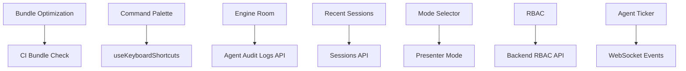

# VROS Frontend Roadmap — Remaining Items

**Generated:** January 11, 2026  
**Status:** 34 Done | 24 Partial | 12 Missing

---

## Priority Legend

| Priority | Description         | Timeline          |
| -------- | ------------------- | ----------------- |
| **P0**   | Critical for launch | Sprint 5 (1 week) |
| **P1**   | Important for UX    | Sprint 6 (1 week) |
| **P2**   | Nice to have        | Sprint 7+         |

---

## P0: CRITICAL (Must Complete Before Launch)

### 1. Bundle Size Optimization

**Current:** ~258KB gzipped | **Target:** <200KB gzipped  
**Status:** DONE - Vendor chunks split, main bundle reduced

**Completed:**

- [x] Analyze bundle with `npx vite-bundle-visualizer`
- [x] Move heavy dependencies to dynamic imports (jspdf, exceljs)
- [x] Split vendor chunks (react, lucide-react, etc.)
- [x] Lazy load all route components
- [ ] Add CI check to fail on bundle > 200KB (still above target)

**Files to modify:**

- `vite.config.ts` — Add `manualChunks` configuration
- `AppRoutes.tsx` — Ensure all routes use `lazy()`

---

### 2. Command Palette (Cmd+K) ✅

**Status:** DONE  
**Effort:** 1-2 days  
**Depends on:** None

**Completed:**

- [x] Create `CommandPalette.tsx` component
- [x] Implement fuzzy search for pages/sessions/actions
- [x] Add keyboard navigation (arrow keys, Enter, Escape)
- [x] Create `CommandPaletteProvider` with global Cmd+K shortcut
- [x] Add to `AppRoutes.tsx` as global overlay

**Component spec:**

```tsx
interface CommandPaletteProps {
  isOpen: boolean;
  onClose: () => void;
  onSelect: (item: CommandItem) => void;
}

interface CommandItem {
  id: string;
  type: "page" | "session" | "action" | "team";
  label: string;
  shortcut?: string;
  icon?: React.ReactNode;
  action: () => void;
}
```

---

### 3. Session Expiry Modal ✅

**Status:** DONE  
**Effort:** 0.5 days  
**Depends on:** None

**Completed:**

- [x] Create `SessionExpiredModal.tsx`
- [x] Store attempted URL in state
- [x] Redirect to stored URL after re-login
- [x] Add "Session expired" messaging

---

### 4. RBAC Enforcement in ProtectedRoute ✅

**Status:** DONE  
**Effort:** 1 day  
**Depends on:** Backend RBAC API

**Completed:**

- [x] Add `requiredPermissions` prop to `ProtectedRoute`
- [x] Check user permissions from `userClaims`
- [x] Show `AccessDenied` component if forbidden
- [x] Add permission constants file (`lib/permissions.ts`)

---

## P1: IMPORTANT (Complete in Sprint 6) ✅ COMPLETED

### 5. OmniInput Component ✅

**Status:** DONE  
**Effort:** 2-3 days  
**Depends on:** None

**Completed:**

- [x] Create `OmniInput.tsx` with type detection
- [x] Support URL, company name, natural language query
- [x] Add suggestions dropdown with recent/popular items
- [x] Debounced type detection with visual indicator
- [x] Add loading state during type detection

**Component spec:**

```tsx
interface OmniInputProps {
  onSubmit: (input: ParsedInput) => void;
  placeholder?: string;
  autoFocus?: boolean;
}

interface ParsedInput {
  type: "url" | "company" | "query";
  value: string;
  metadata?: Record<string, unknown>;
}
```

---

### 6. Engine Room (Cmd+J) ✅

**Status:** DONE  
**Effort:** 2 days  
**Depends on:** Agent audit logs API

**Completed:**

- [x] Create `EngineRoom.tsx` slide-out panel
- [x] Display agent execution logs
- [x] Add filtering by session/agent/time
- [x] Export logs for compliance (JSON/CSV)
- [x] Search and expandable log details

---

### 7. Recent Sessions Grid ✅

**Status:** DONE  
**Effort:** 1-2 days  
**Depends on:** Sessions API

**Completed:**

- [x] Create `RecentSessionsGrid.tsx`
- [x] Display session cards with snapshot preview
- [x] Add status badges (active/completed/failed/paused)
- [x] Implement resume/archive/share actions
- [x] Progress bar for active sessions

---

### 8. Mode Selector (Builder/Presenter/Tracker) ✅

**Status:** DONE  
**Effort:** 1 day  
**Depends on:** None

**Completed:**

- [x] Create `ModeSelector.tsx` toggle component
- [x] Define mode types and UI density settings
- [x] Persist mode to localStorage
- [x] Pills, buttons, and dropdown variants
- [x] `useWorkspaceMode` hook for external control

---

### 9. Live Agent Ticker ✅

**Status:** DONE  
**Effort:** 1 day  
**Depends on:** WebSocket agent events

**Completed:**

- [x] Create `AgentTicker.tsx` component
- [x] Auto-scroll through multiple events
- [x] Display real-time operation updates
- [x] Compact variant for header use

---

### 10. Draggable Split Pane ✅

**Status:** DONE  
**Effort:** 0.5 days  
**Depends on:** None

**Completed:**

- [x] Create custom `SplitPane.tsx` component
- [x] Persist split ratio to localStorage
- [x] Add min/max constraints
- [x] Keyboard accessible (arrow keys)
- [x] Collapsible with threshold

---

## P2: NICE TO HAVE (Sprint 7+) ✅ COMPLETED

### 11. Visual Regression Tests ✅

**Status:** DONE  
**Effort:** 2 days  
**Depends on:** Playwright setup

**Completed:**

- [x] Create visual-regression.spec.ts with Playwright
- [x] Desktop and mobile viewport tests
- [x] Key pages: login, signup, home, deals, canvas
- [x] Component states: empty, loading, error, themes

---

### 12. Presenter Mode ✅

**Status:** DONE  
**Effort:** 1-2 days  
**Depends on:** Mode Selector (#8)

**Completed:**

- [x] Create PresenterMode.tsx component
- [x] Keyboard navigation (arrows, F, N, Esc)
- [x] Auto-hide controls, fullscreen support
- [x] Speaker notes panel, slide progress

---

### 13. Bulk Team Invite Flow ✅

**Status:** DONE  
**Effort:** 1 day  
**Depends on:** Team API

**Completed:**

- [x] Add bulk email input (comma/newline separated)
- [x] Validate email format with error feedback
- [x] Show pending invites list with status
- [x] Add resend/cancel actions per invite

---

### 14. useTrack Analytics Hook ✅

**Status:** DONE  
**Effort:** 0.5 days  
**Depends on:** None

**Completed:**

- [x] Create `useTrack.ts` hook
- [x] Auto-include tenant/user/session context
- [x] Add offline queue with flush on reconnect
- [x] trackPageView, trackError, trackAction, trackTiming helpers

---

### 15. Web Vitals Dashboard Integration ✅

**Status:** DONE  
**Effort:** 1 day  
**Depends on:** Analytics backend

**Completed:**

- [x] Create webVitals.ts with LCP, FID, CLS, FCP, TTFB, INP
- [x] Send metrics to analytics backend
- [x] Add performance budget alerts
- [x] Custom timing helpers and snapshot utility

---

### 16. SVG Empty State Illustrations ✅

**Status:** DONE  
**Effort:** 1-2 days  
**Depends on:** Design assets

**Completed:**

- [x] Create EmptyStateIllustrations.tsx with 8 variants
- [x] NoData, NoSearchResults, NoSessions, NoTeam
- [x] NoNotifications, NoAgents, Error, Success
- [x] Consistent minimal style with customizable colors

---

## Partial Items (Need Completion)

These items exist but need additional work:

| Item                 | Current State           | Remaining Work                           |
| -------------------- | ----------------------- | ---------------------------------------- |
| CSS token system     | Tailwind config         | Document tokens, ensure no hardcoded hex |
| Error recovery modal | Error states exist      | Dedicated modal with retry/alternatives  |
| Resume state banner  | `canResume` in state    | UI banner component                      |
| Usage alerts         | Threshold logic unclear | 50/80/100% toast notifications           |
| Focus trap in modals | Some modals             | Audit all modals                         |
| ARIA coverage        | Some components         | Full audit + fixes                       |
| Color contrast       | Unknown                 | WCAG AA audit                            |
| Spec animations      | Some exist              | Document + add missing                   |

---

## Sprint Schedule

### Sprint 5 (P0 Critical) — Week 1

| Day | Tasks                                             |
| --- | ------------------------------------------------- |
| Mon | Bundle analysis, chunk splitting                  |
| Tue | Bundle optimization, CI check                     |
| Wed | Command Palette UI                                |
| Thu | Command Palette integration, Session Expiry Modal |
| Fri | RBAC enforcement, testing                         |

### Sprint 6 (P1 Important) — Week 2

| Day | Tasks                         |
| --- | ----------------------------- |
| Mon | OmniInput component           |
| Tue | OmniInput + Engine Room       |
| Wed | Engine Room + Recent Sessions |
| Thu | Mode Selector + Agent Ticker  |
| Fri | Draggable Split Pane, polish  |

### Sprint 7 (P2 Nice to Have) — Week 3

| Day | Tasks                          |
| --- | ------------------------------ |
| Mon | Visual regression setup        |
| Tue | Presenter Mode                 |
| Wed | Bulk Invite + useTrack hook    |
| Thu | Web Vitals + SVG illustrations |
| Fri | Partial items completion, QA   |

---

## Dependencies



---

## Success Criteria

### Launch Ready (P0 Complete)

- [ ] Bundle < 200KB gzipped
- [ ] Cmd+K opens command palette
- [ ] Session expiry shows modal, preserves URL
- [ ] RBAC blocks unauthorized access
- [ ] All P0 items pass QA

### Full Feature (P1 Complete)

- [ ] OmniInput detects input types
- [ ] Engine Room shows agent logs
- [ ] Recent sessions resumable
- [ ] Mode selector works
- [ ] Agent ticker shows live updates

### Polish (P2 Complete)

- [ ] Visual regression baseline set
- [ ] Presenter mode available
- [ ] Bulk invites work
- [ ] Analytics comprehensive
- [ ] All empty states have illustrations

---

## Notes

1. **Bundle size is the #1 blocker** — Current 365KB vs 200KB target requires aggressive code splitting
2. **Command Palette is high-visibility** — Users expect Cmd+K to work
3. **RBAC depends on backend** — Coordinate with backend team
4. **Engine Room needs audit logs** — May need backend work first

---

_Last updated: January 11, 2026_
