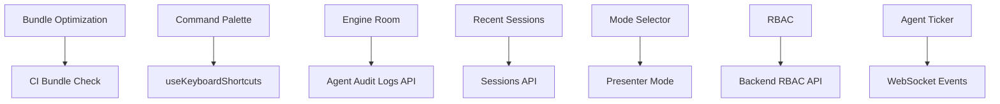

# VROS Frontend Roadmap — Remaining Items

**Generated:** January 11, 2026  
**Status:** 34 Done | 24 Partial | 12 Missing

---

## Priority Legend

| Priority | Description         | Timeline          |
| -------- | ------------------- | ----------------- |
| **P0**   | Critical for launch | Sprint 5 (1 week) |
| **P1**   | Important for UX    | Sprint 6 (1 week) |
| **P2**   | Nice to have        | Sprint 7+         |

---

## P0: CRITICAL (Must Complete Before Launch)

### 1. Bundle Size Optimization

**Current:** ~365KB gzipped | **Target:** <200KB gzipped  
**Effort:** 2-3 days  
**Owner:** TBD

**Tasks:**

- [ ] Analyze bundle with `npx vite-bundle-visualizer`
- [ ] Move heavy dependencies to dynamic imports (jspdf, exceljs)
- [ ] Split vendor chunks (react, lucide-react, etc.)
- [ ] Lazy load all route components
- [ ] Add CI check to fail on bundle > 200KB

**Files to modify:**

- `vite.config.ts` — Add `manualChunks` configuration
- `AppRoutes.tsx` — Ensure all routes use `lazy()`

---

### 2. Command Palette (Cmd+K)

**Status:** Shortcut defined, no UI  
**Effort:** 1-2 days  
**Depends on:** None

**Tasks:**

- [ ] Create `CommandPalette.tsx` component
- [ ] Implement fuzzy search for pages/sessions/actions
- [ ] Add keyboard navigation (arrow keys, Enter, Escape)
- [ ] Connect to `useKeyboardShortcuts` hook
- [ ] Add to `AppRoutes.tsx` as global overlay

**Component spec:**

```tsx
interface CommandPaletteProps {
  isOpen: boolean;
  onClose: () => void;
  onSelect: (item: CommandItem) => void;
}

interface CommandItem {
  id: string;
  type: "page" | "session" | "action" | "team";
  label: string;
  shortcut?: string;
  icon?: React.ReactNode;
  action: () => void;
}
```

---

### 3. Session Expiry Modal

**Status:** Auth state handled, no explicit modal  
**Effort:** 0.5 days  
**Depends on:** None

**Tasks:**

- [ ] Create `SessionExpiredModal.tsx`
- [ ] Show modal on `SIGNED_OUT` event in `AuthContext`
- [ ] Store attempted URL in state
- [ ] Redirect to stored URL after re-login
- [ ] Add "Session expired" messaging

---

### 4. RBAC Enforcement in ProtectedRoute

**Status:** Auth enforced, RBAC partial  
**Effort:** 1 day  
**Depends on:** Backend RBAC API

**Tasks:**

- [ ] Add `requiredPermissions` prop to `ProtectedRoute`
- [ ] Check user permissions from `userClaims`
- [ ] Show `AccessDenied` component if forbidden
- [ ] Add permission constants file

---

## P1: IMPORTANT (Complete in Sprint 6)

### 5. OmniInput Component

**Status:** Missing  
**Effort:** 2-3 days  
**Depends on:** None

**Tasks:**

- [ ] Create `OmniInput.tsx` with type detection
- [ ] Support URL, company name, natural language query
- [ ] Add suggestions dropdown with recent/popular items
- [ ] Implement `Cmd+K` focus shortcut
- [ ] Add loading state during type detection

**Component spec:**

```tsx
interface OmniInputProps {
  onSubmit: (input: ParsedInput) => void;
  placeholder?: string;
  autoFocus?: boolean;
}

interface ParsedInput {
  type: "url" | "company" | "query";
  value: string;
  metadata?: Record<string, unknown>;
}
```

---

### 6. Engine Room (Cmd+J)

**Status:** Missing  
**Effort:** 2 days  
**Depends on:** Agent audit logs API

**Tasks:**

- [ ] Create `EngineRoom.tsx` slide-out panel
- [ ] Display agent execution logs
- [ ] Add filtering by session/agent/time
- [ ] Export logs for compliance (JSON/CSV)
- [ ] Connect to `useKeyboardShortcuts` hook

---

### 7. Recent Sessions Grid

**Status:** Missing  
**Effort:** 1-2 days  
**Depends on:** Sessions API

**Tasks:**

- [ ] Create `RecentSessionsGrid.tsx`
- [ ] Display session cards with snapshot preview
- [ ] Add status badges (active/completed/failed)
- [ ] Implement resume/archive/share actions
- [ ] Add to Home Hub dashboard

---

### 8. Mode Selector (Builder/Presenter/Tracker)

**Status:** Missing  
**Effort:** 1 day  
**Depends on:** None

**Tasks:**

- [ ] Create `ModeSelector.tsx` toggle component
- [ ] Define mode types and UI density settings
- [ ] Persist mode to localStorage
- [ ] Apply mode-specific styles to workspace

---

### 9. Live Agent Ticker

**Status:** Missing  
**Effort:** 1 day  
**Depends on:** WebSocket agent events

**Tasks:**

- [ ] Create `AgentTicker.tsx` component
- [ ] Subscribe to agent status WebSocket channel
- [ ] Display real-time operation updates
- [ ] Add to Home Hub header

---

### 10. Draggable Split Pane

**Status:** Partial (no drag)  
**Effort:** 0.5 days  
**Depends on:** None

**Tasks:**

- [ ] Add `react-resizable-panels` or custom splitter
- [ ] Persist split ratio to localStorage
- [ ] Add min/max constraints
- [ ] Handle mobile collapse

---

## P2: NICE TO HAVE (Sprint 7+)

### 11. Visual Regression Tests

**Status:** Missing  
**Effort:** 2 days  
**Depends on:** Playwright setup

**Tasks:**

- [ ] Set up Percy or Playwright visual comparisons
- [ ] Create baseline screenshots for key pages
- [ ] Add mobile viewport baselines
- [ ] Integrate into CI pipeline

---

### 12. Presenter Mode

**Status:** Missing  
**Effort:** 1-2 days  
**Depends on:** Mode Selector (#8)

**Tasks:**

- [ ] Create high-prestige design variant
- [ ] Larger typography, simplified UI
- [ ] Export-ready layouts
- [ ] Hide editing controls

---

### 13. Bulk Team Invite Flow

**Status:** Missing  
**Effort:** 1 day  
**Depends on:** Team API

**Tasks:**

- [ ] Add bulk email input (comma/newline separated)
- [ ] Validate email format
- [ ] Show pending invites list
- [ ] Add resend/cancel actions

---

### 14. useTrack Analytics Hook

**Status:** Using `analyticsClient` directly  
**Effort:** 0.5 days  
**Depends on:** None

**Tasks:**

- [ ] Create `useTrack.ts` hook
- [ ] Auto-include tenant/user/session context
- [ ] Add offline queue with flush on reconnect
- [ ] Replace direct `analyticsClient` calls

---

### 15. Web Vitals Dashboard Integration

**Status:** Partial  
**Effort:** 1 day  
**Depends on:** Analytics backend

**Tasks:**

- [ ] Expand `performance.ts` to track LCP, FID, CLS
- [ ] Send metrics to analytics backend
- [ ] Add performance budget alerts
- [ ] Create dashboard view

---

### 16. SVG Empty State Illustrations

**Status:** Partial  
**Effort:** 1-2 days  
**Depends on:** Design assets

**Tasks:**

- [ ] Create/source SVG illustrations for each empty state
- [ ] Add to `EmptyState` component variants
- [ ] Ensure consistent style across app

---

## Partial Items (Need Completion)

These items exist but need additional work:

| Item                 | Current State           | Remaining Work                           |
| -------------------- | ----------------------- | ---------------------------------------- |
| CSS token system     | Tailwind config         | Document tokens, ensure no hardcoded hex |
| Error recovery modal | Error states exist      | Dedicated modal with retry/alternatives  |
| Resume state banner  | `canResume` in state    | UI banner component                      |
| Usage alerts         | Threshold logic unclear | 50/80/100% toast notifications           |
| Focus trap in modals | Some modals             | Audit all modals                         |
| ARIA coverage        | Some components         | Full audit + fixes                       |
| Color contrast       | Unknown                 | WCAG AA audit                            |
| Spec animations      | Some exist              | Document + add missing                   |

---

## Sprint Schedule

### Sprint 5 (P0 Critical) — Week 1

| Day | Tasks                                             |
| --- | ------------------------------------------------- |
| Mon | Bundle analysis, chunk splitting                  |
| Tue | Bundle optimization, CI check                     |
| Wed | Command Palette UI                                |
| Thu | Command Palette integration, Session Expiry Modal |
| Fri | RBAC enforcement, testing                         |

### Sprint 6 (P1 Important) — Week 2

| Day | Tasks                         |
| --- | ----------------------------- |
| Mon | OmniInput component           |
| Tue | OmniInput + Engine Room       |
| Wed | Engine Room + Recent Sessions |
| Thu | Mode Selector + Agent Ticker  |
| Fri | Draggable Split Pane, polish  |

### Sprint 7 (P2 Nice to Have) — Week 3

| Day | Tasks                          |
| --- | ------------------------------ |
| Mon | Visual regression setup        |
| Tue | Presenter Mode                 |
| Wed | Bulk Invite + useTrack hook    |
| Thu | Web Vitals + SVG illustrations |
| Fri | Partial items completion, QA   |

---

## Dependencies



---

## Success Criteria

### Launch Ready (P0 Complete)

- [ ] Bundle < 200KB gzipped
- [ ] Cmd+K opens command palette
- [ ] Session expiry shows modal, preserves URL
- [ ] RBAC blocks unauthorized access
- [ ] All P0 items pass QA

### Full Feature (P1 Complete)

- [ ] OmniInput detects input types
- [ ] Engine Room shows agent logs
- [ ] Recent sessions resumable
- [ ] Mode selector works
- [ ] Agent ticker shows live updates

### Polish (P2 Complete)

- [ ] Visual regression baseline set
- [ ] Presenter mode available
- [ ] Bulk invites work
- [ ] Analytics comprehensive
- [ ] All empty states have illustrations

---

## Notes

1. **Bundle size is the #1 blocker** — Current 365KB vs 200KB target requires aggressive code splitting
2. **Command Palette is high-visibility** — Users expect Cmd+K to work
3. **RBAC depends on backend** — Coordinate with backend team
4. **Engine Room needs audit logs** — May need backend work first

---

_Last updated: January 11, 2026_
