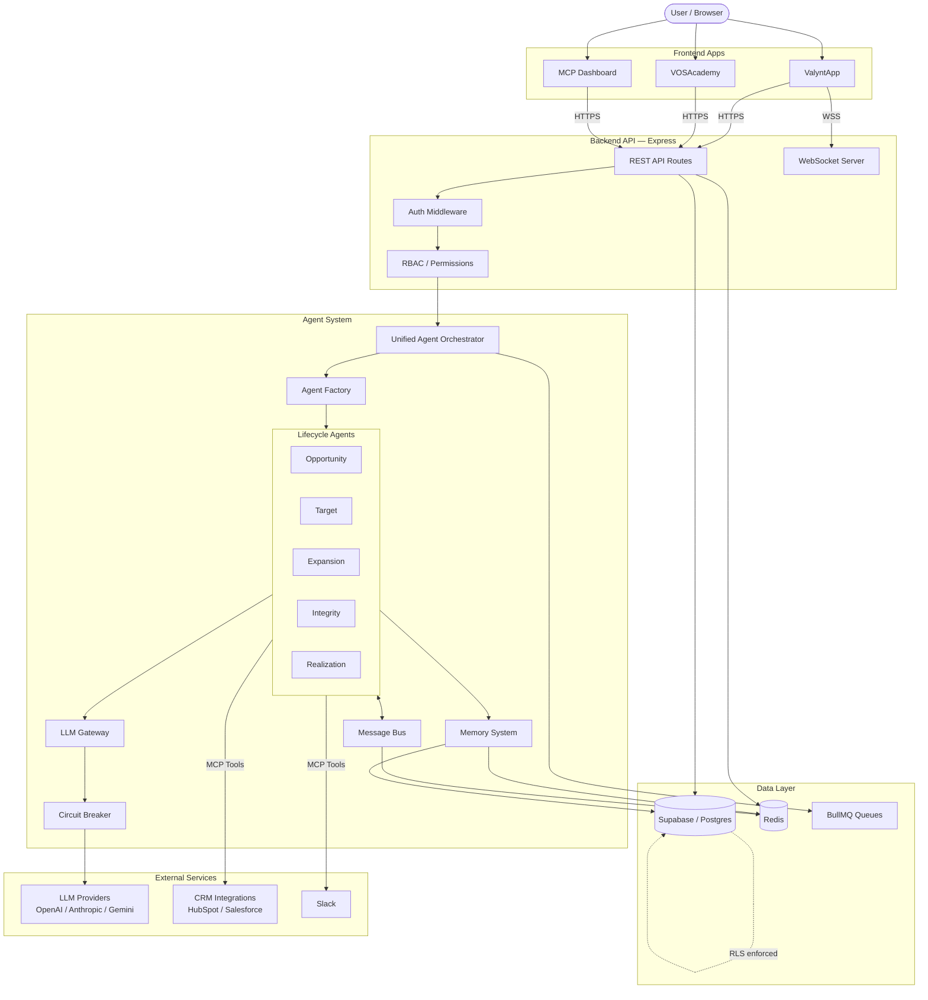
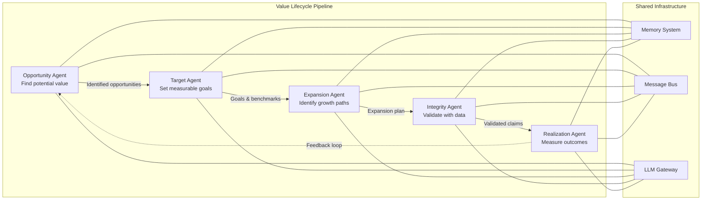
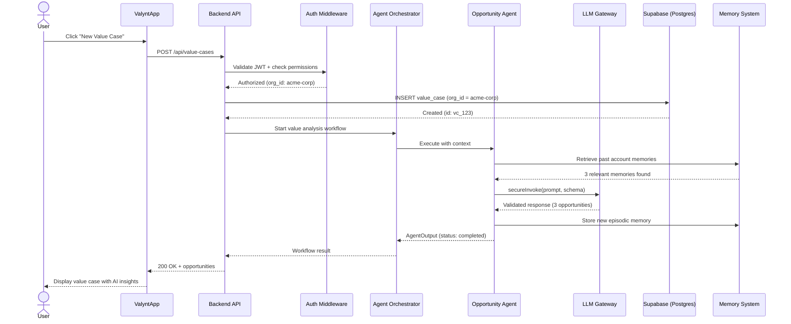
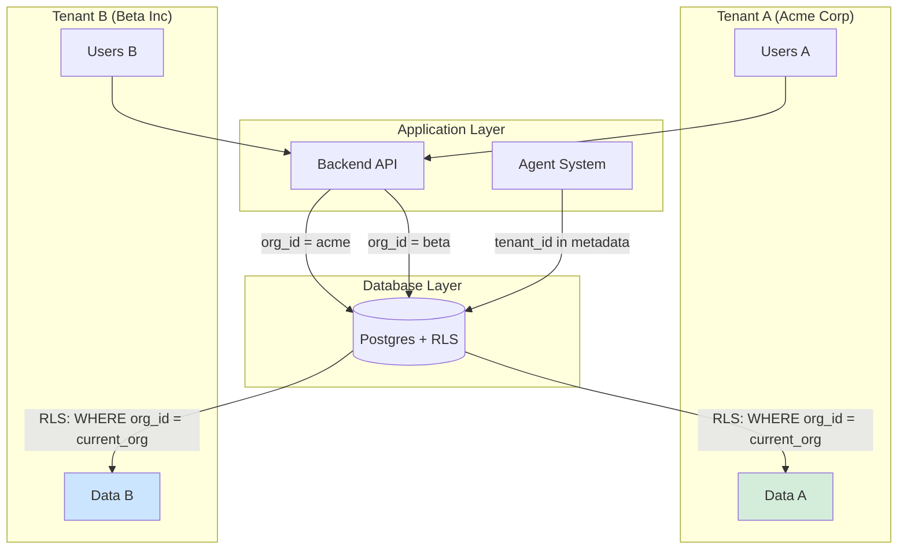
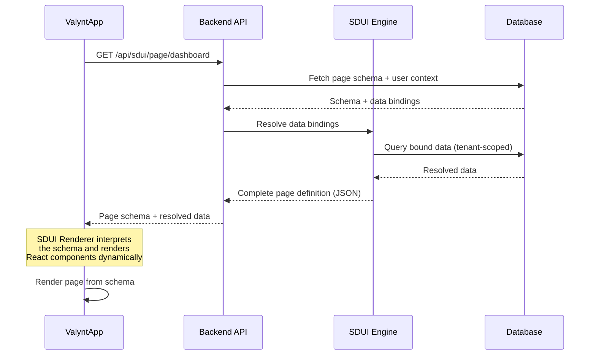

# Component Interaction Diagram

Visual maps of how ValueOS components connect and communicate.

---

## System Overview

How a user request flows through the system:

## Agent Lifecycle Pipeline

How the core 5 lifecycle agents collaborate on a value case (within the 8-agent fabric):

## Request Flow: User Creates a Value Case

Step-by-step flow when a user creates a new value case:

## Data Isolation Model

How tenant isolation works across layers:

## SDUI Rendering Flow

How Server-Driven UI works:

