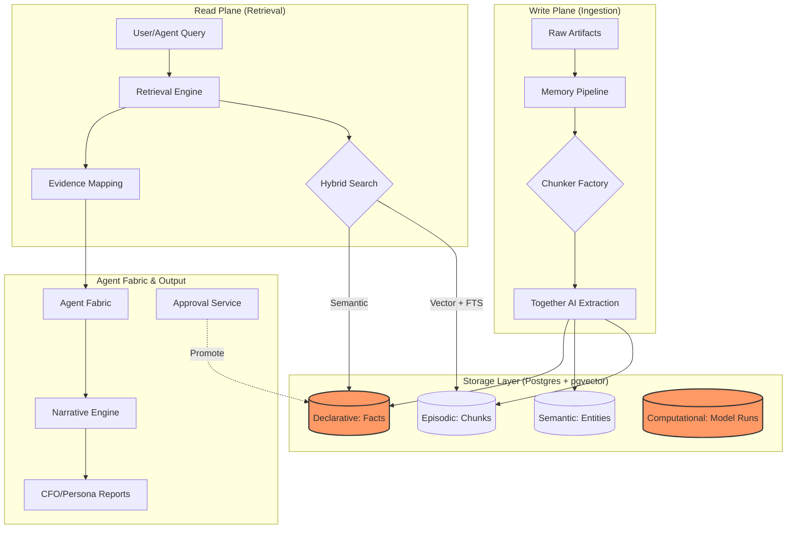

# ValueOS: Memory-First Architecture Guide

ValueOS is a production-grade Operating System for B2B knowledge, designed to transform raw enterprise data into high-fidelity, auditable business value. Unlike standard RAG (Retrieval-Augmented Generation) systems that treat data as transient context, ValueOS treats **Memory as the Primary Asset**.

## 1. The 'Memory-First' Philosophy

The core thesis of ValueOS is that AI outputs are only as reliable as the underlying memory substrate. By decomposing information into distinct layers of "Truth," the system ensures that every claim made by an agent can be traced back to a specific timestamp, document, and human approval.

### The 5 Memory Layers
ValueOS organizes data into five specialized layers to ensure structural integrity:

| Layer | Type | Description |
| :--- | :--- | :--- |
| **Layer 1** | **Episodic** | Raw artifacts (emails, transcripts, PDFs) and their vectorized chunks. Captures "what happened" in time. |
| **Layer 2** | **Semantic** | The Knowledge Graph. Extracted entities (People, Orgs) and their inter-relationships. |
| **Layer 3** | **Declarative** | High-fidelity **Facts**. Curated, versioned truths that represent the "Source of Truth" for a tenant. |
| **Layer 4** | **Computational** | **Model Runs**. Immutable logs of AI calculations, including the benchmark snapshots used at execution. |
| **Layer 5** | **Governance** | Narratives, Approvals, and Access Grants. The final output layer for human consumption and audit. |

---

## 2. Architectural Blueprint

The following diagram illustrates the flow from data ingestion (**Write Plane**) to high-fidelity consumption (**Read Plane**).



---

## 3. Directory Structure

A standardized layout for the ValueOS implementation ensures modularity and clear separation between the database schema and the application services.

```text
/
├── supabase/
│   └── migrations/             # SQL schema, RLS policies, and HNSW indexes
├── src/
│   ├── services/
│   │   ├── MemoryPipeline.ts   # Write Plane: Ingestion & Extraction
│   │   ├── RetrievalEngine.ts  # Read Plane: Hybrid Search & Reranking
│   │   ├── ModelRunEngine.ts   # Computational: Determinstic calculations
│   │   ├── NarrativeEngine.ts  # Synthesis: Persona-based generation
│   │   ├── AgentFabric.ts      # Orchestration: Agent governance
│   │   └── BenchmarkService.ts # Immutable: Industry benchmark management
│   ├── types/
│   │   └── index.ts            # Central TypeScript definitions
│   ├── utils/
│   │   └── crypto.ts           # Deterministic hashing & provenance
│   └── lib/
│       └── supabase.ts         # Client initialization
└── tests/                      # Benchmarking & evaluation suites
```

---

## 4. Service Catalog

| Service | Responsibility |
| :--- | :--- |
| **Memory Service** | The primary orchestrator for searching across episodic and semantic layers. |
| **Memory Pipeline** | Handles idempotency (SHA-256), chunking logic, and Together AI extraction. |
| **Retrieval Engine** | Executes hybrid searches (Vector + FTS) and maps facts to original sources (Lineage). |
| **Model Run Engine** | Executes value calculations with deterministic hashing for "Run Fingerprints." |
| **Benchmark Service** | Manages immutable "Slices" of industry data to prevent silent updates. |
| **Narrative Engine** | Transforms facts and model results into persona-aligned summaries (CFO/VP Sales). |
| **Agent Fabric** | Enforces "Authority Levels" (1-5) on agents to prevent unauthorized memory writes. |
| **Approval Service** | Manages the workflow of promoting `DRAFT` facts to `APPROVED` status. |
| **Access Service** | Manages scoped `Access Grants` for external guests using hashed token verification. |

---

## 5. Setup & Implementation Guide

### Step 1: Initialize Database
Deploy the Core Migration to Supabase. This sets up the `pgvector` extension, HNSW indexes, and the foundational RLS policies.
```bash
# Execute via Supabase CLI or Dashboard SQL Editor
# Location: /supabase/migrations/001_memory_first_schema.sql
```

### Step 2: Environment Configuration
Required keys for LLM extraction and database connectivity.
```bash
SUPABASE_URL="your-project-url"
SUPABASE_SERVICE_ROLE_KEY="your-key"
TOGETHER_AI_API_KEY="your-llama3-endpoint-key"
```

### Step 3: Initialize the Pipeline
Initialize the `MemoryPipeline` to start ingesting business artifacts.
```typescript
import { MemoryPipeline } from './services/MemoryPipeline';

const pipeline = new MemoryPipeline(
  process.env.SUPABASE_URL,
  process.env.SUPABASE_SERVICE_ROLE_KEY,
  process.env.TOGETHER_AI_API_KEY
);
```

---

## 6. Trust & Provenance Model

ValueOS is "Enterprise-Grade" because it solves the AI Hallucination problem through **Cryptographic Lineage**.

1.  **Idempotency & Deduplication**: Every artifact is hashed using `SHA-256`. Identical content is never processed twice, saving costs and preventing semantic noise.
2.  **Deterministic Run Hashes**: The `ModelRunEngine` computes a hash of (`Inputs` + `Logic Version` + `Benchmark Slices`). If any input or formula changes, the hash changes, alerting auditors to data drift.
3.  **The Fact-Evidence Link**: No `Fact` exists in isolation. Every fact in the system is linked to an `artifact_chunk` via the `fact_evidence` table, providing a 1-click "View Original Source" capability in the UI.
4.  **Authority Boundaries**: Agents are restricted by `AuthorityLevel`. A Level 2 Researcher agent can extract data but is physically blocked by the `PermissionGuard` from approving its own findings as "Truth."