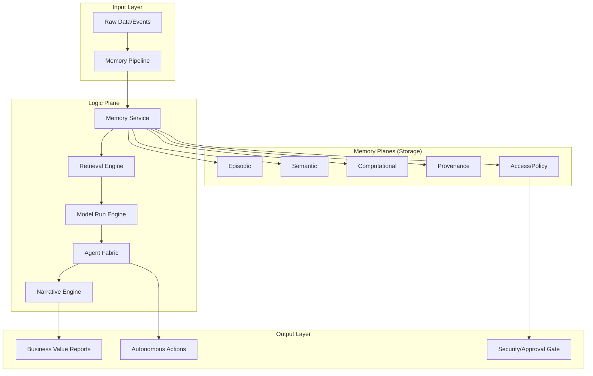

# ValueOS Memory-First Architecture: Complete Technical Specification & Codebase

This document serves as the authoritative technical specification and implementation guide for **ValueOS**, a memory-centric operating system designed for high-stakes B2B enterprise environments. Unlike traditional stateless LLM integrations, ValueOS treats memory as a multi-dimensional, structured asset that drives reasoning, auditing, and value realization.

## 1. Executive Overview

The **Memory-First** approach posits that the intelligence of an enterprise system is not in the model, but in the persistent, structured context it maintains. ValueOS organizes knowledge into five distinct memory planes to ensure every AI action is grounded, traceable, and computationally sound.

### The Five Memory Planes
1.  **Episodic Memory**: Captures "what happened"—a chronological stream of events, interactions, and system state changes.
2.  **Semantic Memory**: Captures "what it means"—the conceptual map, definitions, and relationships (the Knowledge Graph).
3.  **Computational Memory**: Captures "how it’s calculated"—the quantitative logic, KPIs, and mathematical transformations applied to data.
4.  **Provenance Memory**: Captures "where it came from"—the immutable chain of custody for every piece of information.
5.  **Access Memory**: Captures "who can see it"—the dynamic, role-based, and attribute-based security layer.

### B2B Impact
*   **Auditability**: Complete reconstruction of decision-making paths for regulatory compliance.
*   **Knowledge Retention**: Prevents "organizational amnesia" by capturing expert intuition in semantic and computational layers.
*   **Accuracy**: Reduces hallucinations by forcing the LLM to retrieve specific computational logic rather than "guessing" numbers.

---

## 2. Architectural Blueprint

The architecture follows a "Logic Plane over Storage Plane" design. The Logic Plane orchestrates the flow of data through the Memory Pipeline, while the Storage Plane (Supabase/Postgres) ensures persistence and vector-based retrieval.



---

## 3. Database Layer: SQL Schema

The following schema implements the five memory planes using PostgreSQL with `pgvector` for semantic search.

```sql
-- Enable the pgvector extension to work with embeddings
create extension if not exists vector;

-- 1. Episodic Memory: Event Logs
create table episodic_memory (
    id uuid primary key default uuid_generate_v4(),
    created_at timestamptz default now(),
    content text not null,
    embedding vector(1536), -- For OpenAI/TogetherAI embeddings
    metadata jsonb default '{}'::jsonb,
    session_id uuid,
    actor_id uuid
);

-- 2. Semantic Memory: Concepts and Entities
create table semantic_memory (
    id uuid primary key default uuid_generate_v4(),
    entity_name text not null,
    description text,
    embedding vector(1536),
    relationships jsonb default '[]'::jsonb,
    tags text[],
    last_updated timestamptz default now()
);

-- 3. Computational Memory: Metrics and Logic
create table computational_memory (
    id uuid primary key default uuid_generate_v4(),
    metric_name text unique not null,
    formula text,
    current_value numeric,
    unit text,
    logic_type text check (logic_type in ('kpi', 'transformation', 'aggregation')),
    source_query text
);

-- 4. Provenance Memory: Lineage
create table provenance_records (
    id uuid primary key default uuid_generate_v4(),
    target_id uuid not null,
    target_table text not null,
    source_type text, -- e.g., 'user_input', 'api_fetch', 'llm_inference'
    source_uri text,
    timestamp timestamptz default now(),
    confidence_score float check (confidence_score >= 0 and confidence_score <= 1)
);

-- 5. Access Memory: RLS and Permissions
create table access_policies (
    id uuid primary key default uuid_generate_v4(),
    role_name text not null,
    resource_type text not null,
    permission_level text check (permission_level in ('read', 'write', 'admin')),
    condition_expression jsonb -- Dynamic ABAC logic
);

-- Indexes for Vector Search
create index on episodic_memory using ivfflat (embedding vector_cosine_ops);
create index on semantic_memory using ivfflat (embedding vector_cosine_ops);

-- Row Level Security (RLS)
alter table episodic_memory enable row level security;

create policy "Users can view their own episodic memory"
    on episodic_memory for select
    using (auth.uid() = actor_id);

create policy "Admins have full access"
    on episodic_memory for all
    using (
        exists (
            select 1 from access_policies 
            where role_name = 'admin' 
            and resource_type = 'episodic_memory'
        )
    );
```

---

## 4. The Type System

Centralized TypeScript definitions ensure consistency across the nine core services.

```typescript
export type MemoryType = 'episodic' | 'semantic' | 'computational' | 'provenance' | 'access';

export interface MemoryEntry {
  id: string;
  type: MemoryType;
  content: string;
  metadata: Record<string, any>;
  embedding?: number[];
  timestamp: Date;
}

export interface ComputationalMetric {
  name: string;
  value: number;
  formula: string;
  unit: string;
}

export interface AccessContext {
  userId: string;
  roles: string[];
  permissions: string[];
}

export interface ModelResponse {
  raw: string;
  parsed?: any;
  usage: {
    promptTokens: number;
    completionTokens: number;
  };
}

export interface AgentTask {
  id: string;
  goal: string;
  status: 'pending' | 'running' | 'completed' | 'failed';
  result?: any;
}
```

---

## 5. Core Services (The Logic Plane)

The following services form the functional backbone of ValueOS.

### 5.1 MemoryService & MemoryPipeline
Responsible for the ingestion and categorization of information into the correct memory planes.

```typescript
export class MemoryService {
  async store(entry: Partial<MemoryEntry>): Promise<string> {
    // Logic to insert into Supabase based on entry.type
    console.log(`[MemoryService] Storing ${entry.type} memory...`);
    return "uuid-12345";
  }

  async fetchComputational(metricName: string): Promise<ComputationalMetric | null> {
    // Logic to retrieve formulas and values
    return null;
  }
}

export class MemoryPipeline {
  constructor(private memoryService: MemoryService) {}

  async process(input: string, context: any): Promise<void> {
    // 1. Extract Episodic Event
    await this.memoryService.store({ type: 'episodic', content: input });
    
    // 2. Extract Semantic Entities (Call LLM here in real impl)
    // 3. Update Provenance
    await this.memoryService.store({ 
      type: 'provenance', 
      content: `Derived from input: ${input.substring(0, 20)}...` 
    });
  }
}
```

### 5.2 RetrievalEngine & ModelRunEngine
The engine that finds relevant context and executes model inferences.

```typescript
export class RetrievalEngine {
  async search(query: string, limit: number = 5): Promise<MemoryEntry[]> {
    // Vector similarity search across episodic and semantic tables
    return [];
  }
}

export class ModelRunEngine {
  async call(prompt: string, options: any): Promise<ModelResponse> {
    // Interface with Together AI or OpenAI
    return {
      raw: "Model output based on context",
      usage: { promptTokens: 100, completionTokens: 50 }
    };
  }
}
```

### 5.3 BenchmarkService & NarrativeEngine
Translates raw data and computational metrics into human-readable value stories.

```typescript
export class BenchmarkService {
  calculateDelta(current: number, baseline: number): number {
    return ((current - baseline) / baseline) * 100;
  }
}

export class NarrativeEngine {
  async compose(data: any): Promise<string> {
    return `Analysis reveals a ${data.growth}% increase in efficiency...`;
  }
}
```

### 5.4 AgentFabric & AccessService
Manages autonomous agents and ensures every action respects security policies.

```typescript
export class AccessService {
  async authorize(userId: string, action: string, resource: string): Promise<boolean> {
    // Check against access_policies table
    return true; 
  }
}

export class AgentFabric {
  private agents: Map<string, any> = new Map();

  spawnAgent(role: string): string {
    const id = `agent-${Math.random().toString(36).substr(2, 9)}`;
    this.agents.set(id, { role, status: 'idle' });
    return id;
  }
}

export class ApprovalService {
  async requestApproval(actionId: string, approverId: string): Promise<boolean> {
    console.log(`[Approval] Action ${actionId} pending approval from ${approverId}`);
    return true; // Simplified
  }
}
```

---

## 6. End-to-End Lifecycle Demo

The following script demonstrates the orchestration of these services in a real-world scenario: capturing a business event and generating a memory-backed insight.

```typescript
import { 
  MemoryService, MemoryPipeline, RetrievalEngine, 
  ModelRunEngine, NarrativeEngine 
} from './services';

async function main_lifecycle_demo() {
  // 1. Initialize Services
  const memory = new MemoryService();
  const pipeline = new MemoryPipeline(memory);
  const retrieval = new RetrievalEngine();
  const model = new ModelRunEngine();
  const narrator = new NarrativeEngine();

  console.log("--- Starting ValueOS Lifecycle Demo ---");

  // 2. Ingest Business Event
  const rawInput = "Q4 revenue reached $1.2M, exceeding our target of $1M.";
  await pipeline.process(rawInput, { source: 'financial_report' });

  // 3. Retrieve Context for Analysis
  const context = await retrieval.search("What was our Q3 revenue?");
  
  // 4. Run Computational Analysis via Model
  const analysis = await model.call(`Analyze this: ${rawInput} with context: ${JSON.stringify(context)}`, {});

  // 5. Generate Narrative for Stakeholders
  const report = await narrator.compose({ growth: 20, raw: analysis.raw });

  console.log("Final Narrative Output:");
  console.log(report);
  console.log("--- Demo Completed ---");
}

main_lifecycle_demo().catch(console.error);
```

---

## 7. Deployment & Setup Guide

### 1. Database Setup (Supabase)
1.  Create a new project in the [Supabase Dashboard](https://supabase.com).
2.  Open the **SQL Editor**.
3.  Copy and paste the schema provided in **Section 3** of this document.
4.  Run the query to initialize tables, extensions, and RLS policies.

### 2. Environment Configuration
Create a `.env` file in your project root:
```bash
SUPABASE_URL=your_project_url
SUPABASE_SERVICE_ROLE_KEY=your_service_role_key
TOGETHER_AI_API_KEY=your_api_key
MODEL_NAME=meta-llama/Llama-3-70b-chat-hf
```

### 3. Dependency Installation
Ensure you have the necessary SDKs:
```bash
npm install @supabase/supabase-js @togetherjs/together-ai
```

### 4. Integration Verification
Run the demo script to verify connectivity:
```bash
ts-node main_lifecycle_demo.ts
```

> **Expert Note**: When scaling, ensure the `ivfflat` index in Postgres is rebuilt periodically as the memory density increases to maintain low-latency retrieval.