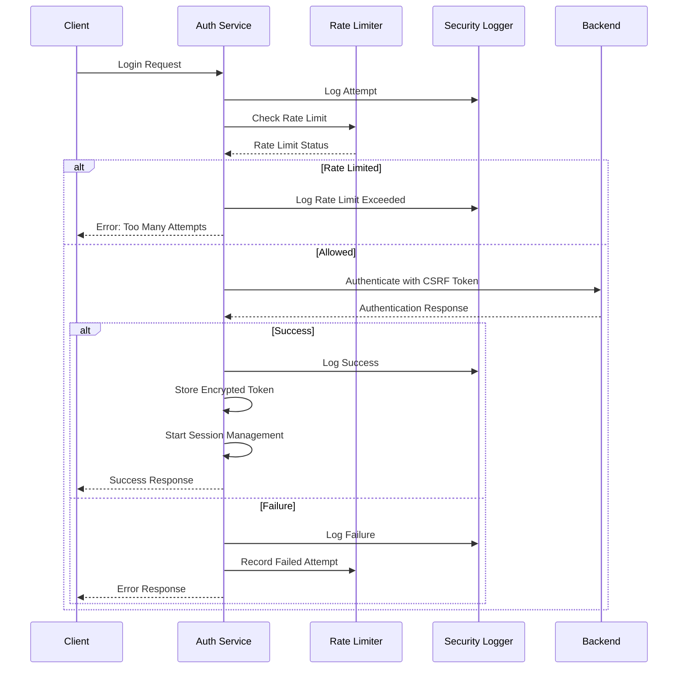

# Security Architecture

**Last Updated**: 2026-02-08

**Consolidated from 3 source documents**

---

## Table of Contents

1. [ValueOS Authentication Security Guide](#valueos-authentication-security-guide)
2. [Security Incident Response Runbook](#security-incident-response-runbook)
3. [OWASP Security Hardening Implementation](#owasp-security-hardening-implementation)

---

## ValueOS Authentication Security Guide

*Source: `security/SECURITY_GUIDE.md`*

## Overview

This document provides comprehensive security guidelines for the ValueOS authentication system, covering implementation details, security best practices, and operational procedures.

## Table of Contents

1. [Security Architecture](#security-architecture)
2. [Authentication Flow](#authentication-flow)
3. [Security Features](#security-features)
4. [Threat Model](#threat-model)
5. [Security Testing](#security-testing)
6. [Monitoring and Alerting](#monitoring-and-alerting)
7. [Incident Response](#incident-response)
8. [Compliance](#compliance)

## Security Architecture

### Multi-Layer Security Approach

The ValueOS authentication system implements defense-in-depth with multiple security layers:

```
┌─────────────────────────────────────────────────────────────┐
│                    Client Application                        │
├─────────────────────────────────────────────────────────────┤
│  • Input Validation  • CSRF Protection  • Rate Limiting    │
│  • Secure Storage   • Session Management • Error Handling   │
├─────────────────────────────────────────────────────────────┤
│                    Network Layer                             │
├─────────────────────────────────────────────────────────────┤
│  • HTTPS/TLS  • Security Headers  • CSP  • WebSocket Auth   │
├─────────────────────────────────────────────────────────────┤
│                    Backend Services                          │
├─────────────────────────────────────────────────────────────┤
│  • Token Validation  • Session Management  • Audit Logging   │
│  • Rate Limiting    • Security Monitoring  • Access Control │
└─────────────────────────────────────────────────────────────┘
```

### Core Components

1. **Secure Token Storage**: Encrypted client-side token storage with device fingerprinting
2. **Rate Limiting**: Brute force protection with exponential backoff
3. **CSRF Protection**: Token-based CSRF mitigation for state-changing operations
4. **Session Management**: Automatic timeout, refresh, and cleanup
5. **Security Logging**: Comprehensive audit trail for all authentication events
6. **Error Boundaries**: Graceful failure handling without information leakage

## Authentication Flow

### Login Process



### Token Management

1. **Access Token**: Short-lived (1 hour) JWT for API access
2. **Refresh Token**: Long-lived token for session renewal
3. **Storage**: Encrypted localStorage with device fingerprint validation
4. **Expiration**: Automatic cleanup and refresh mechanisms

## Security Features

### 1. Secure Token Storage

**Implementation**: `src/lib/secureStorage.ts`

- **Encryption**: Browser fingerprint-based XOR encryption (demo) / AES-256 (production)
- **Validation**: Device fingerprint verification on token retrieval
- **Expiration**: Automatic token expiration and cleanup
- **Fallback**: SessionStorage fallback for private browsing

```typescript
// Example usage
const tokenData = {
  token: "jwt-token",
  refreshToken: "refresh-token",
  expiresAt: Date.now() + 3600000,
  userId: "user123",
};

await secureTokenStorage.setToken(tokenData);
const token = await secureTokenStorage.getAccessToken();
```

### 2. Rate Limiting

**Implementation**: `src/lib/rateLimiter.ts`

- **Limits**: 5 attempts per 5 minutes per email/IP
- **Lockout**: 15-minute exponential backoff
- **Tracking**: In-memory with localStorage persistence
- **Reset**: Successful authentication clears counter

```typescript
// Rate limit configuration
const config = {
  maxAttempts: 5,
  windowDuration: 5 * 60 * 1000, // 5 minutes
  lockoutDuration: 15 * 60 * 1000, // 15 minutes
};
```

### 3. CSRF Protection

**Implementation**: `src/lib/csrfProtection.ts`

- **Token Generation**: 32-character random tokens
- **Storage**: SessionStorage for request-scoped protection
- **Validation**: Automatic token injection and validation
- **Forms**: Dynamic token injection into existing forms

```typescript
// Automatic CSRF protection
const response = await csrfProtection.secureFetch("/api/auth/login", {
  method: "POST",
  headers: { "Content-Type": "application/json" },
  body: JSON.stringify(credentials),
});
```

### 4. Session Management

**Implementation**: `src/lib/sessionManager.ts`

- **Timeout**: Configurable session expiration
- **Warnings**: User notifications before expiration
- **Refresh**: Automatic token refresh attempts
- **Cleanup**: Proper resource cleanup on logout

### 5. Security Logging

**Implementation**: `src/lib/securityLogger.ts`

- **Events**: Comprehensive authentication event tracking
- **Severity**: Low, Medium, High, Critical classification
- **Metrics**: Real-time security metrics and analytics
- **Alerting**: Integration with monitoring services

## Threat Model

### Identified Threats

1. **Brute Force Attacks**
   - **Mitigation**: Rate limiting, account lockout, exponential backoff
   - **Detection**: Multiple failed attempts from same IP/email
   - **Response**: Automatic lockout, security alerts

2. **CSRF Attacks**
   - **Mitigation**: CSRF tokens, SameSite cookies, origin validation
   - **Detection**: Missing or invalid CSRF tokens
   - **Response**: Request rejection, security logging

3. **Session Hijacking**
   - **Mitigation**: Secure token storage, device fingerprinting, short-lived tokens
   - **Detection**: Unusual access patterns, multiple concurrent sessions
   - **Response**: Session termination, forced re-authentication

4. **Token Theft**
   - **Mitigation**: Encrypted storage, HttpOnly cookies, secure transmission
   - **Detection**: Token usage from unexpected locations
   - **Response**: Token revocation, security alerts

5. **XSS Attacks**
   - **Mitigation**: Input validation, output encoding, CSP headers
   - **Detection**: Suspicious script execution attempts
   - **Response**: Content Security Policy enforcement

### Risk Assessment

| Threat         | Likelihood | Impact | Risk Level | Mitigation      |
| -------------- | ---------- | ------ | ---------- | --------------- |
| Brute Force    | High       | Medium | Medium     | Rate Limiting   |
| CSRF           | Medium     | High   | Medium     | CSRF Tokens     |
| Session Hijack | Low        | High   | Medium     | Secure Storage  |
| Token Theft    | Low        | High   | Medium     | Encryption      |
| XSS            | Medium     | High   | High       | CSP, Validation |

## Security Testing

### Automated Tests

**Location**: `src/__tests__/security/`

1. **Authentication Security Tests**
   - Rate limiting effectiveness
   - Token security and encryption
   - CSRF protection validation
   - Input validation and sanitization
   - Error handling security

2. **Integration Tests**
   - End-to-end authentication flows
   - Cross-site request forgery prevention
   - Session management security
   - WebSocket authentication

3. **Security Scans**
   - Dependency vulnerability scanning
   - Static code analysis
   - Dynamic application security testing
   - Penetration testing

### Test Coverage Requirements

- **Authentication Logic**: 100% coverage
- **Security Utilities**: 100% coverage
- **Error Handling**: 95% coverage
- **Input Validation**: 100% coverage

### Security Test Execution

```bash
# Run security tests
npm run test:security

# Run with coverage
npm run test:security:coverage

# Run security scans
npm run audit:security
npm run scan:dependencies
```

## Monitoring and Alerting

### Security Metrics

**Dashboard**: Real-time security monitoring

1. **Authentication Metrics**
   - Total authentication attempts
   - Success/failure rates
   - Unique user count
   - Average session duration

2. **Security Events**
   - Rate limit violations
   - CSRF failures
   - Suspicious activities
   - Security violations

3. **System Health**
   - Token refresh rates
   - Session expiration patterns
   - Error rates by type
   - Performance metrics

### Alerting Rules

1. **Critical Alerts**
   - Security violations
   - Mass authentication failures
   - Suspicious activity spikes
   - System compromise indicators

2. **Warning Alerts**
   - High rate limit hits
   - Elevated failure rates
   - Unusual access patterns
   - Performance degradation

3. **Info Alerts**
   - New user registrations
   - Configuration changes
   - System maintenance events
   - Security test results

### Monitoring Integration

```typescript
// Example monitoring service integration
securityLogger.logEvent({
  type: "security_violation",
  severity: "critical",
  userId: "user123",
  details: { violation: "Unauthorized admin access" },
});
```

## Incident Response

### Security Incident Categories

1. **Critical**: System compromise, data breach, mass unauthorized access
2. **High**: Single account compromise, privilege escalation, persistent attacks
3. **Medium**: Brute force attempts, CSRF attacks, suspicious activities
4. **Low**: Isolated failures, configuration issues, minor violations

### Response Procedures

#### Immediate Response (0-15 minutes)

1. **Assessment**
   - Verify incident scope and impact
   - Identify affected systems and users
   - Determine incident severity

2. **Containment**
   - Block malicious IP addresses
   - Disable compromised accounts
   - Implement emergency rate limits
   - Activate incident response team

#### Investigation (15-60 minutes)

1. **Evidence Collection**
   - Export security logs
   - Preserve system state
   - Document timeline
   - Identify root cause

2. **Analysis**
   - Analyze attack vectors
   - Assess data exposure
   - Evaluate system vulnerabilities
   - Determine propagation risk

#### Resolution (1-4 hours)

1. **Remediation**
   - Patch vulnerabilities
   - Reset compromised credentials
   - Update security configurations
   - Implement additional controls

2. **Recovery**
   - Restore normal operations
   - Monitor for recurrence
   - Validate security measures
   - Update documentation

### Communication Procedures

1. **Internal Communication**
   - Incident response team coordination
   - Status updates to stakeholders
   - Technical documentation
   - Lessons learned

2. **External Communication**
   - User notifications (if required)
   - Regulatory reporting (if applicable)
   - Public statements (if necessary)
   - Vendor coordination

## Compliance

### Regulatory Requirements

1. **GDPR Compliance**
   - Data protection by design
   - Right to be forgotten
   - Data breach notification
   - Privacy by default

2. **SOC 2 Compliance**
   - Security controls implementation
   - Audit trail maintenance
   - Access control verification
   - Incident response procedures

3. **OWASP Standards**
   - Top 10 vulnerability mitigation
   - Secure coding practices
   - Security testing requirements
   - Risk assessment framework

### Security Controls Matrix

| Control        | Implementation               | Status      | Evidence         |
| -------------- | ---------------------------- | ----------- | ---------------- |
| Authentication | Multi-factor auth            | In Progress | Config files     |
| Authorization  | RBAC implementation          | Complete    | Code review      |
| Encryption     | AES-256 token storage        | Complete    | Security tests   |
| Logging        | Comprehensive audit trail    | Complete    | Log samples      |
| Monitoring     | Real-time security dashboard | Complete    | Dashboard access |
| Testing        | Automated security tests     | Complete    | Test reports     |

### Audit Requirements

- **Quarterly**: Security control assessment
- **Monthly**: Vulnerability scanning
- **Weekly**: Log review and analysis
- **Daily**: Security metrics monitoring
- **Real-time**: Critical event alerting

## Best Practices

### Development

1. **Secure Coding**
   - Input validation and sanitization
   - Output encoding and escaping
   - Parameterized queries
   - Least privilege principle

2. **Code Review**
   - Security-focused review checklist
   - Automated security scanning
   - Peer review requirements
   - Documentation standards

3. **Testing**
   - Security test coverage requirements
   - Penetration testing schedule
   - Vulnerability assessment process
   - Incident response testing

### Operations

1. **Configuration Management**
   - Secure configuration templates
   - Environment-specific settings
   - Secret management
   - Change control procedures

2. **Monitoring**
   - Real-time security monitoring
   - Log aggregation and analysis
   - Performance metrics tracking
   - Alert tuning and optimization

3. **Maintenance**
   - Regular security updates
   - Patch management process
   - Security tool maintenance
   - Documentation updates

## Contact Information

### Security Team

- **Security Lead**: security@valueos.com
- **Incident Response**: incidents@valueos.com
- **Vulnerability Reports**: security@valueos.com

### Emergency Contacts

- **Critical Incidents**: +1-555-SECURITY
- **Data Breach**: +1-555-BREACH
- **System Compromise**: +1-555-COMPROMISE

### External Resources

- **Security Documentation**: https://docs.valueos.com/security
- **Vulnerability Disclosure**: https://valueos.com/security
- **Compliance Portal**: https://compliance.valueos.com

---

_Last Updated: January 2026_
_Version: 1.0_
_Classification: Internal Use Only_

---

## Security Incident Response Runbook

*Source: `security/INCIDENT_RESPONSE.md`*

## Overview

This runbook provides step-by-step procedures for handling security incidents in the ValueOS authentication system. It is designed to be used during active security incidents to ensure consistent, effective response.

## Table of Contents

1. [Incident Classification](#incident-classification)
2. [Immediate Response Procedures](#immediate-response-procedures)
3. [Investigation Procedures](#investigation-procedures)
4. [Containment Strategies](#containment-strategies)
5. [Eradication and Recovery](#eradication-and-recovery)
6. [Post-Incident Activities](#post-incident-activities)
7. [Communication Templates](#communication-templates)
8. [Checklists](#checklists)

## Incident Classification

### Severity Levels

| Severity     | Description                                                         | Response Time | Escalation       |
| ------------ | ------------------------------------------------------------------- | ------------- | ---------------- |
| **CRITICAL** | System compromise, data breach, mass unauthorized access            | 0-15 minutes  | Executive level  |
| **HIGH**     | Single account compromise, privilege escalation, persistent attacks | 15-30 minutes | Management level |
| **MEDIUM**   | Brute force attempts, CSRF attacks, suspicious activities           | 1-2 hours     | Team lead        |
| **LOW**      | Isolated failures, configuration issues, minor violations           | 4-8 hours     | Individual       |

### Incident Types

1. **Authentication Bypass**
   - Successful unauthorized access
   - Privilege escalation
   - Session hijacking

2. **Brute Force Attacks**
   - High-volume login attempts
   - Credential stuffing
   - Dictionary attacks

3. **Token Compromise**
   - JWT token theft
   - Refresh token exposure
   - Session token manipulation

4. **CSRF Attacks**
   - Cross-site request forgery
   - State manipulation
   - Unauthorized actions

5. **System Vulnerability**
   - Zero-day exploits
   - Configuration weaknesses
   - Software bugs

## Immediate Response Procedures

### Step 1: Incident Detection (0-5 minutes)

#### Automated Detection

```bash
# Check security metrics dashboard
curl -X GET "https://monitoring.valueos.com/api/security/metrics" \
  -H "Authorization: Bearer $MONITORING_TOKEN"

# Check recent security events
curl -X GET "https://api.valueos.com/security/events/recent" \
  -H "Authorization: Bearer $API_TOKEN"
```

#### Manual Detection Indicators

- Unusual spike in authentication failures
- Multiple successful logins from different IPs
- Security alerts in monitoring dashboard
- User reports of account issues
- System performance degradation

#### Initial Assessment

```bash
# Verify incident scope
./scripts/security/check-incident-scope.sh

# Get affected users
./scripts/security/get-affected-users.sh

# Check system status
./scripts/security/system-health-check.sh
```

### Step 2: Incident Triage (5-15 minutes)

#### Triage Checklist

- [ ] Confirm incident is security-related
- [ ] Determine affected systems and users
- [ ] Assess potential data exposure
- [ ] Identify attack vector
- [ ] Estimate business impact

#### Severity Assessment

```bash
# Run severity assessment script
./scripts/security/assess-severity.sh \
  --incident-type "$INCIDENT_TYPE" \
  --affected-users "$USER_COUNT" \
  --data-exposure "$EXPOSURE_LEVEL"
```

#### Initial Notification

```bash
# Alert incident response team
./scripts/security/notify-team.sh \
  --severity "$SEVERITY" \
  --incident-type "$INCIDENT_TYPE" \
  --description "$DESCRIPTION"
```

### Step 3: Immediate Containment (15-30 minutes)

#### Automated Containment

```bash
# Enable emergency rate limiting
curl -X POST "https://api.valueos.com/security/emergency-rate-limit" \
  -H "Authorization: Bearer $API_TOKEN" \
  -d '{"attempts": 3, "window": 300000}'

# Block malicious IPs
curl -X POST "https://api.valueos.com/security/block-ips" \
  -H "Authorization: Bearer $API_TOKEN" \
  -d '{"ips": ["$MALICIOUS_IP"]}'

# Enable enhanced monitoring
curl -X POST "https://api.valueos.com/security/enhance-monitoring" \
  -H "Authorization: Bearer $API_TOKEN"
```

#### Manual Containment Actions

- [ ] Disable compromised accounts
- [ ] Force password resets for affected users
- [ ] Implement additional rate limiting
- [ ] Enable verbose logging
- [ ] Deploy security patches if available

## Investigation Procedures

### Step 1: Evidence Collection (30-60 minutes)

#### Log Collection

```bash
# Export security logs
./scripts/security/export-logs.sh \
  --start-time "$INCIDENT_START" \
  --end-time "$(date +%s)" \
  --output "/tmp/security-incident-$(date +%s).json"

# Collect authentication logs
./scripts/security/export-auth-logs.sh \
  --user "$AFFECTED_USER" \
  --timeframe "24h"

# Collect system logs
./scripts/security/export-system-logs.sh \
  --components "auth,rate-limit,csrf,session"
```

#### System State Capture

```bash
# Capture current system state
./scripts/security/capture-state.sh \
  --include "tokens,sessions,rate-limits,csrf-tokens"

# Database snapshot (if applicable)
./scripts/security/db-snapshot.sh \
  --tables "users,sessions,tokens,security_events"
```

#### Network Analysis

```bash
# Analyze traffic patterns
./scripts/security/analyze-traffic.sh \
  --timeframe "24h" \
  --ip "$SUSPICIOUS_IP"

# Check for data exfiltration
./scripts/security/check-exfiltration.sh \
  --timeframe "24h"
```

### Step 2: Root Cause Analysis (1-2 hours)

#### Analysis Checklist

- [ ] Review authentication logs for anomalies
- [ ] Analyze failed login patterns
- [ ] Check for successful unauthorized access
- [ ] Identify exploited vulnerabilities
- [ ] Determine attack timeline
- [ ] Assess data exposure scope

#### Common Attack Patterns

```bash
# Check for brute force patterns
./scripts/security/analyze-brute-force.sh \
  --timeframe "24h" \
  --threshold "5"

# Check for credential stuffing
./scripts/security/analyze-credential-stuffing.sh \
  --timeframe "24h"

# Check for session hijacking
./scripts/security/analyze-session-hijacking.sh \
  --timeframe "24h"
```

#### Vulnerability Assessment

```bash
# Scan for exploited vulnerabilities
./scripts/security/scan-vulnerabilities.sh \
  --component "auth"

# Check configuration security
./scripts/security/check-config.sh \
  --component "auth"
```

## Containment Strategies

### Short-term Containment (0-2 hours)

#### Account-Level Actions

```bash
# Disable compromised accounts
curl -X POST "https://api.valueos.com/admin/users/disable" \
  -H "Authorization: Bearer $ADMIN_TOKEN" \
  -d '{"userIds": ["$COMPROMISED_USER_ID"]}'

# Force password reset
curl -X POST "https://api.valueos.com/admin/users/force-reset" \
  -H "Authorization: Bearer $ADMIN_TOKEN" \
  -d '{"userIds": ["$AFFECTED_USER_ID"]}'

# Revoke all sessions
curl -X POST "https://api.valueos.com/admin/sessions/revoke-all" \
  -H "Authorization: Bearer $ADMIN_TOKEN" \
  -d '{"userId": "$COMPROMISED_USER_ID"}'
```

#### System-Level Actions

```bash
# Enable emergency authentication mode
curl -X POST "https://api.valueos.com/admin/auth/emergency-mode" \
  -H "Authorization: Bearer $ADMIN_TOKEN" \
  -d '{"mode": "high-security", "mfa-required": true}'

# Implement IP whitelisting
curl -X POST "https://api.valueos.com/admin/security/ip-whitelist" \
  -H "Authorization: Bearer $ADMIN_TOKEN" \
  -d '{"allowedIPs": ["$CORPORATE_IP_RANGE"]}'

# Enable additional logging
curl -X POST "https://api.valueos.com/admin/logging/enhance" \
  -H "Authorization: Bearer $ADMIN_TOKEN" \
  -d '{"level": "debug", "components": ["auth", "security"]}'
```

### Medium-term Containment (2-24 hours)

#### Network Security

```bash
# Configure Web Application Firewall
./scripts/security/configure-waf.sh \
  --rules "auth-attack-rules" \
  --action "block"

# Update DNS records
./scripts/security/update-dns.sh \
  --action "restrict-access"

# Configure CDN security
./scripts/security/configure-cdn-security.sh \
  --rules "auth-protection"
```

#### Application Security

```bash
# Deploy security patches
./scripts/security/deploy-patches.sh \
  --components "auth,session,csrf"

# Update security configurations
./scripts/security/update-config.sh \
  --component "auth" \
  --security-level "high"

# Enable additional authentication factors
./scripts/security/enable-mfa.sh \
  --users "all"
```

## Eradication and Recovery

### Step 1: Vulnerability Elimination (2-4 hours)

#### Patch Management

```bash
# Apply security patches
./scripts/security/apply-patches.sh \
  --priority "critical" \
  --components "auth"

# Update dependencies
./scripts/security/update-dependencies.sh \
  --security-only

# Rebuild and deploy
./scripts/security/rebuild-deploy.sh \
  --component "auth"
```

#### Configuration Hardening

```bash
# Update security configurations
./scripts/security/harden-config.sh \
  --component "auth"

# Enable additional security controls
./scripts/security/enable-controls.sh \
  --controls "rate-limiting,csrf,mfa"

# Validate security posture
./scripts/security/validate-posture.sh \
  --component "auth"
```

### Step 2: Service Restoration (4-8 hours)

#### Gradual Restoration

```bash
# Enable service for internal users first
./scripts/security/enable-service.sh \
  --user-group "internal" \
  --mfa-required "true"

# Monitor for recurrence
./scripts/security/monitor-recurrence.sh \
  --duration "2h"

# Enable service for all users
./scripts/security/enable-service.sh \
  --user-group "all" \
  --mfa-required "false"
```

#### Validation Testing

```bash
# Run authentication tests
./scripts/security/test-auth.sh \
  --comprehensive

# Validate security controls
./scripts/security/validate-controls.sh \
  --all

# Performance testing
./scripts/security/performance-test.sh \
  --load "normal"
```

## Post-Incident Activities

### Step 1: Documentation (8-24 hours)

#### Incident Report

```markdown
# Security Incident Report

## Executive Summary

[Brief overview for leadership]

## Incident Details

- **Incident ID**: INC-2026-001
- **Date/Time**: [Start time] - [End time]
- **Duration**: [Duration]
- **Severity**: [Severity level]
- **Impact**: [Business impact]

## Timeline

[Detailed chronological events]

## Root Cause Analysis

[What caused the incident]

## Impact Assessment

[Systems, users, data affected]

## Response Actions

[What was done to respond]

## Lessons Learned

[What could be improved]

## Recommendations

[Preventive measures]
```

#### Technical Documentation

```bash
# Generate technical report
./scripts/security/generate-tech-report.sh \
  --incident-id "$INCIDENT_ID" \
  --output "/tmp/incident-$INCIDENT_ID-tech.md"

# Update security documentation
./scripts/security/update-docs.sh \
  --incident-id "$INCIDENT_ID"

# Update runbooks
./scripts/security/update-runbooks.sh \
  --incident-type "$INCIDENT_TYPE"
```

### Step 2: Lessons Learned (24-48 hours)

#### Review Meeting Agenda

1. Incident timeline review
2. Response effectiveness assessment
3. Tool and process evaluation
4. Communication review
5. Improvement opportunities

#### Improvement Actions

```bash
# Create improvement tickets
./scripts/security/create-improvements.sh \
  --incident-id "$INCIDENT_ID"

# Update monitoring rules
./scripts/security/update-monitoring.sh \
  --incident-id "$INCIDENT_ID"

# Update test cases
./scripts/security/update-tests.sh \
  --incident-id "$INCIDENT_ID"
```

### Step 3: Security Enhancements (1-2 weeks)

#### Implementation Plan

- [ ] Deploy additional security controls
- [ ] Enhance monitoring and alerting
- [ ] Update security policies
- [ ] Conduct security training
- [ ] Perform security assessment

#### Validation Activities

```bash
# Security assessment
./scripts/security/assess-posture.sh \
  --comprehensive

# Penetration testing
./scripts/security/pen-test.sh \
  --scope "auth"

# Compliance validation
./scripts/security/validate-compliance.sh \
  --frameworks "SOC2,GDPR"
```

## Communication Templates

### Internal Notification

#### Critical Incident - Immediate

```
SUBJECT: 🚨 CRITICAL SECURITY INCIDENT - $INCIDENT_TYPE

SEVERITY: CRITICAL
INCIDENT ID: $INCIDENT_ID
START TIME: $INCIDENT_START

DESCRIPTION:
$INCIDENT_DESCRIPTION

CURRENT STATUS:
- Investigation in progress
- Containment measures implemented
- Impact assessment ongoing

ACTIONS TAKEN:
$ACTIONS_TAKEN

NEXT STEPS:
- Continue investigation
- Implement additional containment
- Begin recovery planning

CONTACT:
Incident Commander: $COMMANDER_CONTACT
Technical Lead: $TECH_LEAD_CONTACT

STATUS UPDATES:
- Next update in 30 minutes
- Dashboard: https://monitoring.valueos.com/incidents/$INCIDENT_ID
```

#### User Notification (Data Breach)

```
SUBJECT: Important Security Notice - Your Account Information

Dear ValueOS User,

We are writing to inform you about a security incident that may have affected your account.

WHAT HAPPENED:
On $DATE, we detected unauthorized access to our authentication system.

WHAT INFORMATION WAS AFFECTED:
$AFFECTED_INFORMATION

WHAT WE ARE DOING:
- Securing our systems
- Investigating the incident
- Working with security experts
- Notifying regulatory authorities

WHAT YOU SHOULD DO:
- Change your password immediately
- Enable two-factor authentication
- Monitor your account for suspicious activity

We take the security of your information very seriously and apologize for any concern this may cause.

For more information, visit: https://valueos.com/security-incident

ValueOS Security Team
```

### External Communication

#### Press Release (Critical Incident)

```
FOR IMMEDIATE RELEASE

ValueOS Addresses Security Incident

SAN FRANCISCO, CA – $DATE – ValueOS today announced that it is investigating a security incident involving its authentication system.

The company detected unauthorized access to its systems on $DATE and immediately activated its incident response protocol. ValueOS has secured its systems and is working with leading cybersecurity experts to investigate the incident.

"We take the security of our users' data very seriously," said $SPOKESPERSON, $TITLE at ValueOS. "We have taken immediate steps to secure our systems and are conducting a thorough investigation."

The company is notifying affected users and regulatory authorities in accordance with its security policies and applicable laws.

ValueOS has implemented additional security measures and is conducting a comprehensive review of its security systems.

For more information, visit: https://valueos.com/security-incident

Media Contact:
$MEDIA_CONTACT
$MEDIA_PHONE
$MEDIA_EMAIL
```

## Checklists

### Critical Incident Response Checklist

#### Phase 1: Detection (0-15 minutes)

- [ ] Confirm security incident
- [ ] Assess initial impact
- [ ] Determine severity level
- [ ] Alert incident response team
- [ ] Initialize incident tracking

#### Phase 2: Containment (15-60 minutes)

- [ ] Block malicious IP addresses
- [ ] Disable compromised accounts
- [ ] Implement emergency rate limiting
- [ ] Enable enhanced monitoring
- [ ] Preserve evidence

#### Phase 3: Investigation (1-4 hours)

- [ ] Collect relevant logs
- [ ] Analyze attack patterns
- [ ] Identify root cause
- [ ] Assess data exposure
- [ ] Document timeline

#### Phase 4: Eradication (4-8 hours)

- [ ] Eliminate vulnerabilities
- [ ] Patch affected systems
- [ ] Update security configurations
- [ ] Validate fixes
- [ ] Test security controls

#### Phase 5: Recovery (8-24 hours)

- [ ] Restore services gradually
- [ ] Monitor for recurrence
- [ ] Validate system integrity
- [ ] Communicate with stakeholders
- [ ] Document lessons learned

### Post-Incident Review Checklist

#### Technical Review

- [ ] Root cause identified and documented
- [ ] Vulnerabilities patched
- [ ] Security controls updated
- [ ] Monitoring enhanced
- [ ] Tests updated

#### Process Review

- [ ] Response timeline evaluated
- [ ] Communication effectiveness assessed
- [ ] Tool performance reviewed
- [ ] Team coordination evaluated
- [ ] Documentation updated

#### Business Review

- [ ] Impact assessment completed
- [ ] Regulatory requirements met
- [ ] Customer notifications sent
- [ ] Business continuity validated
- [ ] Insurance claims filed (if applicable)

### Security Enhancement Checklist

#### Immediate Enhancements (0-1 week)

- [ ] Deploy additional monitoring
- [ ] Update security configurations
- [ ] Enhance rate limiting rules
- [ ] Improve error handling
- [ ] Update documentation

#### Short-term Enhancements (1-4 weeks)

- [ ] Implement additional authentication factors
- [ ] Deploy advanced threat detection
- [ ] Conduct security assessment
- [ ] Update security policies
- [ ] Provide security training

#### Long-term Enhancements (1-3 months)

- [ ] Architectural security improvements
- [ ] Advanced security tooling
- [ ] Compliance framework updates
- [ ] Regular security audits
- [ ] Continuous security testing

## Contact Information

### Incident Response Team

| Role                | Name   | Contact       | Availability   |
| ------------------- | ------ | ------------- | -------------- |
| Incident Commander  | [Name] | [Phone/Email] | 24/7           |
| Technical Lead      | [Name] | [Phone/Email] | 24/7           |
| Security Analyst    | [Name] | [Phone/Email] | Business Hours |
| Communications Lead | [Name] | [Phone/Email] | Business Hours |

### External Contacts

| Service         | Contact   | Purpose                |
| --------------- | --------- | ---------------------- |
| Legal Counsel   | [Contact] | Legal guidance         |
| PR Firm         | [Contact] | Media relations        |
| Forensics Team  | [Contact] | Investigation support  |
| Law Enforcement | [Contact] | Criminal investigation |

### Emergency Procedures

1. **Life-threatening situations**: Call 911 immediately
2. **System compromise**: Contact incident commander directly
3. **Data breach**: Follow data breach notification procedures
4. **Regulatory reporting**: Contact legal counsel immediately

---

_Last Updated: January 2026_
_Version: 1.0_
_Classification: Confidential_

---

## OWASP Security Hardening Implementation

*Source: `SECURITY_OWASP_IMPLEMENTATION.md`*

This document outlines the comprehensive OWASP security hardening measures implemented in the ValueOS application.

## Security Headers Configuration

### Content Security Policy (CSP)

- **Production**: Strict nonce-based CSP
- **Development**: Relaxed for HMR with `'unsafe-eval'` and `'unsafe-inline'`
- **Report URI**: `/api/csp-report`
- **Directives**:
  - `default-src 'self'`
  - `script-src 'self'` (with nonces in production)
  - `style-src 'self'` (with nonces in production)
  - `img-src 'self' data: https:`
  - `connect-src 'self' [allowed domains]`
  - `object-src 'none'`
  - `frame-src 'none'`
  - `base-uri 'self'`
  - `form-action 'self'`

### Additional Security Headers

- **Strict-Transport-Security**: `max-age=31536000; includeSubDomains; preload`
- **X-Frame-Options**: `DENY`
- **X-Content-Type-Options**: `nosniff`
- **X-XSS-Protection**: `1; mode=block`
- **Referrer-Policy**: `strict-origin-when-cross-origin`
- **Permissions-Policy**: Comprehensive feature restrictions
- **Cross-Origin-Embedder-Policy**: `require-corp`
- **Cross-Origin-Opener-Policy**: `same-origin`
- **Cross-Origin-Resource-Policy**: `same-origin`
- **X-Download-Options**: `noopen`
- **X-Permitted-Cross-Domain-Policies**: `none`

## CSRF Protection

### Implementation

- Double-submit cookie pattern
- CSRF token validation on state-changing requests
- Secure cookie attributes:
  - `HttpOnly`
  - `Secure` (in production)
  - `SameSite=Strict` (production) / `SameSite=Lax` (development)
  - `Max-Age=86400` (24 hours)

### Protected Routes

- POST `/api/documents/upload`
- POST `/api/agents/*`
- POST `/api/llm/*`
- All state-changing API endpoints

## XSS Protections

### Frontend (React/Vite)

- DOMPurify for HTML sanitization
- Input sanitization for all user inputs
- CSP with nonces for inline scripts/styles
- Automatic HTML entity encoding

### Backend

- Input validation and sanitization
- CSP headers enforcement
- XSS protection headers

## SSRF Protections

### Network Segmentation

- Private IP range blocking:
  - `127.0.0.0/8` (localhost)
  - `192.168.0.0/16` (private networks)
  - `10.0.0.0/8` (private networks)
  - `172.16.0.0/12` (private networks)
  - IPv6 private ranges (`fc00::/7`, `fe80::/10`)
- Hostname validation
- DNS rebinding protection
- Port restrictions (80, 443, 3000, 3001, 8000, 5432 allowed)

### Request Validation

- URL parsing and validation
- Hostname allowlist enforcement
- Request logging and monitoring

## CORS Policy

### Configuration

- **Origins**: Configurable via `CORS_ALLOWED_ORIGINS` env var
- **Methods**: `GET, POST, PUT, DELETE, OPTIONS`
- **Headers**: `Content-Type, Authorization, X-CSRF-Token`
- **Credentials**: `true`
- **Max Age**: 86400 seconds (24 hours)

### Default Origins (development)

- `http://localhost:8080`
- `http://localhost:5173`
- `http://localhost:3000`

## File Upload Security

### Validation Rules

- **Max File Size**: 10MB per file
- **Max Files**: 5 files per request
- **Allowed MIME Types**:
  - Images: `image/jpeg`, `image/png`, `image/gif`, `image/webp`
  - Documents: `application/pdf`, `text/plain`, `text/csv`
  - Data: `application/json`, `application/xml`, `text/xml`

### Security Checks

- File extension validation
- MIME type verification
- Path traversal prevention
- Null byte injection detection
- Content-Type header validation (`multipart/form-data` only)

### Rate Limiting

- File uploads: 10 per hour per user
- General API rate limiting: 100 requests per 15 minutes

## Session/Cookie Security

### Cookie Attributes

- **HttpOnly**: Prevents JavaScript access
- **Secure**: HTTPS-only in production
- **SameSite**: `Strict` (production) / `Lax` (development)
- **Max-Age**: 24 hours

### Session Management

- JWT-based authentication with Supabase
- Automatic token refresh
- Secure token storage
- Session timeout enforcement

## Testing

### Test Coverage

- CSRF token validation
- File upload security
- Security headers presence
- SSRF protection
- Input sanitization
- CORS configuration

### Running Tests

```bash
# Backend security tests
cd packages/backend
npm test -- --run owasp-security.test.ts

# Frontend security tests
cd apps/ValyntApp
npm test -- --run security
```

## Configuration

### Environment Variables

```bash
# CORS
CORS_ALLOWED_ORIGINS=http://localhost:3000,https://app.example.com

# CSRF
CSRF_ENABLED=true

# Security headers
NODE_ENV=production  # Enables strict security settings
```

### File Upload Configuration

Modify `packages/backend/src/middleware/fileUploadSecurity.ts`:

```typescript
const DEFAULT_CONFIG: FileUploadConfig = {
  maxFileSize: 10 * 1024 * 1024, // 10MB
  allowedMimeTypes: [...],
  allowedExtensions: [...],
  maxFilesPerRequest: 5,
};
```

## Monitoring & Logging

### Security Events

- CSP violations logged to `/api/csp-report`
- SSRF attempts logged with `ssrf_check` action
- File upload rejections logged with validation errors
- CSRF failures logged with `CSRF validation failed`

### Alerts

- Configure webhook URL via `ALERT_WEBHOOK_URL`
- Email alerts via `ALERT_EMAIL_RECIPIENT`

## Compliance

This implementation addresses the following OWASP Top 10:

- **A01:2021-Broken Access Control**: CSRF protection, CORS policy
- **A02:2021-Cryptographic Failures**: Secure headers, HTTPS enforcement
- **A03:2021-Injection**: Input sanitization, SSRF protection
- **A04:2021-Insecure Design**: Security headers, file upload validation
- **A05:2021-Security Misconfiguration**: Comprehensive security configuration
- **A06:2021-Vulnerable Components**: CSP, dependency scanning
- **A07:2021-Identification/Authentication**: Session security, JWT validation
- **A08:2021-Software/Data Integrity**: File validation, SSRF protection
- **A09:2021-Security Logging**: Comprehensive logging
- **A10:2021-SSRF**: Network segmentation, SSRF protection

## Maintenance

### Regular Updates

- Review and update CSP rules quarterly
- Monitor CSP violation reports
- Update allowed file types as needed
- Review rate limiting thresholds

### Security Audits

- Run automated security scans
- Manual code review for security issues
- Penetration testing validation
- Dependency vulnerability checks

---