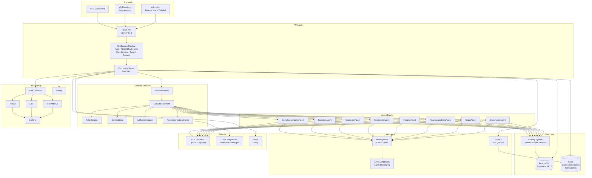
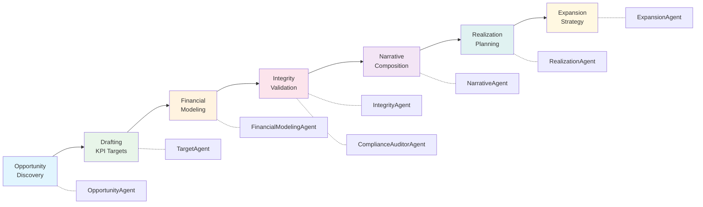
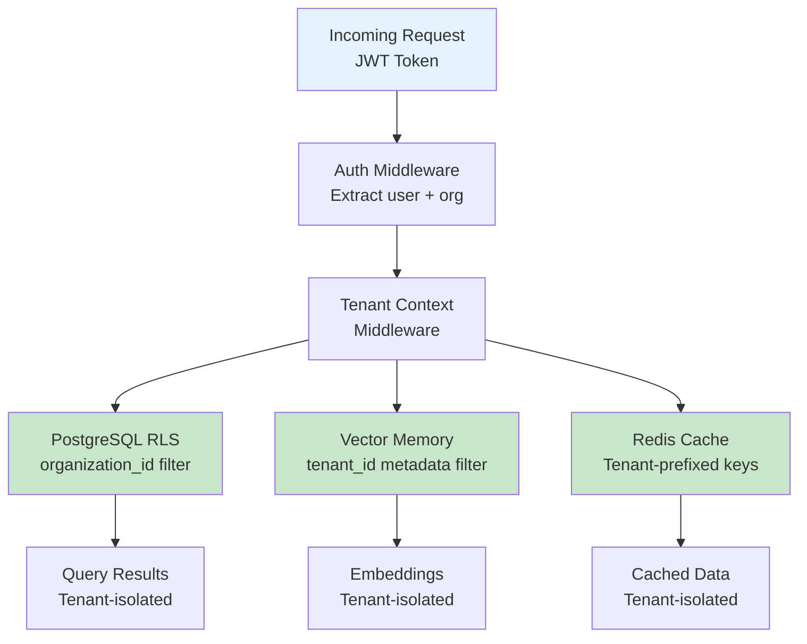
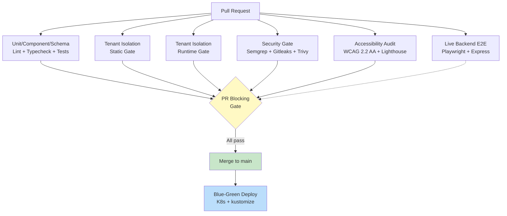

# ValueOS System Architecture Overview

_Added per audit recommendation #14: diagrams-as-code for onboarding speed._

## High-Level Architecture

## Agent Lifecycle Flow

## Multi-Tenant Data Flow

## CI/CD Pipeline

