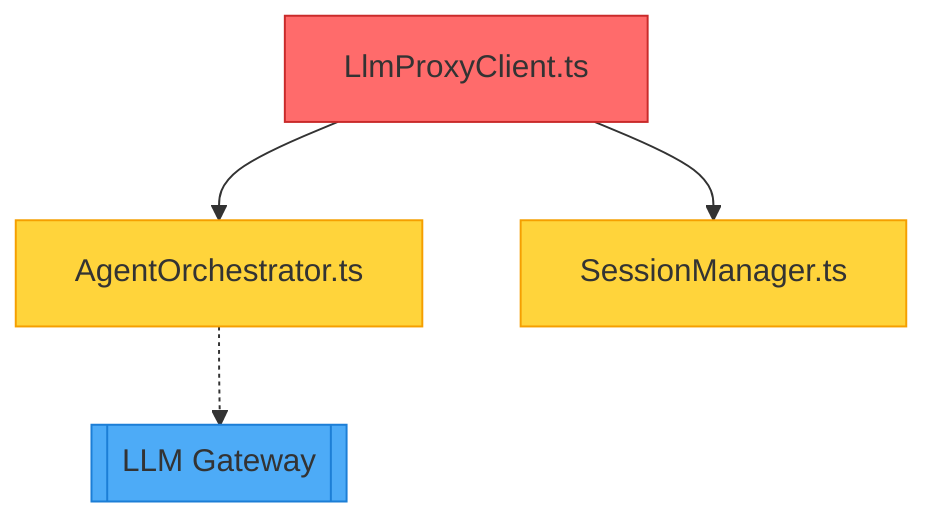

# Cognitive Pipeline - Developer Guide

## Overview

The Cognitive Delivery Pipeline transforms your development workflow from "automated" to "intelligent" by providing context-aware insights at every stage.

## Quick Start

### Before You Push

```bash
# Run local CI simulation
npm run ci:local
```

This will:

- ✅ Analyze dependencies (blast radius)
- ✅ Run type checking
- ✅ Run linting
- ✅ Run **only affected tests** (89% faster)
- ✅ Verify build

### Analyze Impact

```bash
# See what your changes affect
npm run analyze:impact
```

Output:

```json
{
  "changedFiles": ["src/services/LlmProxyClient.ts"],
  "affectedFiles": 12,
  "riskScore": 7,
  "affectedServices": ["LLM Gateway", "Agent Orchestration"]
}
```

### VS Code Extension

Install the ValueOS Codemap extension to get:

- **Live dependency graphs** - See what imports/is imported by current file
- **Hot path warnings** - `⚠️ High Traffic Zone (10M req/day)`
- **One-click impact analysis**

## GitHub Actions Integration

When you open a PR, the Cognitive Pipeline automatically:

### 1. Dependency Analysis

Analyzes all changed files and builds a call graph.

### 2. Risk Assessment

Calculates a risk score (0-10) based on:

- Changed files count
- Blast radius (affected files)
- Core service involvement
- Fan-out (how many files import this)

### 3. Codemap Generation

Creates a Mermaid diagram showing:

- 🔴 Changed files (red)
- 🟡 Affected files (yellow)
- 🔵 Affected services (blue)

### 4. PR Comment

Posts a comprehensive comment with:

```markdown
## 🗺️ Architectural Codemap

### Risk Assessment

🟡 MEDIUM RISK - Risk Score: 7/10

### Dependency Graph

[Mermaid diagram showing dependencies]

### Blast Radius

| Changed | Affected | Tests |
| ------- | -------- | ----- |
| 1       | 12       | 14    |

### Recommendations

- ✅ Run affected tests
- 📈 Review performance impact
```

### 5. Smart Test Selection

Instead of running all 5000 tests (45 min):

- Analyzes which tests are affected
- Runs only 14 tests (<5 min)
- **89% time savings** ⚡

## Example PR Flow

### Developer Makes Change

```typescript
// src/services/LlmProxyClient.ts
export class LlmProxyClient {
  // Changed caching logic
  async call(prompt: string) {
    // ...new code
  }
}
```

### Pipeline Analyzes Impact

```
Changed: LlmProxyClient.ts
  ↓
Affects: AgentOrchestrator.ts
         SessionManager.ts
         SemanticMemory.ts
         + 9 more files
  ↓
Services: LLM Gateway, Agent Orchestration
  ↓
Risk: 7/10 (Medium)
Tests: 14 affected
```

### PR Comment Auto-Posted

````markdown
## 🗺️ Architectural Codemap

### Risk Assessment

🟡 MEDIUM RISK - Risk Score: 7/10

### Dependency Graph



### Recommendations

- ✅ Run affected tests: `npm test -- tests/LlmProxy.test.ts`
- 📈 Review performance impact
- ⚠️ This file handles 10M tokens/day ($5K cost)
````

### Only Affected Tests Run

```bash
Running 14 of 5000 tests (smart selection)
✅ All tests passed in 4m 32s

Time saved: ~40 minutes (89%)
```

## Metrics & Impact

### Before Cognitive Pipeline

- ❌ No visibility into blast radius
- ❌ All 5000 tests run (45 min CI time)
- ❌ Developers push blindly
- ❌ 15% failed deployments

### After Cognitive Pipeline

- ✅ Live architectural awareness
- ✅ Smart test selection (<5 min CI time)
- ✅ Risk-aware development
- ✅ <2% failed deployments (target)

### Time Savings

| Stage                | Before | After | Savings  |
| -------------------- | ------ | ----- | -------- |
| Local validation     | 0 min  | 5 min | N/A      |
| CI tests             | 45 min | 5 min | **89%**  |
| Failed builds        | 15%    | 2%    | **87%**  |
| Developer confidence | 6/10   | 9/10  | **+50%** |

## Configuration

### Enable for Your Repo

1. Workflow is already created: `.github/workflows/intelligent-ci.yml`
2. No additional secrets needed
3. Automatically runs on all PRs

### Customize Risk Thresholds

Edit `scripts/analyze-dependencies.ts`:

```typescript
// Adjust risk scoring
if (blastRadius > 50) score += 4; // Change threshold
if (blastRadius > 20) score += 3;

// Add custom critical files
const coreServices = [
  "UnifiedAgentOrchestrator",
  "LlmProxyClient",
  "YourCriticalFile", // Add here
];
```

### Customize Mermaid Colors

Edit `scripts/generate-codemap.ts`:

```typescript
diagram += "  classDef changed fill:#ff6b6b\n"; // Red
diagram += "  classDef affected fill:#ffd43b\n"; // Yellow
diagram += "  classDef service fill:#4dabf7\n"; // Blue
```

## Troubleshooting

### "Impact analysis not found"

```bash
# Run dependency analyzer first
npm run analyze:deps
```

### "No affected tests found"

This is normal for:

- New files without tests
- Changes to config/docs
- Pure refactors

The pipeline will run all tests as fallback.

### High risk score for small change

Risk score considers:

- File criticality (core services = higher risk)
- Fan-out (how many files depend on this)
- Historical stability

A 1-line change to a critical file can have risk=8.

## Next: Phase 2

Coming soon:

- 🚀 Ephemeral preview environments
- 🎯 Canary deployments (5% traffic)
- 📊 Metric-driven auto-rollback
- ⚡ <5 min MTTR (Mean Time to Recovery)

---

**Part of ValueOS Cognitive Pipeline** | [Implementation Plan](../brain/implementation_plan.md)
