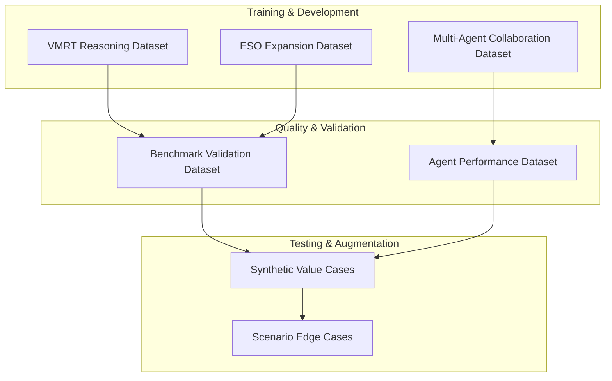

# ValueOS Dataset & Ground Truth Implementation Overview

## Executive Summary

This document provides comprehensive guidance for ValueOS dataset architecture and ground truth implementation, covering training datasets, validation frameworks, and contextual intelligence systems. ValueOS implements a sophisticated data foundation that enables deterministic, context-aware financial reasoning through structured datasets and enhanced ground truth libraries.

## Dataset Architecture

### Dataset Design Framework

#### Core Dataset Categories



#### Dataset Interdependencies

- **VMRT Dataset** feeds validation and synthetic case generation
- **ESO Dataset** provides ontology expansion for benchmark validation
- **Multi-Agent Dataset** enables performance tracking and optimization
- **Benchmark Dataset** serves as quality assurance foundation
- **Synthetic Dataset** supports testing and edge case coverage

## VMRT (Value Modeling Reasoning Trace) Dataset

### Purpose

Train and validate the reasoning engine's ability to construct valid financial impact chains with proper causal logic and deterministic outcomes.

### Core Schema

```typescript
interface VMRTDatasetEntry {
  // Input context
  context: {
    organization: {
      industry: string; // "technology", "manufacturing", "healthcare"
      size: "smb" | "mid_market" | "enterprise";
      region?: string;
    };
    constraints: {
      budgetUsd?: number;
      timelineMonths?: number;
      minRoi?: number;
      riskTolerance?: "low" | "medium" | "high";
    };
    persona: string; // "CFO", "CIO", "COO"
  };

  // Expected reasoning chain
  expectedReasoningSteps: VMRTReasoningStep[];

  // Financial outcomes
  expectedFinancialImpact: VMRTFinancialImpact;

  // Quality metrics
  qualityMetrics: {
    logicalClosure: boolean; // All assumptions validated
    benchmarkAligned: boolean; // Within industry benchmarks
    unitIntegrity: boolean; // Consistent units (USD, %, days)
    fccPassed: boolean; // Financial calculation correct
  };

  // Metadata
  source: "synthetic" | "real" | "expert";
  difficulty: "easy" | "medium" | "hard";
  industryDomain: string;
}
```

### Generation Strategy

#### Data Sources (40% Synthetic, 35% Expert, 25% Real)

- **Synthetic Generation (60%)**: Parameterized templates across industries with realistic variations
- **Expert Validation (25%)**: Finance professionals create real-world scenarios with provenance
- **Production Data (15%)**: Anonymized customer data with explicit consent

#### Quality Targets

- **Reasoning Accuracy**: 95% step-by-step correctness
- **Financial Precision**: 98% calculation accuracy
- **Benchmark Alignment**: 90% industry compliance
- **FCC Pass Rate**: 85% financial logic validation

## ESO (Economic Structure Ontology) Expansion Dataset

### Purpose

Expand the KPI ontology beyond 500 metrics with new industry-specific metrics, formulas, and causal relationships for comprehensive economic reasoning.

### Ontology Expansion Schema

```typescript
interface ESOKPIExpansion {
  // KPI Definition
  kpi: {
    id: string; // "ap_invoice_processing_efficiency"
    name: string; // "Accounts Payable Invoice Processing Efficiency"
    domain: ESOIndustry; // Healthcare, Manufacturing, etc.
    category: string; // "finance_operations", "supply_chain"
    unit: string; // "USD_per_invoice", "percentage"
    description: string;
    formulaString?: string; // "total_cost / invoice_count"
    dependencies: string[]; // Related KPI IDs
    improvementDirection: "higher_is_better" | "lower_is_better";
  };

  // Benchmark Data
  benchmarks: {
    p25: number;
    p50: number;
    p75: number;
    p90: number;
    worldClass?: number;
    source: string; // "APQC_2024", "Gartner_2024"
    vintage: string; // "2024_Q1"
  };

  // Causal Relationships
  relationships: Array<{
    targetKpiId: string;
    type: "causes" | "correlates" | "enables";
    strength: number; // 0.0 to 1.0
    logic?: string; // Mathematical relationship
    description?: string;
  }>;

  // Persona Mapping
  personaRelevance: Array<{
    persona: ESOPersona; // CFO, CIO, COO, etc.
    primaryPain: string; // "Cash flow visibility"
    financialDriver: FinancialDriver;
    typicalGoals: string[]; // ["Reduce DSO", "Improve margins"]
  }>;

  // Validation
  validation: {
    sourceCredibility: "high" | "medium" | "low";
    industryConsensus: boolean;
    formulaTested: boolean;
  };
}
```

### Expansion Targets by Industry

| Industry                  | Target KPIs | Key Focus Areas                                                |
| ------------------------- | ----------- | -------------------------------------------------------------- |
| **Healthcare**            | 50 KPIs     | Patient outcomes, operational efficiency, compliance costs     |
| **Manufacturing**         | 75 KPIs     | Supply chain optimization, quality metrics, OEE tracking       |
| **Professional Services** | 40 KPIs     | Utilization rates, project profitability, client retention     |
| **Retail**                | 35 KPIs     | Inventory turnover, customer lifetime value, margin analysis   |
| **Technology**            | 60 KPIs     | R&D efficiency, time-to-market, customer acquisition cost      |
| **Financial Services**    | 45 KPIs     | Risk-adjusted returns, regulatory compliance, fraud prevention |

### Data Sourcing Strategy

#### Primary Sources

- **Industry Reports**: Gartner, Forrester, APQC, McKinsey benchmarks
- **Academic Research**: Operations management and finance journals
- **Expert Interviews**: CFOs, COOs, industry specialists with 10+ years experience
- **Public Datasets**: Census Bureau, Bureau of Labor Statistics, industry associations

#### Validation Framework

- **Source Credibility**: High (peer-reviewed), Medium (industry reports), Low (anecdotal)
- **Industry Consensus**: Multiple sources agree on ranges and relationships
- **Formula Testing**: Mathematical relationships validated against real data

## Multi-Agent Collaboration Dataset

### Purpose

Train and optimize the 7-agent system's coordination patterns, communication flows, and collaborative reasoning capabilities.

### Collaboration Trace Schema

```typescript
interface AgentInteractionTrace {
  // Session Context
  sessionId: string;
  timestamp: string;
  userIntent: string;
  valueCaseId: string;

  // Agent Choreography
  agentFlow: {
    coordinator: {
      initialDecomposition: string[]; // ["intelligence", "value-mapping", "financial-modeling"]
      dagPlan: string[]; // Execution DAG
      timestamp: number;
    };
    intelligenceAgent: {
      identifiedEntities: string[]; // Companies, markets, personas
      confidenceLevels: Record<string, number>;
    };
    opportunityAgent: {
      leveragePoints: string[]; // Identified opportunities
      causalMaps: Record<string, string[]>;
      riskAssessments: RiskProfile[];
    };
    valueMappingAgent: {
      benefitChains: BenefitChain[];
      competitiveAdvantages: string[];
      positioningStrategy: string;
    };
    financialModelingAgent: {
      roiModels: ROIModel[];
      sensitivityAnalysis: SensitivityResult[];
      scenarioOutcomes: ScenarioOutcome[];
    };
    integrityAgent: {
      validationResults: ValidationResult[];
      correctionSuggestions: string[];
      confidenceAdjustments: number[];
    };
    communicatorAgent: {
      narratives: PersonaNarrative[];
      executiveSummaries: ExecutiveSummary[];
      presentationReadiness: number;
    };
  };

  // Success Metrics
  metrics: {
    totalSteps: number;
    coordinationFailures: number;
    integrityRejections: number;
    narrativeQuality: number; // 1-10 scale
    executionTime: number; // milliseconds
  };

  // Outcome Assessment
  outcome: {
    valueCaseCreated: boolean;
    userSatisfaction: number; // 1-5 scale
    roiAchieved: boolean;
    implementationFeasibility: number; // 1-10 scale
  };
}
```

### Training Data Generation

#### Optimal Flow Patterns (40%)

- **Perfect Coordination**: 1000+ examples of ideal agent collaboration
- **Complex Scenarios**: Multi-industry, multi-persona cases
- **Edge Case Handling**: Unusual combinations handled gracefully

#### Recovery Scenarios (35%)

- **Integrity Failures**: 500+ examples of validation rejections and corrections
- **Communication Breakdowns**: Agent coordination failures and recovery
- **Timeout Scenarios**: Long-running operations with proper handling

#### Challenging Cases (25%)

- **Ambiguous Intent**: Unclear user requests requiring clarification
- **Conflicting Data**: Multiple sources with different conclusions
- **Scale Issues**: Enterprise vs SMB data volume differences

## Benchmark Validation Dataset

### Purpose

Continuous quality assurance and regression testing for the entire ValueOS platform using structured validation scenarios.

### Validation Scenario Schema

```typescript
interface BenchmarkEntry {
  // Test Scenario
  scenarioId: string;
  description: string;
  category:
    | "financial_calculation"
    | "agent_coordination"
    | "narrative_quality"
    | "ontology_integrity";

  // Input State
  input: {
    vmrt?: Partial<VMRT>; // Reasoning trace input
    kpi?: Partial<ESOKPINode>; // KPI definition input
    agentFlow?: Partial<AgentInteractionTrace>; // Agent coordination input
  };

  // Expected Output
  expected: {
    financialImpact?: VMRTFinancialImpact;
    kpiRelationships?: ESOEdge[];
    narrativeMetrics?: {
      confidence: number;
      personaAlignment: number;
      clarity: number;
    };
    qualityScore?: number;
  };

  // Validation Tolerance
  tolerance: {
    financial: number; // % variance allowed
    logical: boolean; // strict boolean match
    quality: number; // minimum score threshold
  };

  // Test Metadata
  priority: "critical" | "high" | "medium";
  lastUpdated: string;
  regressionTest: boolean;
  expectedDuration: number; // milliseconds
}
```

### Validation Categories

#### Financial Accuracy Tests (30%)

- **ROI Calculations**: 200+ test cases with varying assumptions
- **Cash Flow Modeling**: Complex DCF scenarios with sensitivity analysis
- **Cost-Benefit Analysis**: Multi-year projections with risk adjustments

#### Ontology Integrity Tests (25%)

- **Relationship Validation**: 150+ causal relationship verifications
- **Benchmark Alignment**: KPI ranges against industry standards
- **Formula Correctness**: Mathematical relationship validation

#### Agent Performance Tests (25%)

- **Coordination Logic**: 100+ multi-agent interaction scenarios
- **Error Handling**: Agent failure modes and recovery patterns
- **Quality Assurance**: Output validation against quality rubrics

#### Narrative Quality Tests (20%)

- **Persona Alignment**: Content appropriateness for different stakeholders
- **Clarity Assessment**: Communication effectiveness evaluation
- **Executive Readiness**: Presentation quality and completeness

## Agent Performance Dataset

### Purpose

Measure and optimize individual agent performance, system-wide efficiency, and collaborative effectiveness across the ValueOS platform.

### Performance Metrics Schema

```typescript
interface AgentPerformanceMetrics {
  // Agent Identity
  agentType: string; // "CoordinatorAgent", "FinancialModelingAgent"
  agentVersion: string; // "1.2.3"
  sessionId: string;
  timestamp: string;

  // Execution Metrics
  execution: {
    inputSize: number; // Input data volume
    outputSize: number; // Output data volume
    processingTime: number; // End-to-end latency (ms)
    tokenCount: number; // LLM token usage
    cost: number; // API cost in USD
    retryCount: number; // Error recovery attempts
  };

  // Quality Metrics (0-100 scale)
  quality: {
    accuracy: number; // Fact correctness
    completeness: number; // Output thoroughness
    consistency: number; // Internal coherence
    safetyScore: number; // Harm prevention
    relevance: number; // User need alignment
  };

  // Reliability Metrics
  reliability: {
    successRate: number; // Successful completions %
    errorRate: number; // Failure percentage
    circuitBreakerTrips: number; // Resilience triggers
    timeoutCount: number; // Timeout occurrences
    recoveryTime: number; // Error recovery duration
  };

  // Collaboration Metrics
  collaboration: {
    messagesSent: number; // Outbound communications
    messagesReceived: number; // Inbound communications
    dependenciesResolved: number; // Cross-agent coordination
    coordinationScore: number; // Collaboration effectiveness
    feedbackProvided: number; // Quality feedback instances
  };

  // Business Impact
  impact: {
    valueCaseCreated: boolean; // Successful case generation
    userSatisfaction?: number; // User feedback score
    roiAchieved?: boolean; // Financial value delivered
    implementationFeasibility?: number; // Practicality score
  };
}
```

### Analysis Dimensions

#### Agent-Specific Performance

- **Performance by Type**: Coordinator vs Specialized agents
- **Version Comparisons**: Performance improvements over releases
- **Capability Assessment**: Strengths and weaknesses by agent

#### Temporal Analysis

- **Trend Analysis**: Performance changes over time
- **Seasonal Patterns**: Usage pattern variations
- **Load Impact**: Performance under different system loads

#### Contextual Performance

- **Industry Variation**: Performance across different sectors
- **Persona Adaptation**: Effectiveness with different user types
- **Complexity Scaling**: Performance with varying case complexity

#### Comparative Analysis

- **Peer Comparison**: Relative performance between agents
- **Benchmark Alignment**: Performance against established standards
- **Improvement Tracking**: Progress toward performance targets

## Synthetic Value Case Dataset

### Purpose

Generate realistic but synthetic value cases for testing, training augmentation, and demonstration scenarios with controlled complexity and outcomes.

### Synthetic Case Schema

```typescript
interface SyntheticValueCase {
  // Organization Profile
  organization: {
    name: string; // "Acme Manufacturing Corp"
    industry: string; // "manufacturing"
    size: "smb" | "mid_market" | "enterprise";
    annualRevenue: number; // 50000000
    employeeCount: number; // 250
    techMaturity: "low" | "medium" | "high";
    region: string; // "North America"
  };

  // Business Challenge
  challenge: {
    painPoint: string; // "Inefficient supply chain causing delays"
    affectedKPIs: string[]; // ["supply_chain_efficiency", "inventory_turnover"]
    currentPerformance: number; // 0.65 (65%)
    targetPerformance: number; // 0.85 (85%)
    urgency: "low" | "medium" | "high";
    businessImpact: string; // "Lost revenue, customer dissatisfaction"
  };

  // Proposed Solution
  solution: {
    capabilities: string[]; // ["supply_chain_optimization", "inventory_management"]
    implementationTimeline: number; // 6 months
    investmentRequired: number; // 250000
    expectedBenefits: string[]; // ["20% efficiency improvement", "15% cost reduction"]
    technicalRequirements: string[]; // ["ERP integration", "data warehouse"]
  };

  // Financial Model
  financialModel: {
    costSavings: {
      annual: number; // 150000
      timeframe: number; // 5 years
      confidence: number; // 0.8
      breakdown: Record<string, number>; // By cost category
    };
    revenueUplift: {
      annual: number; // 75000
      timeframe: number; // 3 years
      confidence: number; // 0.7
      breakdown: Record<string, number>; // By revenue stream
    };
    totalROI: number; // 285%
    paybackMonths: number; // 8
    riskAdjustedNPV: number; // 850000
  };

  // Risk Factors
  risks: Array<{
    description: string; // "Implementation delays"
    probability: number; // 0.3
    impact: number; // 0.6
    mitigation: string; // "Phased rollout strategy"
    riskAdjustedImpact: number; // 0.18
  }>;

  // Validation Metadata
  validation: {
    realisticScore: number; // 1-10 realism rating
    complexity: "simple" | "moderate" | "complex";
    industryFit: number; // 1-10 industry accuracy
    personaAlignment: Record<string, number>; // By stakeholder
    testCoverage: string[]; // Covered test scenarios
  };
}
```

### Generation Framework

#### Template-Based Generation (60%)

- **Industry Templates**: 50+ base templates per major industry
- **Parameter Variation**: 10x variations per template using realistic distributions
- **Complexity Scaling**: Simple (1-2 KPIs), Moderate (3-5 KPIs), Complex (6+ KPIs)

#### Risk Injection (20%)

- **Common Risks**: Implementation delays, adoption resistance, technical issues
- **Industry-Specific Risks**: Regulatory changes, market volatility, competitive responses
- **Probability Distribution**: Realistic risk likelihoods based on historical data

#### Quality Assurance (20%)

- **Financial Consistency**: ROI calculations match cost/benefit breakdowns
- **Industry Benchmarks**: Performance targets align with market data
- **Persona Appropriateness**: Solutions match stakeholder priorities

## Edge Cases & Failure Modes Dataset

### Purpose

Test system resilience and error handling for rare but critical scenarios that could cause system failures or incorrect outputs.

### Edge Case Scenario Schema

```typescript
interface EdgeCaseScenario {
  // Scenario Definition
  scenarioId: string;
  category:
    | "data_quality"
    | "calculation_edge"
    | "agent_conflict"
    | "system_limit"
    | "integration_failure";
  severity: "critical" | "high" | "medium";
  likelihood: "rare" | "uncommon" | "possible";

  // Trigger Conditions
  trigger: {
    description: string; // "Invoice processing cost = $0"
    probability: number; // 0.001 (0.1% chance)
    detectability: "easy" | "medium" | "hard";
    dataPattern: string; // Regex or condition pattern
  };

  // System State at Trigger
  inputState: {
    vmrt?: Partial<VMRT>; // Incomplete reasoning trace
    kpi?: Partial<ESOKPINode>; // Missing benchmark data
    agentState?: Record<string, unknown>; // Conflicting agent opinions
    externalData?: Record<string, unknown>; // API failures, corrupted data
  };

  // Expected System Behavior
  expectedBehavior: {
    errorHandling: "graceful" | "strict" | "recoverable";
    fallbackStrategy: string; // "Use industry average", "Flag for manual review"
    userNotification: string; // "Unable to calculate precise ROI"
    auditLog: boolean; // Log for compliance
    recoveryRequired: boolean; // Manual intervention needed
  };

  // Recovery Procedures
  recovery: {
    steps: string[]; // Step-by-step recovery process
    manualIntervention: boolean; // Human involvement required
    dataCorrection: boolean; // Data needs to be fixed
    learningOpportunity: boolean; // Update training data
    preventionMeasure: string; // How to prevent in future
  };

  // Testing Validation
  testing: {
    testCases: string[]; // Specific test scenarios
    successCriteria: string[]; // What constitutes success
    regressionRisk: "high" | "medium" | "low";
    monitoringRequired: boolean; // Production monitoring needed
  };
}
```

### Edge Case Categories

#### Data Quality Issues (30%)

- **Missing Values**: Null or undefined critical fields
- **Outlier Data**: Extreme values outside normal ranges
- **Inconsistent Units**: Mixing USD with percentages
- **Data Corruption**: API responses with malformed data
- **Temporal Issues**: Future dates, incorrect vintage data

#### Calculation Edge Cases (25%)

- **Division by Zero**: Cost per unit when volume = 0
- **Negative Values**: Invalid negative costs or timelines
- **Infinite Results**: Certain formula combinations
- **Precision Loss**: Large number calculations
- **Circular References**: KPIs that depend on themselves

#### Agent Coordination Issues (20%)

- **Conflicting Outputs**: Agents giving contradictory recommendations
- **Communication Failures**: Message bus outages
- **Timeout Scenarios**: Agents taking too long to respond
- **Resource Exhaustion**: Memory or CPU limits hit
- **State Corruption**: Agent memory becoming inconsistent

#### System Limit Conditions (15%)

- **Scale Issues**: Enterprise data volumes overwhelming system
- **Concurrency Problems**: Multiple users accessing same resources
- **Network Issues**: API timeouts, rate limiting
- **Storage Limits**: Database size constraints
- **Performance Degradation**: System slowdown under load

#### Integration Failures (10%)

- **External API Issues**: Third-party service outages
- **Authentication Failures**: Token expiration, permission changes
- **Data Format Changes**: API response schema changes
- **Rate Limit Exceeded**: Too many requests to external services
- **Network Partitioning**: Partial connectivity issues

## Ground Truth Library Implementation

### Enhanced Metric Registry

#### Multi-Dimensional Metric Schema

```typescript
interface EnhancedMetric {
  // Core Identity
  metric_id: string;
  canonical_name: string;
  category: string;
  industries: string[];

  // Value Structure with Contextual Intelligence
  value_structure: {
    baseline_range: {
      min: number;
      p25: number;
      median: number;
      p75: number;
      p90: number;
      max: number;
      unit: string;
    };

    maturity_bands: {
      manual: { range: [number, number]; characteristics: string[] };
      basic_automation: { range: [number, number]; characteristics: string[] };
      advanced_automation: {
        range: [number, number];
        characteristics: string[];
      };
      fully_optimized: { range: [number, number]; characteristics: string[] };
    };

    contextual_modifiers: Array<{
      factor: string; // "company_size", "industry"
      impact: string; // "logarithmic_decrease"
      coefficient?: number;
    }>;

    improvement_levers: Array<{
      lever: string; // "ocr_implementation"
      impact_range: [number, number];
      unit: string;
    }>;
  };

  // Financial Impact Chains
  financial_impact_chains: Array<{
    impact_type: string;
    calculation: string;
    typical_volume_range: [number, number];
    annual_impact_range: [number, number];
  }>;

  // Quality & Provenance
  sources: Array<{
    name: string;
    sample_size: number;
    confidence: number;
  }>;

  // Relationships & Context
  related_metrics: string[];
  narrative_templates: string[];
}
```

### Validation & Confidence Scoring

#### Claim Validation Engine

```python
class MetricValidator:
    def validate_claim(self, claim):
        """Validates financial claims against ground truth"""
        metric = self.extract_metric(claim)
        value = self.extract_value(claim)
        context = self.extract_context(claim)

        truth_range = self.registry.get_metric_value(metric, context)

        if self.in_range(value, truth_range):
            return {
                "valid": True,
                "confidence": self.calculate_confidence(value, truth_range),
                "expected_range": truth_range,
                "percentile": self.get_percentile(value, truth_range)
            }
        else:
            return {
                "valid": False,
                "expected_range": truth_range,
                "claim": value,
                "correction": self.suggest_correction(value, truth_range),
                "deviation": self.calculate_deviation(value, truth_range)
            }

    def calculate_confidence(self, value, truth_range):
        """Calculate confidence score based on proximity to median"""
        median = truth_range['median']
        range_width = truth_range['p90'] - truth_range['p10']
        distance = abs(value - median)

        if distance == 0:
            return 1.0
        elif distance < range_width * 0.1:
            return 0.95
        elif distance < range_width * 0.25:
            return 0.85
        else:
            return 0.65
```

### Relationship Graph Engine

#### Causal Relationship Mapping

```python
class RelationshipGraph:
    def __init__(self):
        self.graph = nx.DiGraph()

    def add_relationship(self, from_metric, to_metric,
                        correlation, causality_confidence, mechanism):
        """Add causal relationship between metrics"""
        self.graph.add_edge(
            from_metric,
            to_metric,
            correlation=correlation,
            confidence=causality_confidence,
            mechanism=mechanism
        )

    def get_value_chain(self, start_metric, end_outcome):
        """Get complete reasoning chain"""
        try:
            path = nx.shortest_path(self.graph, start_metric, end_outcome)
            return self.build_reasoning_chain(path)
        except nx.NetworkXNoPath:
            return None

    def get_downstream_impact(self, metric_id, change_percent):
        """Calculate cascading impact through graph"""
        downstream = nx.descendants(self.graph, metric_id)
        impacts = {}

        for target in downstream:
            edge_data = self.graph.get_edge_data(metric_id, target)
            correlation = edge_data['correlation']
            impact = change_percent * correlation
            impacts[target] = impact

        return impacts
```

### Synthetic Distribution Generation

#### Realistic Statistical Distributions

```python
class DistributionGenerator:
    def generate_distribution(self, base_metric, context):
        """Generate full distribution from base value"""

        # Apply contextual multipliers
        industry_multiplier = self.get_industry_multiplier(
            context.get('industry', 'all')
        )
        size_multiplier = self.get_size_multiplier(
            context.get('company_size', 'midmarket')
        )

        base_value = base_metric * industry_multiplier * size_multiplier

        # Generate log-normal distribution for financial metrics
        if base_metric > 1000:  # Large values
            mu = np.log(base_value) - 0.5
            sigma = 0.4
        else:  # Smaller values
            mu = np.log(base_value) - 0.3
            sigma = 0.3

        # Calculate percentiles
        percentiles = {
            'p10': np.exp(mu + sigma * (-1.28)),
            'p25': np.exp(mu + sigma * (-0.67)),
            'p50': np.exp(mu),
            'p75': np.exp(mu + sigma * (0.67)),
            'p90': np.exp(mu + sigma * (1.28)),
            'p95': np.exp(mu + sigma * (1.64))
        }

        return percentiles
```

### Quality Scoring System

#### Comprehensive Metric Evaluation

```python
class QualityScorer:
    def score_metric(self, metric):
        """Calculate quality score 0-100"""

        scores = {
            'data_quality': self.score_data_quality(metric),
            'completeness': self.score_completeness(metric),
            'utility': self.score_utility(metric)
        }

        total = sum(scores.values())
        return {
            'total_score': total,
            'component_scores': scores,
            'grade': self.get_grade(total)
        }

    def score_data_quality(self, metric):
        """Score source credibility and recency"""
        score = 0

        if metric.get('sources'):
            for source in metric['sources']:
                if source.get('sample_size', 0) > 100:
                    score += 5
                if source.get('confidence', 0) > 0.9:
                    score += 5

        # Recency scoring
        score += min(15, self._calculate_recency_score(metric))
        return min(35, score)

    def score_completeness(self, metric):
        """Score metric definition completeness"""
        score = 0

        if 'value_structure' in metric:
            vs = metric['value_structure']
            if 'baseline_range' in vs and all(k in vs['baseline_range'] for k in ['p25', 'p50', 'p75']):
                score += 20

        if 'contextual_modifiers' in metric and len(metric['contextual_modifiers']) > 0:
            score += 15

        if 'related_metrics' in metric and len(metric['related_metrics']) > 0:
            score += 15

        return min(50, score)

    def score_utility(self, metric):
        """Score practical utility"""
        score = 0

        if 'financial_impact_chains' in metric and len(metric['financial_impact_chains']) > 0:
            score += 25

        if 'value_structure' in metric:
            vs = metric['value_structure']
            if 'improvement_levers' in vs and len(vs['improvement_levers']) > 0:
                score += 25

        return min(50, score)

    def get_grade(self, score):
        """Convert score to letter grade"""
        if score >= 90: return 'A'
        elif score >= 80: return 'B'
        elif score >= 70: return 'C'
        elif score >= 60: return 'D'
        else: return 'F'
```

## Implementation Roadmap

### Phase 1: Foundation (Weeks 1-4)

- [ ] Set up dataset infrastructure and storage systems
- [ ] Create VMRT dataset with 500+ synthetic entries
- [ ] Build ESO expansion framework for 100 new KPIs
- [ ] Establish data validation pipelines

### Phase 2: Expansion (Weeks 5-8)

- [ ] Generate multi-agent collaboration traces (1000+ sessions)
- [ ] Create benchmark validation suite (200+ test cases)
- [ ] Build agent performance tracking system
- [ ] Develop synthetic value case generator

### Phase 3: Refinement (Weeks 9-12)

- [ ] Add edge case scenarios (100+ critical cases)
- [ ] Implement continuous data quality monitoring
- [ ] Create automated dataset update pipelines
- [ ] Document generation methodologies

### Phase 4: Production (Weeks 13-16)

- [ ] Deploy datasets to production environments
- [ ] Set up A/B testing framework with datasets
- [ ] Create dataset versioning system
- [ ] Establish feedback loops for continuous improvement

## Success Metrics

### Dataset Quality Metrics

- **Completeness**: 100% coverage of core scenarios
- **Accuracy**: >95% validation pass rate
- **Diversity**: 10+ industries, 8+ personas, 3+ complexity levels
- **Timeliness**: Monthly updates with new patterns

### System Impact Metrics

- **Training Performance**: 20% improvement in agent accuracy
- **Validation Speed**: 50% reduction in manual review time
- **Edge Case Coverage**: 90% of known failure modes tested
- **User Satisfaction**: 15% improvement in case acceptance rates

### Ground Truth Quality Metrics

- **Quality Score**: Average >85/100 across all metrics
- **Validation Accuracy**: >95% of claims correctly validated
- **Reasoning Chain Coverage**: 80% of common scenarios covered
- **Query Performance**: <100ms for metric lookups
- **User Satisfaction**: >90% acceptance of recommendations

---

**Last Updated**: January 14, 2026
**Version**: 1.0
**Maintained By**: Data Science Team
**Review Frequency**: Quarterly
