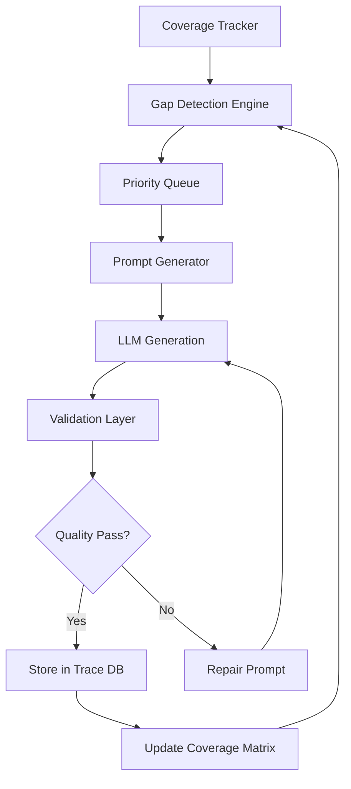
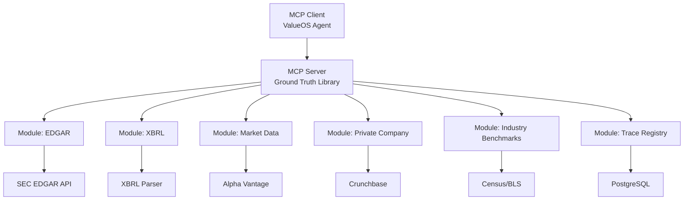

# ValueOS Engineering & Development Overview

## Executive Summary

This document provides a comprehensive guide to ValueOS engineering practices, covering AI architecture principles, implementation methodologies, testing strategies, observability systems, and technical debt management. ValueOS follows a structured approach to building AI-powered financial intelligence systems with rigorous quality standards and production-grade infrastructure.

## AI Architecture Principles

### Three-Layer Truth Framework

ValueOS implements a hierarchical truth framework for financial reasoning:

#### Layer 1: Metric Truth (Reality Check)

- **Purpose**: Ensure all numbers are grounded in real-world data
- **Function**: Statistical constraints, plausibility bounds, segment-specific ranges
- **Protection**: Prevents hallucinated numbers
- **Implementation**: Ground truth library with 1,575+ reasoning traces

#### Layer 2: Structural Truth (Logic Check)

- **Purpose**: Validate computational integrity of financial models
- **Function**: KPI dependencies, formula definitions, computational logic, directional relationships
- **Protection**: Prevents hallucinated math
- **Implementation**: Economic Structure Graph with 50-100 core formulas

#### Layer 3: Causal Truth (Impact Check)

- **Purpose**: Model real-world cause-and-effect relationships
- **Function**: Action-KPI elasticities, expected uplift distributions, time-to-realize curves
- **Protection**: Prevents hallucinated economics
- **Implementation**: Causal Reasoning Graph with 100-200 empirical relationships

### AI System Architecture

```
┌─────────────────────────────────────────────────────────────┐
│                    VALUE OPERATING SYSTEM                   │
├─────────────────────────────────────────────────────────────┤
│  ┌─────────────────────────────────────────────────────┐    │
│  │              AI AGENT FABRIC                       │    │
│  │  ┌─────────────┐  ┌─────────────┐  ┌─────────────┐ │    │
│  │  │ Coordinator │  │ Specialized │  │ Retrieval  │ │    │
│  │  │   Agent     │  │   Agents    │  │ Conditioned │ │    │
│  │  │             │  │             │  │   Agents    │ │    │
│  │  └─────────────┘  └─────────────┘  └─────────────┘ │    │
│  └─────────────────────────────────────────────────────┘    │
├─────────────────────────────────────────────────────────────┤
│  ┌─────────────────────────────────────────────────────┐    │
│  │              THREE LAYER TRUTH                      │    │
│  │  ┌─────────────┐  ┌─────────────┐  ┌─────────────┐ │    │
│  │  │ Metric      │  │ Structural  │  │ Causal      │ │    │
│  │  │  Truth      │  │  Truth      │  │  Truth      │ │    │
│  │  └─────────────┘  └─────────────┘  └─────────────┘ │    │
│  └─────────────────────────────────────────────────────┘    │
├─────────────────────────────────────────────────────────────┤
│  ┌─────────────────────────────────────────────────────┐    │
│  │              PRODUCTION INFRASTRUCTURE             │    │
│  │  ┌─────────────┐  ┌─────────────┐  ┌─────────────┐ │    │
│  │  │ Kubernetes  │  │ Observability│  │ CI/CD      │ │    │
│  │  │   Cluster   │  │    Stack    │  │ Pipeline    │ │    │
│  │  └─────────────┘  └─────────────┘  └─────────────┘ │    │
│  └─────────────────────────────────────────────────────┘    │
└─────────────────────────────────────────────────────────────┘
```

## Implementation Methodology

### Coverage Matrix Strategy

#### Comprehensive Coverage Framework

- **15 Industries**: SaaS, Manufacturing, Healthcare, Financial Services, Retail, Energy, Professional Services, Transportation, Education, Government
- **25 Personas**: Executives (CEO, CFO, COO, CIO/CTO, CRO, CMO, CHRO, CDO), Functional Leaders (VP Finance, VP Sales, etc.), Operational (Director IT, Controller, etc.), Technical (Enterprise Architect, Security Lead, etc.)
- **3 Value Types**: Revenue Uplift, Cost Savings, Risk Reduction
- **7 Lifecycle Stages**: Awareness, Discovery, Qualification, Solution Design, Business Case, Negotiation, Commitment
- **10 Problem Categories**: Efficiency Gaps, Growth Barriers, Compliance Requirements, Competitive Pressure, Customer Experience, Digital Transformation, Data Silos, Talent Challenges, Supply Chain Disruption, Margin Compression

#### Priority Cell Selection

**Priority 1 (525 cells)**: High-value combinations with immediate business impact
**Priority 2 (Additional cells)**: Medium-value combinations
**Priority 3 (All remaining)**: Nice-to-have coverage

#### Quality Distribution

- **30% SMB**: Limited budget, agile decision-making, few stakeholders
- **50% Mid-Market**: Moderate complexity, formal procurement, multi-stakeholder
- **20% Enterprise**: High complexity, executive approval, long sales cycle

### Ground Truth Library Implementation

#### Trace Generation Pipeline



#### Generation Milestones

1. **First 100 traces**: Quality validation and pipeline testing
2. **First 500 traces**: Coverage validation and issue resolution
3. **1,575 traces**: Complete priority coverage with quality assurance

### MCP Server Deployment

#### Architecture Overview



#### MCP Tools Available

- `get_metric_value`: Contextualized metric values with confidence bounds
- `validate_claim`: Financial claim validation against ground truth
- `get_value_chain`: Reasoning chain from metric to outcome
- `get_similar_traces`: Retrieve similar reasoning traces
- `get_coverage_report`: Current coverage status
- `get_gap_filling_prompts`: Prompts to fill coverage gaps

## Testing Strategy

### Coverage Matrix Testing

#### Reasoning Requirements

- **Minimum Steps**: 5 reasoning steps per trace
- **Maximum Steps**: 15 reasoning steps per trace
- **Required Elements**: Problem identification, root cause analysis, capability mapping, outcome prediction, KPI selection, baseline establishment, impact calculation, assumption documentation, risk assessment, confidence scoring

#### Financial Sophistication Levels

- **Basic (30%)**: Simple ROI, payback period, annual savings
- **Intermediate (50%)**: NPV, IRR, TCO, sensitivity analysis
- **Advanced (20%)**: Monte Carlo, real options, portfolio optimization, risk-adjusted returns

### Diversity Scoring System

#### Distribution Metrics

```python
def calculate_diversity_score(traces):
    scores = {
        'industry_distribution': score_evenness(traces, 'industry'),
        'persona_distribution': score_evenness(traces, 'persona'),
        'value_type_distribution': score_evenness(traces, 'value_type'),
        'stage_distribution': score_evenness(traces, 'stage'),
        'company_size_distribution': score_evenness(traces, 'company_size'),
        'deal_size_distribution': score_evenness(traces, 'deal_size'),
        'complexity_distribution': score_evenness(traces, 'complexity'),
        'financial_sophistication': score_evenness(traces, 'sophistication')
    }
    return sum(scores.values()) / len(scores)
```

#### Quality Assurance

- **Gini Coefficient Analysis**: Measure distribution evenness
- **Gap Detection**: Automatic identification of coverage deficiencies
- **Quality Scoring**: Automated assessment of reasoning quality
- **Diversity Metrics**: Ensure comprehensive scenario coverage

## Observability & Monitoring

### Production-Grade Observability Stack

#### Core Components

- **Grafana**: Visualization and dashboards (9.5/10)
- **Jaeger**: Distributed tracing (9.5/10)
- **Tempo**: Alternative tracing backend (9.0/10)
- **Prometheus**: Metrics collection (9.5/10)
- **Loki**: Log aggregation (9.5/10)
- **Fluent Bit**: Log forwarding (9.5/10)
- **OpenTelemetry**: Instrumentation (10/10)

#### Architecture Overview

```
┌─────────────────────────────────────────────────────────────┐
│                         Grafana                              │
│              (Visualization & Dashboards)                    │
│  - Pre-built dashboards                                      │
│  - Multi-datasource queries                                  │
│  - Alerting & notifications                                  │
└────────┬──────────────┬──────────────┬─────────────────────┘
         │              │              │
         ▼              ▼              ▼
┌────────────┐  ┌────────────┐  ┌────────────┐
│ Prometheus │  │   Jaeger   │  │    Loki    │
│  (Metrics) │  │  (Traces)  │  │   (Logs)   │
│            │  │            │  │            │
│ - PromQL   │  │ - OTLP     │  │ - LogQL    │
│ - Alerts   │  │ - Zipkin   │  │ - Labels   │
│ - Storage  │  │ - Badger   │  │ - Streams  │
└─────┬──────┘  └─────┬──────┘  └─────┬──────┘
      │               │               │
      │               │               │
      ▼               ▼               ▼
┌─────────────────────────────────────────────┐
│         Application Pods                     │
│  ┌──────────┐  ┌──────────┐  ┌──────────┐  │
│  │ Backend  │  │ Backend  │  │ Frontend │  │
│  │  (OTEL)  │  │  (OTEL)  │  │          │  │
│  │          │  │          │  │          │  │
│  │ Metrics  │  │ Traces   │  │ Logs     │  │
│  │ :9464    │  │ :4317    │  │ stdout   │  │
│  └──────────┘  └──────────┘  └──────────┘  │
└─────────────────────────────────────────────┘
                 ▲
                 │
              ┌──┴────┐
              │ Fluent│
              │  Bit  │
              │DaemonSet│
              │        │
              │- Collect│
              │- Enrich │
              │- Forward│
              └────────┘
```

### Monitoring Capabilities

#### Application Metrics

- HTTP request rate, duration, error rate
- Active requests and database connections
- Cache hit/miss rates and agent performance
- Database query duration and connection health

#### System Metrics

- CPU, memory, disk I/O, network traffic
- Pod status, container restarts, resource utilization

#### Distributed Tracing

- Request flow visualization and service dependencies
- Span duration analysis and error tracking
- Performance bottleneck identification

#### Alerting Rules

- High error rate (>5%), high response time (P95 >1s)
- Pod down (>2min), high CPU/memory usage
- Pod restarting frequently

### OpenTelemetry Instrumentation

#### Auto-Instrumentation Coverage

```typescript
const instrumentation = [
  "http", // HTTP requests
  "express", // Express framework
  "pg", // PostgreSQL queries
  "redis", // Redis operations
  "dns", // DNS lookups (disabled for perf)
  "fs", // File system (disabled for perf)
  "net", // Network operations
];
```

#### Export Targets

- **Traces**: Jaeger via OTLP gRPC (port 4317)
- **Metrics**: Prometheus via OTLP (port 9464)
- **Logs**: Loki via Fluent Bit

## Technical Debt Management

### Critical Security & Compliance Issues

#### RBAC Integration Gaps

- Missing RBAC integration in `src/config/secretsManager.v2.ts`
- Incomplete tenant verification logic
- Missing database audit log writes for secret operations

#### Audit Logging Deficiencies

- Secret providers missing audit log writes
- Incomplete audit trail for sensitive operations
- Missing compliance event logging

### Code Quality Issues

#### Large File Complexity

- `ChatCanvasLayout.tsx`: 2,100+ lines (UI logic sprawl)
- `structural-data.ts`: 1,900+ lines (huge type definitions)
- `UnifiedAgentOrchestrator.ts`: 1,600+ lines (central orchestration bottleneck)
- `BaseAgent.ts`: 977+ lines (violates single responsibility)

#### Logic Duplication

- Parallel implementations of business case generators
- Incomplete migration from legacy to enhanced versions
- Multiple configuration files for same tools

#### TODO/FIXME Accumulation

- 89 TODO/FIXME comments across codebase
- Missing implementations in key views
- Incomplete service initialization

### Configuration Sprawl

#### Vite Configuration Fragmentation

- Multiple config files: `vite.config.ts`, `vite.config.minimal.ts`, `vite.config.ts.bare`, `vite.config.ts.react-only`, `vite.config.ts.ultra-minimal`, `vite-debug.config.ts`
- Maintenance overhead from configuration variants
- Unclear which config to use for different scenarios

#### Test Configuration Complexity

- Multiple Vitest configs: `vitest.config.ts`, `vitest.config.bfa.ts`, `vitest.config.fast.ts`, `vitest.config.integration.ts`, `vitest.config.resilience.ts`, `vitest.config.ui.ts`, `vitest.config.unit.ts`
- Inconsistent test execution across environments

#### Package File Variants

- Multiple package.json files for different scenarios
- Non-standard dependency versions creating confusion

### Testing Architecture Issues

#### Directory Structure Confusion

- Tests scattered across `tests/`, `test/`, `src/test/`
- Unclear conventions for test organization
- Mixed unit, integration, and E2E tests

#### Dependency Management

- Non-standard Vite/Vitest versions
- Custom registry usage creating lock-in
- Dependency version conflicts

## Development Practices

### Code Quality Standards

#### TypeScript Implementation

- **Strict Mode**: All code compiled with strict TypeScript settings
- **Type Safety**: 100% type coverage with no `any` types
- **Interface Design**: Comprehensive type definitions for all APIs
- **Generic Constraints**: Proper use of TypeScript generics

#### Code Organization

- **Feature-Based Structure**: Code organized by business capabilities
- **Shared Libraries**: Common functionality extracted to reusable packages
- **API Contracts**: OpenAPI specification for service interfaces
- **Import Structure**: Clear separation of internal/external dependencies

### Testing Strategy

#### Test Categories

- **Unit Tests**: Individual component and function testing
- **Integration Tests**: Service interaction and API testing
- **End-to-End Tests**: Complete user workflow validation
- **Performance Tests**: Load and scalability testing
- **Security Tests**: Vulnerability and access control testing

#### Quality Gates

- **Code Coverage**: Minimum 80% coverage requirement
- **Mutation Testing**: Additional quality validation
- **Performance Benchmarks**: Regression prevention
- **Security Scanning**: Automated vulnerability detection

### CI/CD Pipeline

#### Quality Assurance

- **Linting**: ESLint with strict rules and formatting
- **Type Checking**: TypeScript compilation verification
- **Testing**: Automated test execution with coverage reporting
- **Security Scanning**: Dependency and code vulnerability analysis
- **Build Verification**: Production build validation

#### Deployment Strategy

- **Blue-Green Deployments**: Zero-downtime release capability
- **Feature Flags**: Gradual feature rollout control
- **Rollback Procedures**: Automated failure recovery
- **Monitoring Integration**: Real-time deployment health tracking

## Performance Optimization

### Application Performance

#### Response Time Targets

- **API Endpoints**: P95 < 500ms
- **Page Loads**: < 2 seconds
- **Agent Processing**: < 30 seconds for complex operations
- **Database Queries**: < 100ms for standard operations

#### Caching Strategy

- **Application Level**: Redis for session and computed data
- **Database Level**: Query result caching with TTL
- **CDN Level**: Static asset global distribution
- **Browser Level**: Appropriate cache headers and local storage

### Infrastructure Scaling

#### Horizontal Scaling

- **Stateless Services**: Independent scaling units
- **Load Balancing**: Traffic distribution algorithms
- **Auto-scaling**: CPU/memory-based scaling triggers
- **Service Mesh**: Istio-based service communication

#### Database Scaling

- **Read Replicas**: Query load distribution
- **Connection Pooling**: Resource utilization optimization
- **Sharding Strategy**: Data partitioning for large datasets
- **Archive Strategy**: Historical data management

## Future Engineering Roadmap

### AI Architecture Evolution

#### Advanced Agent Capabilities

- **Multi-modal Processing**: Text, image, and data integration
- **Federated Learning**: Distributed model training
- **Explainable AI**: Reasoning transparency and audit trails
- **Adaptive Learning**: Continuous model improvement

#### Truth Layer Expansion

- **Real-time Truth Updates**: Live data integration
- **Cross-domain Reasoning**: Multi-industry knowledge application
- **Causal Inference**: Advanced impact prediction
- **Uncertainty Quantification**: Confidence interval modeling

### Platform Modernization

#### Serverless Migration

- **Function as Service**: Appropriate workload decomposition
- **Event-Driven Architecture**: Message-based system communication
- **Micro-frontend Architecture**: UI modularity and composition
- **Edge Computing**: Reduced latency for global users

#### Infrastructure Evolution

- **Multi-cloud Strategy**: Provider diversity and resilience
- **GitOps Implementation**: Declarative infrastructure management
- **Service Mesh**: Advanced traffic management and security
- **Chaos Engineering**: Failure simulation and resilience testing

### Quality Assurance Advancement

#### Testing Automation

- **AI-Assisted Testing**: Intelligent test case generation
- **Visual Regression**: UI consistency validation
- **Performance Profiling**: Automated bottleneck detection
- **Contract Testing**: API compatibility verification

#### Observability Enhancement

- **Service Mesh Integration**: Advanced traffic observability
- **Business Metrics**: Revenue and user experience KPIs
- **Predictive Monitoring**: Anomaly detection and alerting
- **Cost Optimization**: Resource usage and efficiency tracking

## Conclusion

ValueOS engineering practices emphasize rigorous quality standards, comprehensive testing, production-grade observability, and systematic technical debt management. The three-layer truth framework provides the foundation for reliable AI-powered financial reasoning, while the coverage matrix ensures comprehensive scenario handling.

The development methodology focuses on iterative improvement, automated quality assurance, and scalable infrastructure that can support enterprise-grade AI applications.

---

**Last Updated**: January 14, 2026
**Version**: 1.0
**Maintained By**: Engineering Team
**Review Frequency**: Quarterly
