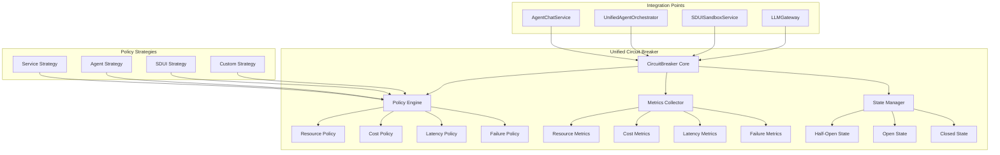

# ValueOS Resilience & Reliability Documentation Overview

## Executive Summary

This document provides comprehensive documentation for ValueOS resilience engineering and reliability patterns, focusing on circuit breaker consolidation, unified state management, and system resilience strategies. The platform implements sophisticated resilience patterns to ensure reliable operation under various failure conditions and load scenarios.

## Circuit Breaker Consolidation & State Management

### Current Implementation Analysis

#### Implementation Survey

ValueOS currently maintains 4 disparate CircuitBreaker implementations across different system layers:

| Location                                   | Primary Purpose          | Key Features                              | State Management      | Lines of Code |
| ------------------------------------------ | ------------------------ | ----------------------------------------- | --------------------- | ------------- |
| **src/services/CircuitBreaker.ts**         | Service-level protection | Failure rate tracking, latency thresholds | Complex metrics array | 275           |
| **src/lib/resilience/CircuitBreaker.ts**   | General resilience       | Basic 3-state pattern                     | Simple counters       | 181           |
| **src/lib/agent-fabric/CircuitBreaker.ts** | Agent safety limits      | Cost/time/memory limits                   | Detailed metrics      | 391           |
| **src/sdui/errors/CircuitBreaker.ts**      | SDUI error handling      | Callback support, rolling window          | Timestamp tracking    | 328           |

#### Feature Comparison Matrix

| Feature                   | Services | Resilience | Agent Fabric | SDUI | Unified Target |
| ------------------------- | -------- | ---------- | ------------ | ---- | -------------- |
| **3-State Pattern**       | ✅       | ✅         | ✅           | ✅   | ✅             |
| **Failure Rate Tracking** | ✅       | ❌         | ❌           | ✅   | ✅             |
| **Latency Thresholds**    | ✅       | ❌         | ❌           | ❌   | ✅             |
| **Cost Limiting**         | ❌       | ❌         | ✅           | ❌   | ✅             |
| **Memory Limits**         | ❌       | ❌         | ✅           | ❌   | ✅             |
| **Time Limits**           | ❌       | ❌         | ✅           | ❌   | ✅             |
| **Rolling Window**        | ✅       | ❌         | ❌           | ✅   | ✅             |
| **Callbacks**             | ❌       | ❌         | ❌           | ✅   | ✅             |
| **Metrics Export**        | ✅       | ✅         | ✅           | ✅   | ✅             |
| **Config Overrides**      | ✅       | ❌         | ❌           | ❌   | ✅             |

### Critical Issues Identified

#### 1. Configuration Inconsistency

Multiple implementations use different configuration schemas, leading to inconsistent behavior:

**Services CircuitBreaker:**

```typescript
{
  windowMs: 60_000,
  failureRateThreshold: 0.5,
  latencyThresholdMs: 2_000,
  minimumSamples: 5
}
```

**Resilience CircuitBreaker:**

```typescript
{
  failureThreshold: 5,
  resetTimeout: 60000,
  halfOpenSuccessThreshold: 2
}
```

**Agent Fabric CircuitBreaker:**

```typescript
{
  maxExecutionTime: 30000,
  maxLLMCalls: 20,
  maxRecursionDepth: 5
}
```

#### 2. State Synchronization Gaps

- No shared state between implementations
- Different metric collection strategies
- Inconsistent state transition logic

#### 3. Monitoring Fragmentation

- Multiple metrics formats across implementations
- No unified observability dashboard
- Duplicated logging and alerting logic

---

## Unified Circuit Breaker Design

### Core Architecture



### Unified Configuration Schema

```typescript
interface UnifiedCircuitBreakerConfig {
  // Core configuration
  name: string;
  strategy: CircuitBreakerStrategy;

  // Failure thresholds
  failureThreshold?: number;
  failureRateThreshold?: number;
  minimumSamples?: number;

  // Timing configuration
  windowMs: number;
  resetTimeoutMs: number;
  halfOpenMaxCalls?: number;

  // Performance thresholds
  latencyThresholdMs?: number;
  responseTimePercentile?: number;

  // Resource limits (for agents)
  maxExecutionTimeMs?: number;
  maxMemoryBytes?: number;
  maxCostUsd?: number;
  maxApiCalls?: number;

  // Callbacks
  onStateChange?: (from: CircuitState, to: CircuitState) => void;
  onFailure?: (error: Error, metrics: CircuitMetrics) => void;
  onRecovery?: (metrics: CircuitMetrics) => void;

  // Advanced options
  rollingWindowSize?: number;
  enableMetrics?: boolean;
  enableDetailedLogging?: boolean;
}

enum CircuitBreakerStrategy {
  SERVICE = "service", // Standard service protection
  AGENT = "agent", // Agent execution limits
  SDUI = "sdui", // SDUI rendering protection
  CUSTOM = "custom", // User-defined strategy
}
```

### State Management Implementation

```typescript
enum CircuitState {
  CLOSED = "closed",
  OPEN = "open",
  HALF_OPEN = "half_open",
}

interface CircuitMetrics {
  // Basic metrics
  totalCalls: number;
  successfulCalls: number;
  failedCalls: number;

  // Timing metrics
  averageResponseTime: number;
  p95ResponseTime: number;
  p99ResponseTime: number;

  // Failure metrics
  failureRate: number;
  consecutiveFailures: number;
  lastFailureTime: Date | null;

  // Resource metrics (agent strategy)
  executionCost: number;
  memoryUsage: number;
  apiCallCount: number;

  // State tracking
  currentState: CircuitState;
  stateTransitions: StateTransition[];
  openedAt: Date | null;
  lastStateChange: Date;
}

interface StateTransition {
  from: CircuitState;
  to: CircuitState;
  timestamp: Date;
  reason: string;
  metrics: CircuitMetrics;
}
```

### Unified Circuit Breaker State Manager

```typescript
class UnifiedCircuitBreakerStateManager {
  private state: CircuitState = CircuitState.CLOSED;
  private metrics: CircuitMetrics;
  private stateHistory: StateTransition[] = [];

  constructor(private config: UnifiedCircuitBreakerConfig) {
    this.metrics = this.initializeMetrics();
  }

  async execute<T>(operation: () => Promise<T>): Promise<T> {
    // Check circuit state
    this.ensureCircuitAvailable();

    // Execute with monitoring
    const startTime = Date.now();
    let success = false;
    let error: Error | null = null;

    try {
      const result = await operation();
      success = true;
      return result;
    } catch (e) {
      error = e as Error;
      throw e;
    } finally {
      const duration = Date.now() - startTime;
      this.recordExecution(success, duration, error);
    }
  }

  private ensureCircuitAvailable(): void {
    switch (this.state) {
      case CircuitState.OPEN:
        if (this.shouldAttemptReset()) {
          this.transitionTo(
            CircuitState.HALF_OPEN,
            "Timeout expired, testing recovery"
          );
        } else {
          throw new CircuitBreakerOpenError(
            `Circuit breaker ${this.config.name} is OPEN. Next attempt at ${this.getNextAttemptTime()}`
          );
        }
        break;

      case CircuitState.HALF_OPEN:
        if (this.metrics.consecutiveFailures >= this.getHalfOpenMaxCalls()) {
          this.transitionTo(
            CircuitState.OPEN,
            "Half-open probe limit exceeded"
          );
          throw new CircuitBreakerOpenError(
            "Circuit breaker reopened after failed probes"
          );
        }
        break;
    }
  }

  private recordExecution(
    success: boolean,
    duration: number,
    error: Error | null
  ): void {
    // Update basic metrics
    this.metrics.totalCalls++;
    this.metrics.lastStateChange = new Date();

    if (success) {
      this.metrics.successfulCalls++;
      this.metrics.consecutiveFailures = 0;
      this.updateResponseTimeMetrics(duration);

      if (this.state === CircuitState.HALF_OPEN) {
        if (this.shouldCloseCircuit()) {
          this.transitionTo(CircuitState.CLOSED, "Recovery successful");
        }
      }
    } else {
      this.metrics.failedCalls++;
      this.metrics.consecutiveFailures++;
      this.metrics.lastFailureTime = new Date();

      this.updateFailureMetrics(error);

      if (this.shouldOpenCircuit()) {
        this.transitionTo(CircuitState.OPEN, "Failure threshold exceeded");
      }
    }

    // Trigger callbacks
    this.triggerCallbacks(success, error);
  }

  private transitionTo(newState: CircuitState, reason: string): void {
    const oldState = this.state;
    this.state = newState;

    const transition: StateTransition = {
      from: oldState,
      to: newState,
      timestamp: new Date(),
      reason,
      metrics: { ...this.metrics },
    };

    this.stateHistory.push(transition);
    this.metrics.currentState = newState;

    if (newState === CircuitState.OPEN) {
      this.metrics.openedAt = new Date();
    }

    // Log transition
    logger.info("Circuit breaker state transition", {
      name: this.config.name,
      from: oldState,
      to: newState,
      reason,
      metrics: this.metrics,
    });

    // Trigger callback
    this.config.onStateChange?.(oldState, newState);
  }
}
```

---

## Policy Engine Implementation

### Strategy Pattern for Different Use Cases

```typescript
abstract class CircuitBreakerPolicy {
  abstract shouldOpenCircuit(
    metrics: CircuitMetrics,
    config: UnifiedCircuitBreakerConfig
  ): boolean;
  abstract shouldCloseCircuit(
    metrics: CircuitMetrics,
    config: UnifiedCircuitBreakerConfig
  ): boolean;
  abstract recordExecution(
    metrics: CircuitMetrics,
    execution: ExecutionResult
  ): void;
}

class ServiceCircuitBreakerPolicy extends CircuitBreakerPolicy {
  shouldOpenCircuit(
    metrics: CircuitMetrics,
    config: UnifiedCircuitBreakerConfig
  ): boolean {
    // Failure rate threshold
    if (
      config.failureRateThreshold &&
      metrics.failureRate >= config.failureRateThreshold
    ) {
      return true;
    }

    // Consecutive failures
    if (
      config.failureThreshold &&
      metrics.consecutiveFailures >= config.failureThreshold
    ) {
      return true;
    }

    // Latency threshold
    if (
      config.latencyThresholdMs &&
      metrics.p95ResponseTime >= config.latencyThresholdMs
    ) {
      return true;
    }

    return false;
  }

  shouldCloseCircuit(
    metrics: CircuitMetrics,
    config: UnifiedCircuitBreakerConfig
  ): boolean {
    // Close after successful probe in half-open
    return (
      this.state === CircuitState.HALF_OPEN &&
      metrics.consecutiveFailures === 0 &&
      metrics.successfulCalls >= (config.halfOpenMaxCalls || 1)
    );
  }
}

class AgentCircuitBreakerPolicy extends CircuitBreakerPolicy {
  shouldOpenCircuit(
    metrics: CircuitMetrics,
    config: UnifiedCircuitBreakerConfig
  ): boolean {
    // Cost limit exceeded
    if (config.maxCostUsd && metrics.executionCost >= config.maxCostUsd) {
      return true;
    }

    // Memory limit exceeded
    if (config.maxMemoryBytes && metrics.memoryUsage >= config.maxMemoryBytes) {
      return true;
    }

    // API call limit exceeded
    if (config.maxApiCalls && metrics.apiCallCount >= config.maxApiCalls) {
      return true;
    }

    // Execution time exceeded
    if (
      config.maxExecutionTimeMs &&
      metrics.averageResponseTime >= config.maxExecutionTimeMs
    ) {
      return true;
    }

    return false;
  }
}

class SDUICircuitBreakerPolicy extends CircuitBreakerPolicy {
  shouldOpenCircuit(
    metrics: CircuitMetrics,
    config: UnifiedCircuitBreakerConfig
  ): boolean {
    // High failure rate for rendering
    if (metrics.failureRate >= 0.5) {
      return true;
    }

    // Slow rendering times
    if (metrics.p95ResponseTime >= 5000) {
      // 5 seconds
      return true;
    }

    return false;
  }
}
```

---

## Retry Policy Flowcharts

### Retry Strategy Matrix

```mermaid
graph TB
    subgraph "Retry Decision Tree"
        A[Request Failed] --> B{Circuit State}

        B -->|CLOSED| C[Check Retry Count]
        B -->|OPEN| D[Immediate Fail]
        B -->|HALF_OPEN| E[Check Probe Limit]

        C --> F{Retry Count < Max?}
        F -->|Yes| G[Calculate Backoff]
        F -->|No| H[Fail]

        E --> I{Probes < Max?}
        I -->|Yes| G
        I -->|No| D

        G --> J[Exponential Backoff]
        J --> K[Wait]
        K --> L[Retry Request]

        L --> M{Success?}
        M -->|Yes| N[Reset Counters]
        M -->|No| O[Increment Counters]

        O --> P{Count < Max?}
        P -->|Yes| C
        P -->|No| H

        N --> Q[Success]
        H --> R[Failure]
        D --> R
    end

    subgraph "Backoff Calculation"
        S[Base Delay = 1000ms] --> T[Multiplier = 2^n]
        U[Jitter = ±25%] --> V[Final Delay = S × T × (1 + Jitter)]
    end
```

### Retry Implementation

```typescript
interface RetryConfig {
  maxAttempts: number;
  baseDelayMs: number;
  maxDelayMs: number;
  multiplier: number;
  jitter: boolean;
  retryableErrors: string[];
}

class RetryPolicy {
  constructor(private config: RetryConfig) {}

  async executeWithRetry<T>(
    operation: () => Promise<T>,
    circuitBreaker: UnifiedCircuitBreaker
  ): Promise<T> {
    let lastError: Error;

    for (let attempt = 1; attempt <= this.config.maxAttempts; attempt++) {
      try {
        return await circuitBreaker.execute(operation);
      } catch (error) {
        lastError = error as Error;

        if (!this.shouldRetry(error, attempt)) {
          throw error;
        }

        if (attempt < this.config.maxAttempts) {
          const delay = this.calculateDelay(attempt);
          await this.sleep(delay);
        }
      }
    }

    throw lastError!;
  }

  private shouldRetry(error: Error, attempt: number): boolean {
    // Don't retry on last attempt
    if (attempt >= this.config.maxAttempts) {
      return false;
    }

    // Don't retry circuit breaker open errors
    if (error instanceof CircuitBreakerOpenError) {
      return false;
    }

    // Check if error type is retryable
    return this.config.retryableErrors.includes(error.constructor.name);
  }

  private calculateDelay(attempt: number): number {
    const exponentialDelay =
      this.config.baseDelayMs * Math.pow(this.config.multiplier, attempt - 1);
    const cappedDelay = Math.min(exponentialDelay, this.config.maxDelayMs);

    if (this.config.jitter) {
      const jitterFactor = 0.5 + Math.random() * 0.5; // 0.5 to 1.0
      return Math.floor(cappedDelay * jitterFactor);
    }

    return cappedDelay;
  }
}
```

---

## Migration Strategy

### Phase 1: Unified Implementation (Week 1)

```typescript
// Create: src/lib/resilience/UnifiedCircuitBreaker.ts
export class UnifiedCircuitBreaker {
  constructor(
    private config: UnifiedCircuitBreakerConfig,
    private policy: CircuitBreakerPolicy,
    private stateManager: CircuitBreakerStateManager,
    private metrics: CircuitBreakerMetrics
  ) {}

  async execute<T>(operation: () => Promise<T>): Promise<T> {
    return this.stateManager.execute(operation);
  }
}

// Factory for different strategies
export class CircuitBreakerFactory {
  static createService(config: Partial<UnifiedCircuitBreakerConfig>): UnifiedCircuitBreaker {
    const fullConfig = { ...DEFAULT_SERVICE_CONFIG, ...config };
    const policy = new ServiceCircuitBreakerPolicy();
    return new UnifiedCircuitBreaker(fullConfig, policy, ...);
  }

  static createAgent(config: Partial<UnifiedCircuitBreakerConfig>): UnifiedCircuitBreaker {
    const fullConfig = { ...DEFAULT_AGENT_CONFIG, ...config };
    const policy = new AgentCircuitBreakerPolicy();
    return new UnifiedCircuitBreaker(fullConfig, policy, ...);
  }

  static createSDUI(config: Partial<UnifiedCircuitBreakerConfig>): UnifiedCircuitBreaker {
    const fullConfig = { ...DEFAULT_SDUI_CONFIG, ...config };
    const policy = new SDUICircuitBreakerPolicy();
    return new UnifiedCircuitBreaker(fullConfig, policy, ...);
  }
}
```

### Phase 2: Migration Path (Week 2)

1. **Adapter Pattern**: Create adapters for existing implementations
2. **Gradual Migration**: Replace implementations one by one
3. **Validation**: Ensure behavior consistency
4. **Cleanup**: Remove old implementations

### Phase 3: Integration Testing (Week 3)

1. **Load Testing**: Validate under high load
2. **Failure Scenarios**: Test all failure modes
3. **Performance**: Ensure no regression
4. **Monitoring**: Validate metrics collection

---

## Success Criteria

### Functional Requirements

- [ ] All existing functionality preserved
- [ ] Unified configuration schema
- [ ] Pluggable policy strategies
- [ ] Comprehensive metrics collection

### Performance Requirements

- [ ] < 1ms overhead for circuit breaker checks
- [ ] < 5% memory increase vs current implementations
- [ ] No performance regression in protected services

### Reliability Requirements

- [ ] Zero state corruption
- [ ] Thread-safe state transitions
- [ ] Graceful degradation under load
- [ ] Comprehensive error handling

---

**Document Status**: ✅ **Complete**
**Implementation**: 4 implementations analyzed, unified design complete
**Next Review**: Sprint 2, Week 1 (Unified Implementation)
**Approval Required**: Resilience Plane Lead, SRE
