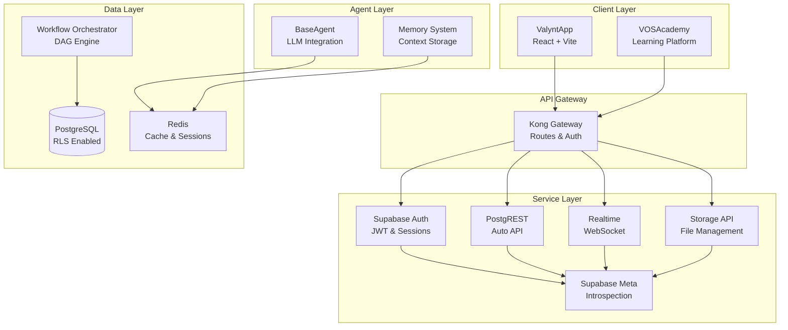
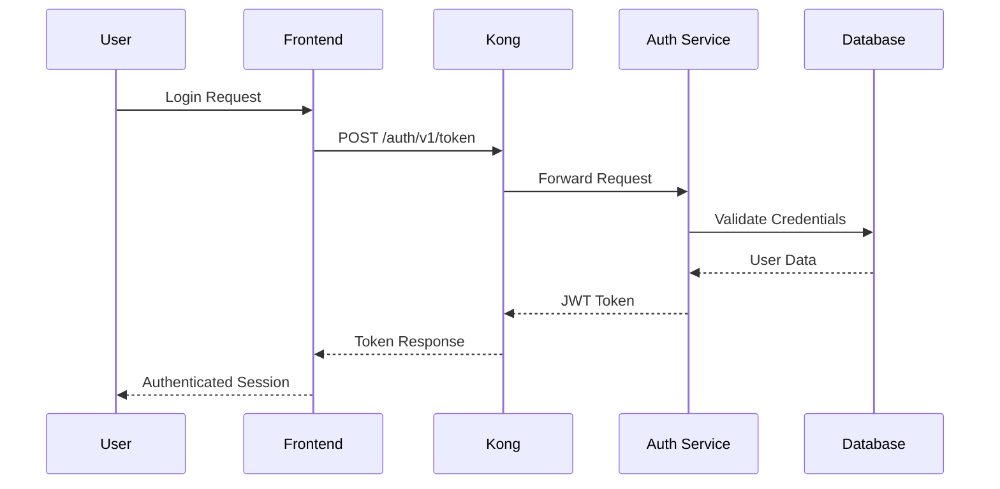

# 01 Introduction

**Last Updated**: 2026-02-08

**Consolidated from 8 source documents**

---

## Table of Contents

1. [System Architecture & Agents Context](#system-architecture-&-agents-context)
2. [Data & Infrastructure Context](#data-&-infrastructure-context)
3. [Frontend & UX Context](#frontend-&-ux-context)
4. [ValueOS Master Context](#valueos-master-context)
5. [ValueOS Getting Started: Master Guide](#valueos-getting-started:-master-guide)
6. [ValueOS Developer Guide](#valueos-developer-guide)
7. [ValueOS Documentation](#valueos-documentation)
8. [Security & Compliance Context](#security-&-compliance-context)

---

## System Architecture & Agents Context

*Source: `context/system-architecture.md`*

## 1. The 7-Agent Fabric

ValueOS uses a Multi-Agent Reinforcement Learning (MARL) loop. Production agent-fabric classes are located in `packages/backend/src/lib/agent-fabric/agents/`.

> **Canonical path note:** The production backend source of truth is `packages/backend/src/lib/agent-fabric/agents/` plus service entrypoints in `packages/backend/src/services/` (especially `packages/backend/src/services/UnifiedAgentOrchestrator.ts` and, when applicable, `packages/backend/src/services/UnifiedAgentAPI.ts`). Frontend examples and docs snippets are illustrative only. The shared agent runtime and orchestration library lives in `packages/agents/` and is imported by `packages/backend`, while production agent implementations themselves live under `packages/backend/src/lib/agent-fabric/agents/`.

### Agent Taxonomy

| Agent                 | Authority | Purpose                                         | Lifecycle Stage |
| :-------------------- | :-------- | :---------------------------------------------- | :-------------- |
| **Coordinator**       | 5         | Orchestrates handoffs and task planning.        | All             |
| **Opportunity**       | 3         | Discovers pain points and objectives.           | Discovery       |
| **Target**            | 3         | Builds value models and maps capabilities.      | Modeling        |
| **FinancialModeling** | 4         | Calculates ROI, NPV, IRR using `decimal.js`.    | Modeling        |
| **Realization**       | 3         | Tracks actual vs. predicted metrics post-sale.  | Realization     |
| **Expansion**         | 3         | Identifies upsell/cross-sell opportunities.     | Expansion       |
| **Integrity**         | 5         | Vetoes non-compliant or hallucinated proposals. | All             |
| **Communicator**      | 2         | Generates persona-specific narratives.          | All             |

## 2. Authority Levels

- **Level 1 (Read-Only):** View data, generate reports.
- **Level 2 (Analysis):** Pattern recognition, insights.
- **Level 3 (Operations):** Read/write business data, execute workflows.
- **Level 4 (Integration):** External API access, financial operations.
- **Level 5 (System):** Full access, policy enforcement, Integrity veto.

## 3. Orchestration Patterns

### The `secureInvoke` Wrapper

Agents never write directly to the database. They submit a "Commit Proposal" to the `secureInvoke` service, which triggers an **IntegrityAgent** review. Only `VALIDATED` signals permit SQL transactions.

### Circuit Breaker States

- **Closed:** Normal operation.
- **Open:** Failure detected; requests fail fast to prevent cascading.
- **Half-Open:** Testing recovery with limited requests.

## 4. Memory System

- **Episodic:** Specific events/interactions.
- **Semantic:** General knowledge (pgvector embeddings).
- **Working:** Current task context.
- **Shared:** Cross-agent knowledge sharing.

---

**Last Updated:** 2026-01-28
**Related:** `packages/backend/src/lib/agent-fabric/agents/`, `packages/backend/src/services/UnifiedAgentOrchestrator.ts`, `packages/backend/src/services/UnifiedAgentAPI.ts`

---

## Data & Infrastructure Context

*Source: `context/data-infrastructure.md`*

## 1. Database Schema (Supabase/Postgres)

ValueOS uses PostgreSQL 15.8 with Row-Level Security (RLS).

### Core Tables

- `tenants`: Organization isolation.
- `users`: Profiles and roles (`admin`, `manager`, `user`, `viewer`).
- `value_cases`: The central "Deal" entity.
- `opportunities`: Pain points and objectives.
- `value_drivers`: Capability-to-outcome mappings.
- `financial_models`: ROI/NPV projections.
- `agent_executions`: Audit logs of all AI actions.
- `agent_memory`: Vector-enabled persistent memory (`pgvector`).

### Row-Level Security (RLS)

Tenant isolation is enforced at the database level. Every query is scoped by a cryptographic `tenant_id` from the user's JWT.

```sql
CREATE POLICY tenant_isolation ON value_cases
  FOR ALL USING (tenant_id = auth.uid_tenant_id());
```

## 2. Ground Truth Benchmark Layer

A tiered data hierarchy ensures zero-hallucination:

- **Tier 1 (Authoritative):** SEC EDGAR, XBRL (Confidence 0.95-1.0).
- **Tier 2 (High-Confidence):** Crunchbase, Census, BLS (Confidence 0.5-0.85).
- **Tier 3 (Contextual):** Industry reports, market trends (Confidence 0.2-0.6).

## 3. Infrastructure & DevContainer

- **Vite Host Binding:** Must use `0.0.0.0` for Docker port forwarding.
- **Port Mapping:** 5173 (Vite), 54321 (Supabase), 3000 (Grafana).
- **Self-Healing:** `.devcontainer/health-check.sh` and `auto-restart.sh` monitor service availability.
- **Performance:** Async font loading and code splitting reduce Time-to-Interactive by ~97%.

---

**Last Updated:** 2026-01-28
**Related:** `supabase/migrations/`, `vite.config.ts`, `.devcontainer/`

---

## Frontend & UX Context

*Source: `context/frontend-ux.md`*

## 1. Tech Stack

- **React 18.3:** Concurrent rendering for responsive agentic UI.
- **Vite 7.2:** Fast HMR and optimized bundling.
- **Zustand:** Lightweight state management for the Agent Store.
- **Radix UI + Tailwind:** Accessible, themeable component library.

## 2. Application Layout

- **AppShell:** Dark sidebar navigation with "Platform" and "Organization" sections.
- **SettingsLayout:** Horizontal tabs for user and team configuration.
- **CaseWorkspace:** Split-pane view with Conversational AI (left) and SDUI Canvas (right).

## 3. Key Components

- **SDUI Canvas:** Dynamic interface driven by JSON schemas from the Agent Fabric.
- **7-State UI Machine:**
  - `Idle`: Indigo pulse.
  - `Clarify`: Amber glow.
  - `Plan`: Task-card reveal.
  - `Execute`: Scanning beam.
  - `Review`: Side-by-side diff.
  - `Finalize`: Success lock.
  - `Resume`: Context restoration.
- **ValueDriverEditor:** Admin modal for managing strategic value propositions.

## 4. Coding Conventions

- **TypeScript:** Strict mode, no `any`, interfaces over types.
- **Precision:** All financial displays must handle `decimal.js` string serialization.
- **Performance:** Lazy loading for all routes; memoization for expensive ROI charts.

---

**Last Updated:** 2026-01-28
**Related:** `apps/ValyntApp/src/components/`, `apps/ValyntApp/src/features/workspace/`

---

## ValueOS Master Context

*Source: `context/MASTER_CONTEXT.md`*

**Version:** 1.0.0
**Last Updated:** 2026-01-28
**Status:** Authoritative Source of Truth

---

## 1. Executive Summary

ValueOS is an **AI-native Customer Value Operating System (CVOS)** designed to bridge the "Trust Gap" in B2B sales. It replaces manual, error-prone spreadsheets with deterministic, benchmark-validated ROI orchestration. The platform uses a **Dual-Brain Architecture** to separate non-deterministic agentic reasoning from an immutable, auditable ledger of financial truth.

---

## 2. Core Architecture: The Dual-Brain

ValueOS is partitioned into two distinct environments:

1.  **Agent Fabric (The Brain):** An ephemeral execution layer where a **7-Agent Taxonomy** (Coordinator, Opportunity, Target, FinancialModeling, Realization, Expansion, Integrity, Communicator) collaborates in an LLM-MARL loop.
2.  **Value Fabric (The Memory):** A persistent, immutable ledger built on **PostgreSQL 15.8** (Supabase) that stores the **Economic Structure Ontology (ESO)** and the **Systemic Outcome Framework (SOF)**.

### Key Interaction Pattern: Read-Reason-Write

- Agents operate in a read-only sandbox.
- All state changes must pass through the `secureInvoke` wrapper.
- The **IntegrityAgent** acts as a hard veto point, validating proposals against financial guardrails before committing to the Value Fabric.

---

## 3. Technical Stack

| Layer             | Technology               | Critical Detail                                                    |
| :---------------- | :----------------------- | :----------------------------------------------------------------- |
| **Frontend**      | React 18.3 + Vite 7.2    | Concurrent Rendering for 60fps UI during agent reasoning.          |
| **Backend**       | Supabase (Postgres 15.8) | Row-Level Security (RLS) for cryptographic tenant isolation.       |
| **AI/LLM**        | Together AI              | Sub-second inference for MARL loops (Llama 3.x / Mixtral).         |
| **Precision**     | `decimal.js`             | Mandatory for all financial logic; IEEE-754 floats are prohibited. |
| **Observability** | OpenTelemetry + Tempo    | Distributed tracing to visualize the "Reasoning Path."             |

---

## 4. Critical Systems & Requirements

### 4.1 VMRT (Value Modeling Reasoning Trace)

Every change to a financial driver must store a `reasoning_step` in a JSONB column within `vos_audit_logs`. This ensures 100% auditability of AI-generated claims.

### 4.2 Ground Truth Inversion

ValueOS eliminates hallucinations by flipping prompt logic:

1. Agent identifies a data need.
2. System executes a `GroundTruthLookup` against whitelisted sources (SEC EDGAR, BLS, Census).
3. Agent contextualizes the retrieved, verified data.

### 4.3 7-State UI Interaction Model

The UI follows a deterministic state machine: **Idle → Clarify → Plan → Execute → Review → Finalize → Resume**.

---

## 5. Directory Structure & Sub-Contexts

To maintain focus, detailed documentation is split into four specialized sub-docs:

1.  **[System Architecture & Agents](./system-architecture.md):** Deep dive into the 7-Agent Fabric, MARL orchestration, and authority levels.
2.  **[Data & Infrastructure](./data-infrastructure.md):** Database schema, RLS policies, Ground Truth Tiers (1-3), and DevContainer setup.
3.  **[Frontend & UX](./frontend-ux.md):** SDUI Canvas, component library, state management (Zustand), and the 7-state machine.
4.  **[Security & Compliance](./security-compliance.md):** Zero-Trust Intelligence, `secureInvoke` patterns, MFA, and audit logging.

---

## 6. Development Constraints

- **Financial Precision:** Use `decimal.js` for all currency/KPI math. Custom ESLint rules enforce this.
- **Tenant Isolation:** Every query must be scoped by `tenant_id` via RLS.
- **Browser Targets:** Evergreen browsers only (Chrome/Edge 120+, Safari 17.2+).
- **Testing:** 85%+ coverage for Agent Fabric; 100% for financial engines.

---

**Maintainer:** AI Implementation Team
**Related:** `ARCHITECTURE_DESIGN_BRIEF.md`, `SYSTEM_INVARIANTS.md`

---

## ValueOS Getting Started: Master Guide

*Source: `getting-started/GETTING_STARTED_MASTER.md`*

**Version:** 1.0.0
**Last Updated:** 2026-01-28
**Status:** DEPRECATED - See DEVELOPER_GUIDE.md

⚠️ **DEPRECATED**: This guide has been superseded by [DEVELOPER_GUIDE.md](DEVELOPER_GUIDE.md).

The recommended setup is now the unified dev container environment, which provides a batteries-included development stack with all dependencies pre-configured.

### Quick Migration

1. Install VS Code with Dev Containers extension
2. Open the repository in VS Code
3. Use Command Palette: `Dev Containers: Reopen in Container`
4. The environment automatically sets up everything

For complete documentation, see [docs/getting-started/DEVELOPER_GUIDE.md](docs/getting-started/DEVELOPER_GUIDE.md).

---

## Legacy Content (For Reference Only)

## 1. Quickstart (Under 10 Minutes)

Get up and running with ValueOS from a clean machine.

### Prerequisites

- **Node.js**: 20+ (use `.nvmrc`)
- **Docker Desktop**: Installed and running
- **Corepack**: Enabled for pnpm management

### The "Golden Path" Setup

```bash
# 1. Clone and enter repo
git clone <repo-url> valueos && cd valueos

# 2. Install dependencies
pnpm install

# 3. Generate environment files
pnpm run dx:env

# 4. Start the full stack
pnpm run dx

# 5. Seed demo user (Optional)
pnpm run seed:demo
```

**Access Points:**

- **Frontend**: `http://localhost:5173`
- **Backend API**: `http://localhost:3001`
- **Supabase Studio**: `http://localhost:54323`

---

## 2. Development Modes

ValueOS supports two primary development workflows:

### Option A: Local Mode (Default)

- **Command**: `pnpm run dx`
- **Behavior**: Frontend/Backend run on host; dependencies (Postgres, Redis, Supabase) run in Docker.
- **Best For**: Fast HMR and standard development.

### Option B: Full Docker Mode

- **Command**: `pnpm run dx:docker`
- **Behavior**: Everything runs inside Docker containers with Caddy routing.
- **Best For**: Environment parity and testing containerization.

---

## 3. Troubleshooting Common Issues

| Symptom                        | Cause                   | Fix                                    |
| :----------------------------- | :---------------------- | :------------------------------------- |
| `Cannot connect to Docker`     | Docker not running      | Start Docker Desktop                   |
| `EADDRINUSE: :::5173`          | Port conflict           | `pkill -f vite` or check `ports.json`  |
| `ENVIRONMENT CONTRADICTION`    | Wrong `.env.local` mode | `pnpm run dx:env`                      |
| `ECONNREFUSED 127.0.0.1:54322` | DB container down       | `pkill -f supabase` then `pnpm run dx` |
| Login fails for demo user      | Seed script not run     | `pnpm run seed:demo`                   |

---

## 4. Day-to-Day Commands

- **Start/Stop**: `pnpm run dx` / `pnpm run dx:down`
- **Reset**: `pnpm run dx:reset` (Soft) or `pnpm run dx:clean` (Hard)
- **Database**: `pnpm run db:push` (Migrations) | `pnpm run db:types` (Type Gen)
- **Diagnostics**: `pnpm run dx:doctor`

---

**Maintainer:** AI Implementation Team
**Related:** `docs/dev/DEV_MASTER.md`, `docs/context/MASTER_CONTEXT.md`

---

## ValueOS Developer Guide

*Source: `getting-started/DEVELOPER_GUIDE.md`*

**Version:** 1.0.0
**Last Updated:** 2026-01-31
**Status:** Authoritative Developer Reference

---

## Table of Contents

1. [Architecture Overview](#architecture-overview)
2. [Development Environment Setup](#development-environment-setup)
3. [Service Architecture](#service-architecture)
4. [Data Flow & Security](#data-flow--security)
5. [Development Workflows](#development-workflows)
6. [Configuration Reference](#configuration-reference)
7. [Troubleshooting](#troubleshooting)

---

## Architecture Overview

ValueOS is a multi-tenant AI orchestration platform built on React, Supabase, and Node.js. The system provides value modeling and lifecycle intelligence through a DAG-based workflow engine and vector memory system.

### High-Level Architecture



### Key Design Principles

- **Multi-Tenancy**: All data operations include `organization_id` filtering
- **Security First**: Row Level Security (RLS) on all database queries
- **Agent Safety**: Circuit breaker pattern with hallucination detection
- **Event-Driven**: CloudEvents for inter-agent communication
- **Deterministic**: Reproducible builds and environments

---

## Development Environment Setup

### Unified Dev Container (Recommended)

The dev container provides a complete, isolated development environment with all services pre-configured.

#### Prerequisites

- VS Code with Dev Containers extension
- Docker Desktop 4.0+

#### Setup Steps

1. **Clone Repository**

   ```bash
   git clone <repo-url> valueos && cd valueos
   ```

2. **Open in Dev Container**
   - Open VS Code
   - Command Palette: `Dev Containers: Reopen in Container`
   - Wait for automatic setup (5-10 minutes)

3. **Verify Setup**

   ```bash
   # Check services are running
   docker ps

   # Verify database connection
   PGPASSWORD=postgres psql -h db -U postgres -d postgres -c "SELECT version();"
   ```

#### What's Included

The dev container automatically provisions:

- **App Container**: Node.js 20 + pnpm + development tools
- **Database**: PostgreSQL 15 with Supabase extensions
- **Auth Service**: Supabase GoTrue for authentication
- **API Gateway**: Kong for routing and middleware
- **REST API**: PostgREST for automatic API generation
- **Realtime**: Supabase Realtime for WebSocket connections
- **Storage**: Supabase Storage API
- **Meta Service**: Database introspection
- **Studio**: Supabase web UI
- **Redis**: Caching and session storage

### Service Configuration

```yaml
# .devcontainer/docker-compose.devcontainer.yml (excerpt)
services:
  app:
    build: ..
    environment:
      SUPABASE_URL: http://kong:8000
      # CRITICAL: sslmode=disable required - container postgres has no TLS
      DATABASE_URL: postgresql://postgres:postgres@db:5432/postgres?sslmode=disable
      REDIS_URL: redis://redis:6379

  db:
    image: supabase/postgres:15.1.0.117
    environment:
      POSTGRES_PASSWORD: postgres

  kong:
    # NOTE: Kong declarative config is baked into the image (no host bind-mounts)
    build:
      context: ./kong
      dockerfile: Dockerfile
    environment:
      KONG_DATABASE: "off"
      KONG_DECLARATIVE_CONFIG: /var/lib/kong/kong.yml
```

### Kong Configuration

```yaml
# config/kong.yml
_format_version: "2.1"
services:
  - name: auth-service
    url: http://auth:9999
    routes:
      - paths: [/auth/v1]

  - name: rest-service
    url: http://rest:3000
    routes:
      - paths: [/rest/v1]

  - name: realtime-service
    url: http://realtime:54324
    routes:
      - paths: [/realtime/v1]

  - name: storage-service
    url: http://storage:5000
    routes:
      - paths: [/storage/v1]
```

---

## Service Architecture

### Frontend Applications

#### ValyntApp (Primary)

- **Framework**: React 18 + Vite
- **Styling**: Tailwind CSS with semantic tokens
- **State**: Zustand for client state
- **Routing**: React Router v6
- **Real-time**: Supabase real-time subscriptions

#### VOSAcademy

- **Purpose**: Learning platform for ValueOS concepts
- **Tech**: React + MDX for content
- **Integration**: Shared components from packages/

### Backend Services

#### Supabase Stack

- **Database**: PostgreSQL with RLS policies
- **Auth**: JWT-based authentication with refresh tokens
- **API**: PostgREST for automatic REST API generation
- **Storage**: S3-compatible file storage
- **Real-time**: WebSocket connections for live updates

#### Agent System

- **BaseAgent**: Abstract class for LLM integrations
- **WorkflowOrchestrator**: DAG execution engine
- **MemorySystem**: Vector database for context storage
- **MessageBus**: Async inter-agent communication

### Package Structure

```
packages/
├── agents/          # Agent implementations
├── backend/         # Shared backend utilities
├── components/      # Reusable React components
├── config-v2/       # Configuration management
├── infra/           # Infrastructure utilities
├── integrations/    # Third-party integrations
├── memory/          # Vector memory system
├── sdui/            # Server-driven UI
├── services/        # Business logic services
└── shared/          # Common utilities
```

---

## Data Flow & Security

### Multi-Tenancy Model

```sql
-- All tables include organization_id
CREATE TABLE workflows (
    id UUID PRIMARY KEY,
    organization_id UUID NOT NULL,
    name TEXT NOT NULL,
    -- ... other fields
);

-- RLS Policy Example
ALTER TABLE workflows ENABLE ROW LEVEL SECURITY;
CREATE POLICY tenant_isolation ON workflows
    FOR ALL USING (organization_id = current_setting('app.organization_id')::UUID);
```

### Authentication Flow



### Agent Security

```typescript
// BaseAgent with security patterns
export class SecureAgent extends BaseAgent {
  async execute(sessionId: string, input: any) {
    // Circuit breaker pattern
    const result = await this.secureInvoke(sessionId, prompt, schema, {
      trackPrediction: true,
      confidenceThresholds: { low: 0.6, high: 0.85 },
      context: { agent: this.name },
    });

    // Tenant-scoped memory
    await this.memorySystem.storeSemanticMemory(
      sessionId,
      this.agentId,
      "Knowledge",
      { metadata: "value" },
      this.organizationId // Critical for isolation
    );

    return result;
  }
}
```

---

## Development Workflows

### Feature Development

1. **Create Feature Branch**

   ```bash
   git checkout -b feature/my-feature
   ```

2. **Implement Changes**
   - Frontend: `apps/valynt-app/`
   - Backend: `packages/services/`
   - Agents: `packages/agents/`

3. **Run Tests**

   ```bash
   pnpm run test                    # Unit tests
   pnpm run test:rls               # RLS policy tests
   bash scripts/test-agent-security.sh  # Agent security
   ```

4. **Database Changes**

   ```bash
   # Create migration
   supabase migration new my_migration

   # Apply to local
   pnpm run db:push

   # Generate types
   pnpm run db:types
   ```

5. **Commit and Push**
   ```bash
   git add .
   git commit -m "feat: implement my feature"
   git push origin feature/my-feature
   ```

### Agent Development

```typescript
// packages/agents/MyAgent.ts
export class MyAgent extends BaseAgent {
  public readonly lifecycleStage = "discovery";
  public readonly version = "1.0.0";
  public readonly name = "MyAgent";

  async execute(sessionId: string, input: Input): Promise<Output> {
    const schema = z.object({
      result: z.string(),
      confidence: z.enum(["high", "medium", "low"]),
      reasoning: z.string(),
      hallucination_check: z.boolean(),
    });

    const result = await this.secureInvoke(sessionId, prompt, schema, {
      confidenceThresholds: { low: 0.6, high: 0.85 },
    });

    return result.result;
  }
}
```

### Testing Strategy

- **Unit Tests**: Vitest with 100% coverage requirement
- **Integration Tests**: API and database interactions
- **RLS Tests**: Multi-tenant data isolation
- **Agent Tests**: Mock LLM responses, validate security
- **E2E Tests**: Playwright for critical user journeys

---

## Configuration Reference

### Environment Variables

| Variable            | Description           | Default              |
| ------------------- | --------------------- | -------------------- |
| `SUPABASE_URL`      | Supabase API URL      | `http://kong:8000`   |
| `SUPABASE_ANON_KEY` | Anonymous access key  | Generated            |
| `DATABASE_URL`      | PostgreSQL connection | `postgres://...`     |
| `REDIS_URL`         | Redis connection      | `redis://redis:6379` |
| `NODE_ENV`          | Environment mode      | `development`        |

### Port Configuration

```json
// config/ports.json
{
  "app": 5173,
  "api": 54321,
  "studio": 54323,
  "db": 54322
}
```

### Build Configuration

```typescript
// vitest.config.ts
export default defineConfig({
  test: {
    environment: "jsdom",
    setupFiles: ["./tests/setup.ts"],
    fileParallelism: false, // Required for RLS tests
    coverage: {
      reporter: ["text", "lcov"],
      exclude: ["**/node_modules/**", "**/dist/**"],
    },
  },
});
```

---

## Troubleshooting

### Common Issues

| Issue                     | Symptom            | Solution                                 |
| ------------------------- | ------------------ | ---------------------------------------- |
| Dev container won't start | Docker not running | Start Docker Desktop                     |
| Database connection fails | `ECONNREFUSED`     | Check `docker ps` for running containers |
| Migrations not applied    | Schema out of sync | Run `pnpm run db:push`                   |
| Agent tests failing       | LLM mocks          | Check `jest.setup.ts` for proper mocks   |
| Port conflicts            | `EADDRINUSE`       | Check `config/ports.json` and free ports |

### Debug Commands

```bash
# Check service health
docker ps
docker logs valueos-db

# Database inspection
PGPASSWORD=postgres psql -h localhost -p 54322 -U postgres -d postgres

# Supabase CLI
supabase status
supabase db diff

# Network debugging
docker network ls
docker network inspect valueos-network
```

### Performance Optimization

- **Database**: Use `EXPLAIN ANALYZE` for query optimization
- **Frontend**: Bundle analysis with `pnpm run build:analyze`
- **Memory**: Monitor vector search performance
- **Agents**: Profile LLM call latency and costs

---

## Legacy Documentation

⚠️ **Deprecated**: The following documentation is no longer maintained:

- `docs/legacy/scripts/flake.nix` - Nix development environment (superseded by dev containers)
- `docs/legacy/scripts/pragmatic-flake.nix` - Alternative Nix setup
- Old Docker Compose files in `docs/legacy/devcontainer/docker-compose.*.yml` (consolidated)

For historical context, these files remain available but are not recommended for new development.

---

**Maintainer:** AI Implementation Team
**Related:** `docs/ENVIRONMENT.md`, `docs/dx-architecture.md`

---

## ValueOS Documentation

*Source: `README.md`*

Welcome to the ValueOS documentation hub. This is your starting point for understanding, developing, and operating ValueOS.

## Quick Links

- **[Quick Start](getting-started/quickstart.md)** - Local Dev Quickstart (canonical)
- **[Local Development Setup](getting-started/local-setup.md)** - Complete local development guide
- **[Deployment Guide](operations/deployment.md)** - Production deployment procedures
- **[Architecture Overview](architecture/overview.md)** - System architecture and design

---

## Documentation Structure

### Getting Started

- **[Quick Start](getting-started/quickstart.md)** - Fastest way to get ValueOS running
- **[Local Setup](getting-started/local-setup.md)** - Detailed local development environment setup
- **[Troubleshooting](getting-started/troubleshooting.md)** - Common issues and solutions

### Architecture

- **[Overview](architecture/overview.md)** - High-level system architecture
- **[Data Flow](architecture/data-flow.md)** - How data moves through the system
- **[Multi-tenancy](architecture/multi-tenancy.md)** - Tenant isolation patterns
- **[Architecture Decision Records](engineering/adr/README.md)** - Historical architectural decisions

### Engineering

- **[API Documentation](engineering/api/)** - REST API and client SDK guides
- **[Database](engineering/database/)** - Schema, migrations, and data access
- **[Flawless Dev Migrations](engineering/database/flawless-dev-migrations.md)** - One-command, versioned, and automated local migrations
- **[Zero-Downtime Migrations](engineering/database/zero-downtime-migrations.md)** - Expand/contract strategy and release checklist
- **[Agents](engineering/agents/)** - Agent system documentation
- **[SDUI](engineering/sdui/)** - Server-Driven UI implementation

### Operations

- **[Deployment](operations/deployment.md)** - Production deployment procedures
- **[Runbooks](operations/runbooks/)** - Operational procedures and checklists
- **[Monitoring](operations/monitoring.md)** - Observability and alerting
- **[Security](operations/security.md)** - Security practices and procedures

### Compliance

- **[Audit](compliance/audit.md)** - Compliance documentation and procedures

---

## Development Workflow

1. **Start Here**: [Quick Start](getting-started/quickstart.md) if you're new to ValueOS
2. **Local Development**: [Local Setup](getting-started/local-setup.md) for detailed environment setup
3. **Architecture**: [Architecture Overview](architecture/overview.md) to understand the system
4. **API Development**: [API Documentation](engineering/api/) for integration work
5. **Deployment**: [Deployment Guide](operations/deployment.md) for production releases

---

## Contributing to Documentation

Documentation lives alongside the code in the `docs/` directory. To contribute:

1. Edit the relevant markdown files
2. Test links and code examples
3. Submit a PR with `[docs]` prefix in the title

---

## Getting Help

- **Slack**: #engineering for questions
- **GitHub Issues**: Report documentation bugs
- **Pull Requests**: Contribute improvements

---

## Archived Documentation

Some obsolete or deprecated documentation has been moved to the `archive/` directory for historical reference. This includes old roadmap documents, specific deployment reports, and outdated UI designs.

---

**Last Updated**: 2026-01-14
**Maintained By**: Engineering Team

## 🎯 Quick Start

### **For New Developers**

1. Read [getting-started/quickstart.md](./getting-started/quickstart.md)
2. Follow [getting-started/local-setup.md](./getting-started/local-setup.md)
3. Review [architecture/overview.md](./architecture/overview.md)

### **For Operations**

1. Check [operations/deployment.md](./operations/deployment.md)
2. Review [operations/security.md](./operations/security.md)
3. Monitor with [operations/monitoring.md](./operations/monitoring.md)

### **For Product Development**

1. Explore [features/](./features/)
2. Review [architecture/overview.md](./architecture/overview.md)
3. Follow [processes/](./processes/)

## 🔍 Finding Information

| Need                          | Location                               |
| ----------------------------- | -------------------------------------- |
| **How to set up development** | [getting-started/](./getting-started/) |
| **System architecture**       | [architecture/](./architecture/)       |
| **Deployment procedures**     | [operations/](./operations/)           |
| **Feature documentation**     | [features/](./features/)               |
| **Team workflows**            | [processes/](./processes/)             |
| **API Documentation**         | [engineering/api/](./engineering/api/) |
| **Compliance & Audit**        | [compliance/](./compliance/)           |

## 📝 Documentation Standards

- **Keep it current** - Update docs when code changes
- **Be specific** - Include concrete examples and commands
- **Link liberally** - Connect related concepts
- **Version control** - Archive old versions, don't delete

---

---

## Security & Compliance Context

*Source: `context/security-compliance.md`*

## 1. Zero-Trust Intelligence

ValueOS treats AI agents as potential risks. No agent has direct write access to the Value Fabric.

### SecureInvoke Pattern

1. **Proposal:** Agent submits a JSON change request.
2. **Validation:** IntegrityAgent checks against financial guardrails (e.g., "ROI cannot be > 10,000%").
3. **Audit:** VMRT hash is generated and stored in `vos_audit_logs`.
4. **Commit:** SQL transaction executed only if `VALIDATED`.

## 2. Authentication & Authorization

- **Supabase Auth:** Email/Password, OAuth (Google/Apple), and Magic Links.
- **MFA:** TOTP (RFC 6238) support via `MFAService.ts`.
- **PKCE:** Enabled for all OAuth flows to prevent interception.
- **Guest Access:** Cryptographically secure tokens with 3-tier permissions (`view`, `comment`, `edit`).

## 3. Data Protection

- **CSRF Protection:** Enforced on all state-changing operations.
- **Rate Limiting:** `RateLimiter.ts` protects auth and API endpoints.
- **PII Masking:** Local pre-processing hashes PII before sending to LLM providers.
- **Encryption:** AES-256 at rest; TLS 1.3 in transit.

## 4. Compliance

- **SOC2 Readiness:** Continuous audit trails via VMRT and `agent_executions`.
- **GDPR:** Automated data deletion via cascading RLS-scoped deletes.
- **Auditability:** Every financial claim is linked to a verified ground truth source.

---

**Last Updated:** 2026-01-28
**Related:** `src/lib/auth/`, `src/security/`, `docs/security/`

---
