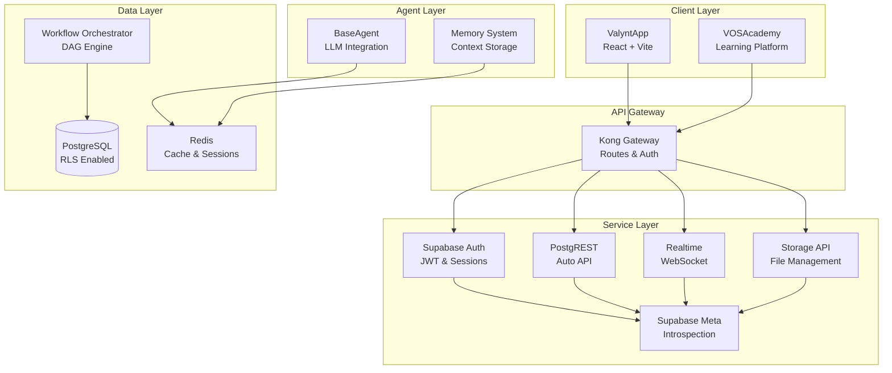
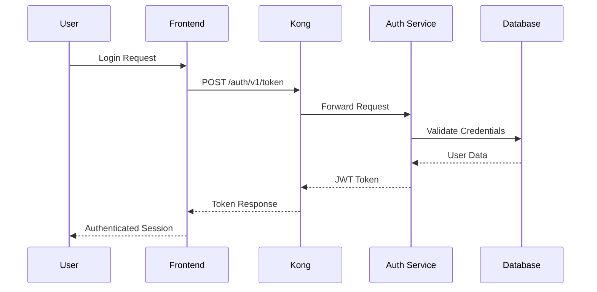

# ValueOS Developer Guide

**Version:** 1.0.0
**Last Updated:** 2026-01-31
**Status:** Authoritative Developer Reference

---

## Table of Contents

1. [Architecture Overview](#architecture-overview)
2. [Development Environment Setup](#development-environment-setup)
3. [Service Architecture](#service-architecture)
4. [Data Flow & Security](#data-flow--security)
5. [Development Workflows](#development-workflows)
6. [Configuration Reference](#configuration-reference)
7. [Troubleshooting](#troubleshooting)

---

## Architecture Overview

ValueOS is a multi-tenant AI orchestration platform built on React, Supabase, and Node.js. The system provides value modeling and lifecycle intelligence through a DAG-based workflow engine and vector memory system.

### High-Level Architecture



### Key Design Principles

- **Multi-Tenancy**: All data operations include `organization_id` filtering
- **Security First**: Row Level Security (RLS) on all database queries
- **Agent Safety**: Circuit breaker pattern with hallucination detection
- **Event-Driven**: CloudEvents for inter-agent communication
- **Deterministic**: Reproducible builds and environments

---

## Development Environment Setup

### Unified Dev Container (Recommended)

The dev container provides a complete, isolated development environment with all services pre-configured.

#### Prerequisites

- VS Code with Dev Containers extension
- Docker Desktop 4.0+

#### Setup Steps

1. **Clone Repository**

   ```bash
   git clone <repo-url> valueos && cd valueos
   ```

2. **Open in Dev Container**
   - Open VS Code
   - Command Palette: `Dev Containers: Reopen in Container`
   - Wait for automatic setup (5-10 minutes)

3. **Verify Setup**

   ```bash
   # Check services are running
   docker ps

   # Verify database connection
   PGPASSWORD=postgres psql -h db -U postgres -d postgres -c "SELECT version();"
   ```

#### What's Included

The dev container automatically provisions:

- **App Container**: Node.js 20 + pnpm + development tools
- **Database**: PostgreSQL 15 with Supabase extensions
- **Auth Service**: Supabase GoTrue for authentication
- **API Gateway**: Kong for routing and middleware
- **REST API**: PostgREST for automatic API generation
- **Realtime**: Supabase Realtime for WebSocket connections
- **Storage**: Supabase Storage API
- **Meta Service**: Database introspection
- **Studio**: Supabase web UI
- **Redis**: Caching and session storage

### Service Configuration

```yaml
# .devcontainer/docker-compose.devcontainer.yml (excerpt)
services:
  app:
    build: ..
    environment:
      SUPABASE_URL: http://kong:8000
      # CRITICAL: sslmode=disable required - container postgres has no TLS
      DATABASE_URL: postgresql://postgres:postgres@db:5432/postgres?sslmode=disable
      REDIS_URL: redis://redis:6379

  db:
    image: supabase/postgres:15.1.0.117
    environment:
      POSTGRES_PASSWORD: postgres

  kong:
    # NOTE: Kong declarative config is baked into the image (no host bind-mounts)
    build:
      context: ./kong
      dockerfile: Dockerfile
    environment:
      KONG_DATABASE: "off"
      KONG_DECLARATIVE_CONFIG: /var/lib/kong/kong.yml
```

### Kong Configuration

```yaml
# config/kong.yml
_format_version: "2.1"
services:
  - name: auth-service
    url: http://auth:9999
    routes:
      - paths: [/auth/v1]

  - name: rest-service
    url: http://rest:3000
    routes:
      - paths: [/rest/v1]

  - name: realtime-service
    url: http://realtime:54324
    routes:
      - paths: [/realtime/v1]

  - name: storage-service
    url: http://storage:5000
    routes:
      - paths: [/storage/v1]
```

---

## Service Architecture

### Frontend Applications

#### ValyntApp (Primary)

- **Framework**: React 18 + Vite
- **Styling**: Tailwind CSS with semantic tokens
- **State**: Zustand for client state
- **Routing**: React Router v6
- **Real-time**: Supabase real-time subscriptions

#### VOSAcademy

- **Purpose**: Learning platform for ValueOS concepts
- **Tech**: React + MDX for content
- **Integration**: Shared components from packages/

### Backend Services

#### Supabase Stack

- **Database**: PostgreSQL with RLS policies
- **Auth**: JWT-based authentication with refresh tokens
- **API**: PostgREST for automatic REST API generation
- **Storage**: S3-compatible file storage
- **Real-time**: WebSocket connections for live updates

#### Agent System

- **BaseAgent**: Abstract class for LLM integrations
- **WorkflowOrchestrator**: DAG execution engine
- **MemorySystem**: Vector database for context storage
- **MessageBus**: Async inter-agent communication

### Package Structure

```
packages/
├── agents/          # Agent implementations
├── backend/         # Shared backend utilities
├── components/      # Reusable React components
├── config-v2/       # Configuration management
├── infra/           # Infrastructure utilities
├── integrations/    # Third-party integrations
├── memory/          # Vector memory system
├── sdui/            # Server-driven UI
├── services/        # Business logic services
└── shared/          # Common utilities
```

---

## Data Flow & Security

### Multi-Tenancy Model

```sql
-- All tables include organization_id
CREATE TABLE workflows (
    id UUID PRIMARY KEY,
    organization_id UUID NOT NULL,
    name TEXT NOT NULL,
    -- ... other fields
);

-- RLS Policy Example
ALTER TABLE workflows ENABLE ROW LEVEL SECURITY;
CREATE POLICY tenant_isolation ON workflows
    FOR ALL USING (organization_id = current_setting('app.organization_id')::UUID);
```

### Authentication Flow



### Agent Security

```typescript
// BaseAgent with security patterns
export class SecureAgent extends BaseAgent {
  async execute(sessionId: string, input: any) {
    // Circuit breaker pattern
    const result = await this.secureInvoke(sessionId, prompt, schema, {
      trackPrediction: true,
      confidenceThresholds: { low: 0.6, high: 0.85 },
      context: { agent: this.name },
    });

    // Tenant-scoped memory
    await this.memorySystem.storeSemanticMemory(
      sessionId,
      this.agentId,
      "Knowledge",
      { metadata: "value" },
      this.organizationId // Critical for isolation
    );

    return result;
  }
}
```

---

## Development Workflows

### Feature Development

1. **Create Feature Branch**

   ```bash
   git checkout -b feature/my-feature
   ```

2. **Implement Changes**
   - Frontend: `apps/valynt-app/`
   - Backend: `packages/services/`
   - Agents: `packages/agents/`

3. **Run Tests**

   ```bash
   pnpm run test                    # Unit tests
   pnpm run test:rls               # RLS policy tests
   bash scripts/test-agent-security.sh  # Agent security
   ```

4. **Database Changes**

   ```bash
   # Create migration
   supabase migration new my_migration

   # Apply to local
   pnpm run db:push

   # Generate types
   pnpm run db:types
   ```

5. **Commit and Push**
   ```bash
   git add .
   git commit -m "feat: implement my feature"
   git push origin feature/my-feature
   ```

### Agent Development

```typescript
// packages/agents/MyAgent.ts
export class MyAgent extends BaseAgent {
  public readonly lifecycleStage = "discovery";
  public readonly version = "1.0.0";
  public readonly name = "MyAgent";

  async execute(sessionId: string, input: Input): Promise<Output> {
    const schema = z.object({
      result: z.string(),
      confidence: z.enum(["high", "medium", "low"]),
      reasoning: z.string(),
      hallucination_check: z.boolean(),
    });

    const result = await this.secureInvoke(sessionId, prompt, schema, {
      confidenceThresholds: { low: 0.6, high: 0.85 },
    });

    return result.result;
  }
}
```

### Testing Strategy

- **Unit Tests**: Vitest with 100% coverage requirement
- **Integration Tests**: API and database interactions
- **RLS Tests**: Multi-tenant data isolation
- **Agent Tests**: Mock LLM responses, validate security
- **E2E Tests**: Playwright for critical user journeys

---

## Configuration Reference

### Environment Variables

| Variable            | Description           | Default              |
| ------------------- | --------------------- | -------------------- |
| `SUPABASE_URL`      | Supabase API URL      | `http://kong:8000`   |
| `SUPABASE_ANON_KEY` | Anonymous access key  | Generated            |
| `DATABASE_URL`      | PostgreSQL connection | `postgres://...`     |
| `REDIS_URL`         | Redis connection      | `redis://redis:6379` |
| `NODE_ENV`          | Environment mode      | `development`        |

### Port Configuration

```json
// config/ports.json
{
  "app": 5173,
  "api": 54321,
  "studio": 54323,
  "db": 54322
}
```

### Build Configuration

```typescript
// vitest.config.ts
export default defineConfig({
  test: {
    environment: "jsdom",
    setupFiles: ["./tests/setup.ts"],
    fileParallelism: false, // Required for RLS tests
    coverage: {
      reporter: ["text", "lcov"],
      exclude: ["**/node_modules/**", "**/dist/**"],
    },
  },
});
```

---

## Troubleshooting

### Common Issues

| Issue                     | Symptom            | Solution                                 |
| ------------------------- | ------------------ | ---------------------------------------- |
| Dev container won't start | Docker not running | Start Docker Desktop                     |
| Database connection fails | `ECONNREFUSED`     | Check `docker ps` for running containers |
| Migrations not applied    | Schema out of sync | Run `pnpm run db:push`                   |
| Agent tests failing       | LLM mocks          | Check `jest.setup.ts` for proper mocks   |
| Port conflicts            | `EADDRINUSE`       | Check `config/ports.json` and free ports |

### Debug Commands

```bash
# Check service health
docker ps
docker logs valueos-db

# Database inspection
PGPASSWORD=postgres psql -h localhost -p 54322 -U postgres -d postgres

# Supabase CLI
supabase status
supabase db diff

# Network debugging
docker network ls
docker network inspect valueos-network
```

### Performance Optimization

- **Database**: Use `EXPLAIN ANALYZE` for query optimization
- **Frontend**: Bundle analysis with `pnpm run build:analyze`
- **Memory**: Monitor vector search performance
- **Agents**: Profile LLM call latency and costs

---

## Legacy Documentation

⚠️ **Deprecated**: The following documentation is no longer maintained:

- `docs/legacy/scripts/flake.nix` - Nix development environment (superseded by dev containers)
- `docs/legacy/scripts/pragmatic-flake.nix` - Alternative Nix setup
- Old Docker Compose files in `docs/legacy/devcontainer/docker-compose.*.yml` (consolidated)

For historical context, these files remain available but are not recommended for new development.

---

**Maintainer:** AI Implementation Team
**Related:** `docs/ENVIRONMENT.md`, `docs/dx-architecture.md`
