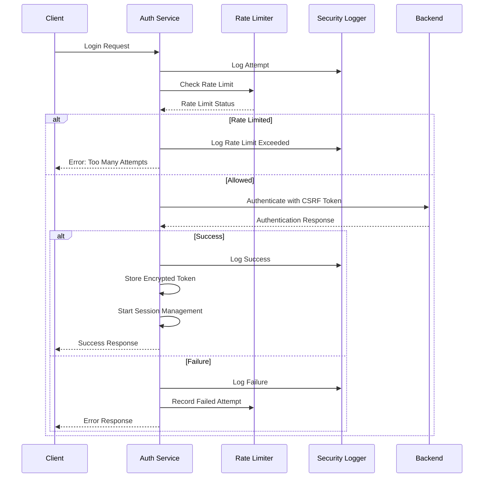

# ValueOS Authentication Security Guide

## Overview

This document provides comprehensive security guidelines for the ValueOS authentication system, covering implementation details, security best practices, and operational procedures.

## Table of Contents

1. [Security Architecture](#security-architecture)
2. [Authentication Flow](#authentication-flow)
3. [Security Features](#security-features)
4. [Threat Model](#threat-model)
5. [Security Testing](#security-testing)
6. [Monitoring and Alerting](#monitoring-and-alerting)
7. [Incident Response](#incident-response)
8. [Compliance](#compliance)

## Security Architecture

### Multi-Layer Security Approach

The ValueOS authentication system implements defense-in-depth with multiple security layers:

```
┌─────────────────────────────────────────────────────────────┐
│                    Client Application                        │
├─────────────────────────────────────────────────────────────┤
│  • Input Validation  • CSRF Protection  • Rate Limiting    │
│  • Secure Storage   • Session Management • Error Handling   │
├─────────────────────────────────────────────────────────────┤
│                    Network Layer                             │
├─────────────────────────────────────────────────────────────┤
│  • HTTPS/TLS  • Security Headers  • CSP  • WebSocket Auth   │
├─────────────────────────────────────────────────────────────┤
│                    Backend Services                          │
├─────────────────────────────────────────────────────────────┤
│  • Token Validation  • Session Management  • Audit Logging   │
│  • Rate Limiting    • Security Monitoring  • Access Control │
└─────────────────────────────────────────────────────────────┘
```

### Core Components

1. **Secure Token Storage**: Encrypted client-side token storage with device fingerprinting
2. **Rate Limiting**: Brute force protection with exponential backoff
3. **CSRF Protection**: Token-based CSRF mitigation for state-changing operations
4. **Session Management**: Automatic timeout, refresh, and cleanup
5. **Security Logging**: Comprehensive audit trail for all authentication events
6. **Error Boundaries**: Graceful failure handling without information leakage

## Authentication Flow

### Login Process



### Token Management

1. **Access Token**: Short-lived (1 hour) JWT for API access
2. **Refresh Token**: Long-lived token for session renewal
3. **Storage**: Encrypted localStorage with device fingerprint validation
4. **Expiration**: Automatic cleanup and refresh mechanisms

## Security Features

### 1. Secure Token Storage

**Implementation**: `src/lib/secureStorage.ts`

- **Encryption**: Browser fingerprint-based XOR encryption (demo) / AES-256 (production)
- **Validation**: Device fingerprint verification on token retrieval
- **Expiration**: Automatic token expiration and cleanup
- **Fallback**: SessionStorage fallback for private browsing

```typescript
// Example usage
const tokenData = {
  token: "jwt-token",
  refreshToken: "refresh-token",
  expiresAt: Date.now() + 3600000,
  userId: "user123",
};

await secureTokenStorage.setToken(tokenData);
const token = await secureTokenStorage.getAccessToken();
```

### 2. Rate Limiting

**Implementation**: `src/lib/rateLimiter.ts`

- **Limits**: 5 attempts per 5 minutes per email/IP
- **Lockout**: 15-minute exponential backoff
- **Tracking**: In-memory with localStorage persistence
- **Reset**: Successful authentication clears counter

```typescript
// Rate limit configuration
const config = {
  maxAttempts: 5,
  windowDuration: 5 * 60 * 1000, // 5 minutes
  lockoutDuration: 15 * 60 * 1000, // 15 minutes
};
```

### 3. CSRF Protection

**Implementation**: `src/lib/csrfProtection.ts`

- **Token Generation**: 32-character random tokens
- **Storage**: SessionStorage for request-scoped protection
- **Validation**: Automatic token injection and validation
- **Forms**: Dynamic token injection into existing forms

```typescript
// Automatic CSRF protection
const response = await csrfProtection.secureFetch("/api/auth/login", {
  method: "POST",
  headers: { "Content-Type": "application/json" },
  body: JSON.stringify(credentials),
});
```

### 4. Session Management

**Implementation**: `src/lib/sessionManager.ts`

- **Timeout**: Configurable session expiration
- **Warnings**: User notifications before expiration
- **Refresh**: Automatic token refresh attempts
- **Cleanup**: Proper resource cleanup on logout

### 5. Security Logging

**Implementation**: `src/lib/securityLogger.ts`

- **Events**: Comprehensive authentication event tracking
- **Severity**: Low, Medium, High, Critical classification
- **Metrics**: Real-time security metrics and analytics
- **Alerting**: Integration with monitoring services

## Threat Model

### Identified Threats

1. **Brute Force Attacks**
   - **Mitigation**: Rate limiting, account lockout, exponential backoff
   - **Detection**: Multiple failed attempts from same IP/email
   - **Response**: Automatic lockout, security alerts

2. **CSRF Attacks**
   - **Mitigation**: CSRF tokens, SameSite cookies, origin validation
   - **Detection**: Missing or invalid CSRF tokens
   - **Response**: Request rejection, security logging

3. **Session Hijacking**
   - **Mitigation**: Secure token storage, device fingerprinting, short-lived tokens
   - **Detection**: Unusual access patterns, multiple concurrent sessions
   - **Response**: Session termination, forced re-authentication

4. **Token Theft**
   - **Mitigation**: Encrypted storage, HttpOnly cookies, secure transmission
   - **Detection**: Token usage from unexpected locations
   - **Response**: Token revocation, security alerts

5. **XSS Attacks**
   - **Mitigation**: Input validation, output encoding, CSP headers
   - **Detection**: Suspicious script execution attempts
   - **Response**: Content Security Policy enforcement

### Risk Assessment

| Threat         | Likelihood | Impact | Risk Level | Mitigation      |
| -------------- | ---------- | ------ | ---------- | --------------- |
| Brute Force    | High       | Medium | Medium     | Rate Limiting   |
| CSRF           | Medium     | High   | Medium     | CSRF Tokens     |
| Session Hijack | Low        | High   | Medium     | Secure Storage  |
| Token Theft    | Low        | High   | Medium     | Encryption      |
| XSS            | Medium     | High   | High       | CSP, Validation |

## Security Testing

### Automated Tests

**Location**: `src/__tests__/security/`

1. **Authentication Security Tests**
   - Rate limiting effectiveness
   - Token security and encryption
   - CSRF protection validation
   - Input validation and sanitization
   - Error handling security

2. **Integration Tests**
   - End-to-end authentication flows
   - Cross-site request forgery prevention
   - Session management security
   - WebSocket authentication

3. **Security Scans**
   - Dependency vulnerability scanning
   - Static code analysis
   - Dynamic application security testing
   - Penetration testing

### Test Coverage Requirements

- **Authentication Logic**: 100% coverage
- **Security Utilities**: 100% coverage
- **Error Handling**: 95% coverage
- **Input Validation**: 100% coverage

### Security Test Execution

```bash
# Run security tests
npm run test:security

# Run with coverage
npm run test:security:coverage

# Run security scans
npm run audit:security
npm run scan:dependencies
```

## Monitoring and Alerting

### Security Metrics

**Dashboard**: Real-time security monitoring

1. **Authentication Metrics**
   - Total authentication attempts
   - Success/failure rates
   - Unique user count
   - Average session duration

2. **Security Events**
   - Rate limit violations
   - CSRF failures
   - Suspicious activities
   - Security violations

3. **System Health**
   - Token refresh rates
   - Session expiration patterns
   - Error rates by type
   - Performance metrics

### Alerting Rules

1. **Critical Alerts**
   - Security violations
   - Mass authentication failures
   - Suspicious activity spikes
   - System compromise indicators

2. **Warning Alerts**
   - High rate limit hits
   - Elevated failure rates
   - Unusual access patterns
   - Performance degradation

3. **Info Alerts**
   - New user registrations
   - Configuration changes
   - System maintenance events
   - Security test results

### Monitoring Integration

```typescript
// Example monitoring service integration
securityLogger.logEvent({
  type: "security_violation",
  severity: "critical",
  userId: "user123",
  details: { violation: "Unauthorized admin access" },
});
```

## Incident Response

### Security Incident Categories

1. **Critical**: System compromise, data breach, mass unauthorized access
2. **High**: Single account compromise, privilege escalation, persistent attacks
3. **Medium**: Brute force attempts, CSRF attacks, suspicious activities
4. **Low**: Isolated failures, configuration issues, minor violations

### Response Procedures

#### Immediate Response (0-15 minutes)

1. **Assessment**
   - Verify incident scope and impact
   - Identify affected systems and users
   - Determine incident severity

2. **Containment**
   - Block malicious IP addresses
   - Disable compromised accounts
   - Implement emergency rate limits
   - Activate incident response team

#### Investigation (15-60 minutes)

1. **Evidence Collection**
   - Export security logs
   - Preserve system state
   - Document timeline
   - Identify root cause

2. **Analysis**
   - Analyze attack vectors
   - Assess data exposure
   - Evaluate system vulnerabilities
   - Determine propagation risk

#### Resolution (1-4 hours)

1. **Remediation**
   - Patch vulnerabilities
   - Reset compromised credentials
   - Update security configurations
   - Implement additional controls

2. **Recovery**
   - Restore normal operations
   - Monitor for recurrence
   - Validate security measures
   - Update documentation

### Communication Procedures

1. **Internal Communication**
   - Incident response team coordination
   - Status updates to stakeholders
   - Technical documentation
   - Lessons learned

2. **External Communication**
   - User notifications (if required)
   - Regulatory reporting (if applicable)
   - Public statements (if necessary)
   - Vendor coordination

## Compliance

### Regulatory Requirements

1. **GDPR Compliance**
   - Data protection by design
   - Right to be forgotten
   - Data breach notification
   - Privacy by default

2. **SOC 2 Compliance**
   - Security controls implementation
   - Audit trail maintenance
   - Access control verification
   - Incident response procedures

3. **OWASP Standards**
   - Top 10 vulnerability mitigation
   - Secure coding practices
   - Security testing requirements
   - Risk assessment framework

### Security Controls Matrix

| Control        | Implementation               | Status      | Evidence         |
| -------------- | ---------------------------- | ----------- | ---------------- |
| Authentication | Multi-factor auth            | In Progress | Config files     |
| Authorization  | RBAC implementation          | Complete    | Code review      |
| Encryption     | AES-256 token storage        | Complete    | Security tests   |
| Logging        | Comprehensive audit trail    | Complete    | Log samples      |
| Monitoring     | Real-time security dashboard | Complete    | Dashboard access |
| Testing        | Automated security tests     | Complete    | Test reports     |

### Audit Requirements

- **Quarterly**: Security control assessment
- **Monthly**: Vulnerability scanning
- **Weekly**: Log review and analysis
- **Daily**: Security metrics monitoring
- **Real-time**: Critical event alerting

## Best Practices

### Development

1. **Secure Coding**
   - Input validation and sanitization
   - Output encoding and escaping
   - Parameterized queries
   - Least privilege principle

2. **Code Review**
   - Security-focused review checklist
   - Automated security scanning
   - Peer review requirements
   - Documentation standards

3. **Testing**
   - Security test coverage requirements
   - Penetration testing schedule
   - Vulnerability assessment process
   - Incident response testing

### Operations

1. **Configuration Management**
   - Secure configuration templates
   - Environment-specific settings
   - Secret management
   - Change control procedures

2. **Monitoring**
   - Real-time security monitoring
   - Log aggregation and analysis
   - Performance metrics tracking
   - Alert tuning and optimization

3. **Maintenance**
   - Regular security updates
   - Patch management process
   - Security tool maintenance
   - Documentation updates

## Contact Information

### Security Team

- **Security Lead**: security@valueos.com
- **Incident Response**: incidents@valueos.com
- **Vulnerability Reports**: security@valueos.com

### Emergency Contacts

- **Critical Incidents**: +1-555-SECURITY
- **Data Breach**: +1-555-BREACH
- **System Compromise**: +1-555-COMPROMISE

### External Resources

- **Security Documentation**: https://docs.valueos.com/security
- **Vulnerability Disclosure**: https://valueos.com/security
- **Compliance Portal**: https://compliance.valueos.com

---

_Last Updated: January 2026_
_Version: 1.0_
_Classification: Internal Use Only_
