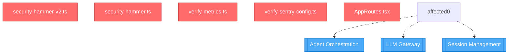

## 🗺️ Architectural Codemap

### Risk Assessment

🟡 **MEDIUM RISK** - Risk Score: **6/10**

### Dependency Graph

### Blast Radius

| Metric | Count |
|--------|-------|
| Changed Files | 40 |
| Affected Files | 0 |
| Affected Tests | 1 |
| Affected Services | 3 |

<strong>Changed Files (40)</strong>

- `scripts/security-hammer-v2.ts`
- `scripts/security-hammer.ts`
- `scripts/verify-metrics.ts`
- `scripts/verify-sentry-config.ts`
- `src/AppRoutes.tsx`
- `src/bootstrap.ts`
- `src/components/Agents/AgentChatInterface.tsx`
- `src/components/ChatCanvas/ChatCanvasLayout.tsx`
- `src/components/Common/Input.tsx`
- `src/components/Feedback/BetaFeedbackWidget.tsx`
- `src/components/Layout/MainLayout.tsx`
- `src/components/Modals/__tests__/StarterModals.test.tsx`
- `src/components/SDUI/ScenarioSelector.tsx`
- `src/components/SDUI/ValueTreeCard.tsx`
- `src/components/SDUI/index.ts`
- `src/config/llm.ts`
- `src/config/settings.ts`
- `src/config/validateEnv.ts`
- `src/lib/agent-fabric/LLMGateway.ts`
- `src/lib/agent-fabric/llm-types.ts`
- `src/lib/resilience/Backoff.ts`
- `src/sdui/registry.tsx`
- `src/sdui/renderPage.tsx`
- `src/sdui/templates/chat-opportunity-template.ts`
- `src/security/CSRFProtection.ts`
- `src/services/AgentChatService.ts`
- `src/services/AgentQueryService.ts`
- `src/services/AgentSDUIAdapter.ts`
- `src/services/LLMFallback.ts`
- `src/services/SemanticMemory.ts`
- `src/services/ValueFabricService.ts`
- `src/services/bfa/tools/onboarding/__tests__/activate-customer.test.ts`
- `src/views/ValueCanvas.tsx`
- `tests/fuzzing/sdui-fuzzer.spec.ts`
- `tests/integration/bfa/onboarding/activate-customer.spec.ts`
- `tests/performance/bfa/onboarding/activate-customer.perf.test.ts`
- `tests/security/bfa/onboarding/activate-customer.security.test.ts`
- `tests/setup.ts`
- `vitest.config.bfa.ts`
- `vitest.config.resilience.ts`

### Affected Services

- 🏗️ **Agent Orchestration**
- 🏗️ **LLM Gateway**
- 🏗️ **Session Management**

### Recommendations

- ✅ Run affected tests: `npm test -- src/lib/agent-fabric/LLMGateway.test.ts`
- 📈 Review performance impact

---
Generated by ValueOS Cognitive Pipeline | [Learn more](../../../docs/cognitive-pipeline.md)
