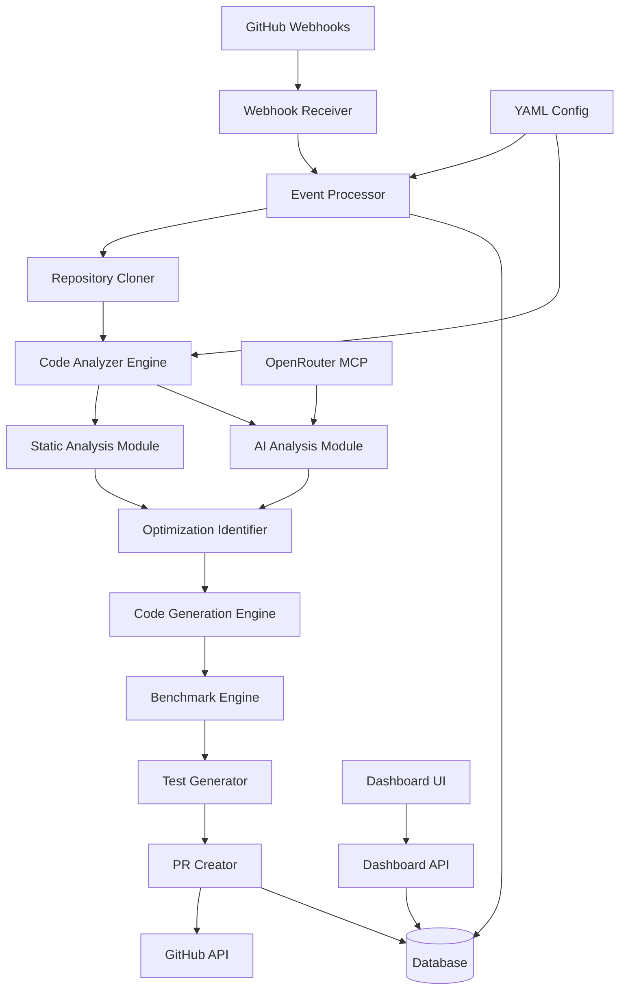

# GitHub Code Optimizer Bot

A sophisticated autonomous bot that monitors GitHub repositories for code optimization opportunities, using static analysis and AI-driven heuristics to suggest and implement improvements.

## Architecture Overview



### Components

1. **Webhook Receiver**: Express.js server handling GitHub webhooks (push, PR events)
2. **Event Processor**: Validates and routes events based on repository configuration
3. **Repository Cloner**: Securely clones repository code for analysis
4. **Code Analyzer Engine**: Orchestrates static and AI analysis
5. **Static Analysis Module**: Mimics CodeQL/pylint for identifying code issues
6. **AI Analysis Module**: Uses LLM (via OpenRouter) for intelligent optimization suggestions
7. **Optimization Identifier**: Combines analysis results to prioritize optimizations
8. **Code Generation Engine**: Generates refactored code snippets
9. **Benchmark Engine**: Runs performance benchmarks before/after changes
10. **Test Generator**: Creates unit tests for verification
11. **PR Creator**: Generates GitHub pull requests with explanations
12. **Dashboard API**: REST API for dashboard functionality
13. **Dashboard UI**: React-based interface for reviewing suggestions
14. **Database**: Stores suggestions, logs, and configuration data
15. **Config Manager**: Handles YAML-based repository configurations

## Key Features

- **Autonomous Operation**: Monitors repositories without manual intervention
- **Multi-Language Support**: Handles Python, JavaScript, Java, and other languages
- **Performance Prioritization**: Focuses on execution time, resource usage, and maintainability
- **Safety First**: Generates tests and benchmarks to prevent regressions
- **Batch Processing**: Handles large codebases efficiently
- **Permission-Aware**: Respects repository access controls
- **Configurable Thresholds**: User-defined optimization criteria

## Data Flow

1. GitHub webhook triggers analysis
2. Repository code is cloned securely
3. Static analysis identifies potential issues
4. AI heuristics suggest optimizations
5. Code generation creates improved versions
6. Benchmarks validate performance gains
7. Tests ensure correctness
8. Pull request created with full context
9. Dashboard allows user review and approval

## Security Considerations

- Repository code never stored permanently
- Analysis runs in isolated containers
- API tokens encrypted at rest
- Rate limiting on all external APIs
- Permission checks before any modifications

## Deployment

The bot is designed to run as a Docker container with:

- Main service (Node.js/TypeScript)
- Worker processes for analysis
- Redis for queuing
- PostgreSQL/Supabase for persistence
- Nginx reverse proxy

## Configuration

Each repository can include a `.github/code-optimizer.yml` file:

```yaml
enabled: true
thresholds:
  performance_gain: 0.2 # 20% improvement required
languages: ["javascript", "python"]
blacklist:
  - "node_modules/**"
  - "dist/**"
max_files: 100
ai_model: "openai/gpt-4o"
```

## Integration Points

- **GitHub Apps**: For repository access and webhooks
- **OpenRouter MCP**: For AI-powered analysis
- **Supabase**: For data persistence (optional)
- **Docker**: For containerized execution
- **Redis**: For job queuing (optional)

## Requirements

- Node.js 18+
- Docker & Docker Compose
- GitHub Personal Access Token
- OpenRouter API key

## Installation

### Quick Start with Docker

1. **Navigate to the bot directory:**

   ```bash
   cd services/github-code-optimizer
   ```

2. **Run the installation script:**

   ```bash
   ./install.sh
   ```

   This will:
   - Check system requirements
   - Create a `.env` configuration file
   - Build and start the Docker containers
   - Verify the installation

3. **Configure environment variables:**
   Edit the `.env` file with your tokens:
   ```env
   GITHUB_TOKEN=your_github_personal_access_token
   GITHUB_WEBHOOK_SECRET=your_webhook_secret
   OPENROUTER_API_KEY=your_openrouter_api_key
   ```

### Manual Installation

1. **Install dependencies:**

   ```bash
   npm install
   ```

2. **Build the project:**

   ```bash
   npm run build
   ```

3. **Set environment variables:**

   ```bash
   export GITHUB_TOKEN=your_token
   export OPENROUTER_API_KEY=your_key
   export GITHUB_WEBHOOK_SECRET=your_secret
   ```

4. **Start the bot:**
   ```bash
   npm start
   ```

## Configuration

### Repository Configuration

Add a `.github/code-optimizer.yml` file to any repository to enable the bot:

```yaml
enabled: true
thresholds:
  performanceGain: 0.1 # Minimum 10% improvement required
  maxFiles: 100 # Maximum files to analyze
  maxFileSize: 1048576 # Maximum file size (1MB)
languages:
  - javascript
  - typescript
  - python
blacklist:
  - "node_modules/**"
  - "dist/**"
  - "*.min.js"
ai:
  model: "openai/gpt-4o"
  maxTokens: 4096
```

### Environment Variables

| Variable                | Required | Description                                        |
| ----------------------- | -------- | -------------------------------------------------- |
| `GITHUB_TOKEN`          | Yes      | GitHub Personal Access Token with repo permissions |
| `GITHUB_WEBHOOK_SECRET` | No       | Secret for webhook verification                    |
| `OPENROUTER_API_KEY`    | Yes      | OpenRouter API key for AI analysis                 |
| `PORT`                  | No       | Server port (default: 3000)                        |
| `LOG_LEVEL`             | No       | Logging level (error, warn, info, debug)           |
| `DATABASE_TYPE`         | No       | Database type (memory, sqlite, postgres)           |

## Usage

### GitHub App Setup

1. **Create a GitHub App:**
   - Go to GitHub Settings → Developer settings → GitHub Apps
   - Set Webhook URL to `https://your-domain.com/webhooks/github`
   - Set Webhook secret to match `GITHUB_WEBHOOK_SECRET`
   - Subscribe to repository events: Push, Pull Request

2. **Install the App:**
   - Install on repositories or organizations
   - Grant repository permissions: Contents (read/write), Pull requests (read/write)

### Dashboard

Access the dashboard at `http://localhost:3000` to:

- View analysis statistics
- Review optimization suggestions
- Monitor active jobs
- Approve or reject changes

## API Endpoints

### Webhooks

- `POST /webhooks/github` - GitHub webhook handler

### Dashboard API

- `GET /api/overview` - Dashboard statistics
- `GET /api/repositories` - List repositories
- `GET /api/repositories/:owner/:name` - Repository details
- `GET /api/jobs` - Analysis jobs

## Supported Languages

- JavaScript/TypeScript
- Python
- Java
- C/C++
- C#
- Go
- Rust
- PHP
- Ruby

## Development

### Project Structure

```
src/
├── server.ts           # Main application entry
├── config/             # Configuration management
├── types/              # TypeScript type definitions
├── services/           # Business logic services
├── webhooks/           # GitHub webhook handlers
├── analysis/           # Code analysis modules
├── generation/         # Code generation utilities
├── dashboard/          # Dashboard API
├── utils/              # Utility functions
└── tests/              # Test files
```

### Testing

```bash
# Run tests
npm test

# Run tests in watch mode
npm run test:watch

# Build the project
npm run build

# Start development server
npm run dev
```

## Troubleshooting

### Common Issues

1. **Webhook not triggering:**
   - Verify webhook URL and secret
   - Check GitHub App permissions

2. **Analysis fails:**
   - Check repository access permissions
   - Verify file size limits

3. **AI responses failing:**
   - Check OpenRouter API key
   - Verify model availability

### Logs

View application logs:

```bash
docker-compose logs -f github-code-optimizer
```

## Requirements

- Node.js 18+
- Docker & Docker Compose
- GitHub Personal Access Token
- OpenRouter API key
